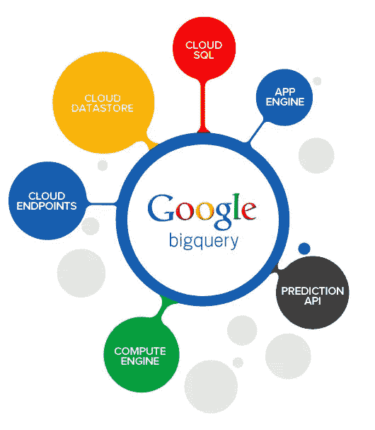
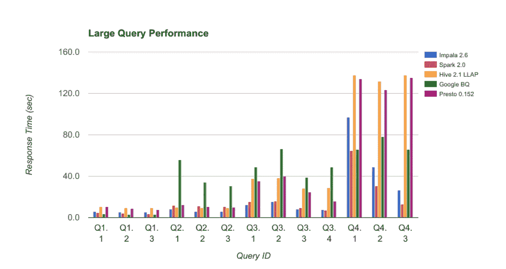
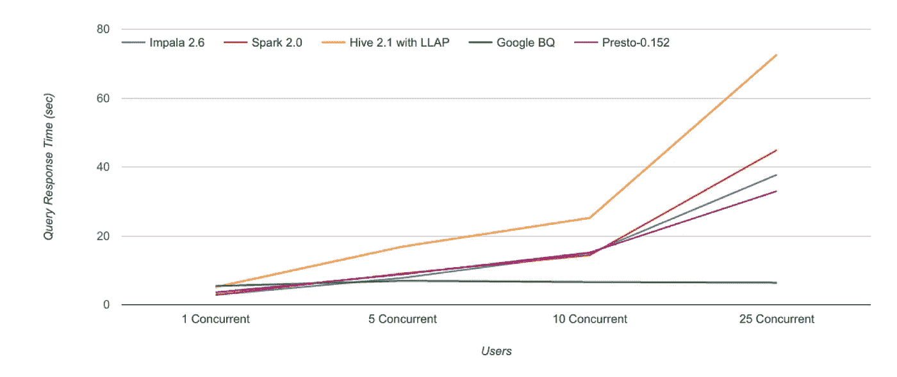
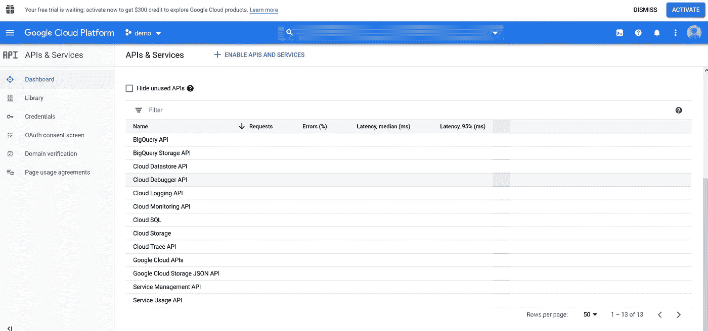
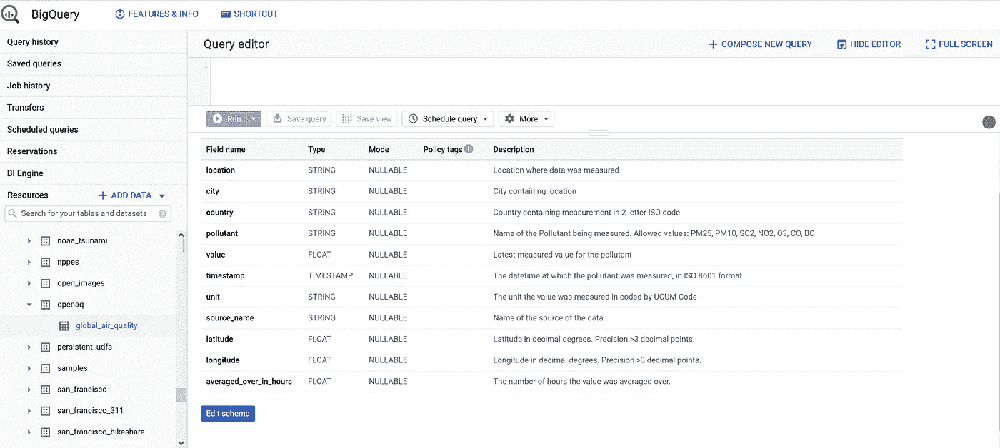

# 带 R 的 Google 大查询

> 原文：<https://medium.com/analytics-vidhya/google-big-query-with-r-875facef7844?source=collection_archive---------3----------------------->

## 用 R API 实现闪电般的数据库查询。

[来源](https://blog.dotcom-monitor.com/web-page-load-speed/web-performance-analytics-https-archive-bigquery/)

*这篇文章也发表在【https://www.r-bloggers.com/】**上。***

**这是关于用 R 和 Docker 构建和部署一个健壮的 API 的系列文章的第一部分，这个 API 允许您从 Google Big Query 中提取实时数据。对于第二部分，请参见* [*使用 Cron 和 R*](/analytics-vidhya/live-data-extraction-with-cron-and-r-f29324bf153e) *进行简单而可靠的实时数据提取。**

# *什么是谷歌大查询？*

*B [ig Query](https://cloud.google.com/bigquery/what-is-bigquery) 是一个高性能的云数据存储服务，始于 2011 年。您可以在 Google Cloud 控制台中管理它，并从 bq 控制台或通过 API 使用标准 SQL 命令查询存储。它很容易设置，自动缩放，并且有各种已建立的谷歌和其他服务的连接器。在本文中，我将向您展示使用 Big Query 的优势，以及如何使用 R 中的 API 和使用`dplyr`函数构建查询。*

# *大查询有什么优势？*

*与其他云数据存储相比，Google Big Query 有一些优势。其他技术可能不相上下，甚至更好，但所有优势的结合，尤其是与谷歌的整合，是 Big Query 真正出众的地方。优点是:*

*   ***闪电般的快速查询速度:** BQ 拥有与其他现代数据库技术类似的[基准测试结果](https://www.atscale.com/blog/tech-talk-bi-performance-benchmarks-with-bigquery-from-google/)。BQ 还[与其他数据仓库](https://fivetran.com/blog/warehouse-benchmark)解决方案进行了比较，这些解决方案具有类似的功能，如 Amazon Redshift、Snowflake、Microsoft Azure 和 Presto，并且都显示出或多或少类似的性能和定价。*

**

*大查询在不使用 GROUP BY 语句的情况下表现出优异的性能(Q1)，在使用 GROUP BY 语句的情况下表现明显更差(Q2-Q3)。通过许多大型连接和许多 GROUP by(Q4 ),它在其他测试技术中表现中等。[来源](https://www.atscale.com/blog/tech-talk-bi-performance-benchmarks-with-bigquery-from-google/)*

**

*Biq Query 在并发查询下确实表现出色。由于快速的自动伸缩，与其他技术相比，查询时间保持不变。[来源](https://www.atscale.com/blog/tech-talk-bi-performance-benchmarks-with-bigquery-from-google/)*

*   ***低成本:** BQ 的成本与其他大数据仓库解决方案类似。截至目前，每月存储成本为 0.02 美元/GB，数据查询成本为 5 美元/TB。每月 10 GB 存储免费，每月 1 TB 数据查询免费。许多操作，如数据加载、复制、导出、删除以及失败的查询都是免费的。此外，还有查询缓存，如果您对相同的、未更改的数据再次运行查询，您不必付费。也有统一价格。*
*   ***与谷歌服务轻松集成:**来自**谷歌分析 360** 的数据可以轻松存储在 BQ 中。这是一个很大的优势，因为 Google Analytics 对存储的行数有限制，并且只支持样本数据的报告。如果您将分析数据存储在 BQ 中，您可以获得更详细的客户旅程，并将每个维度与每个指标相结合，因为您可以访问所有跟踪数据。此外，Google 云存储和 Google Drive 上的数据集可以通过 BQ 查询，无需手动导入数据集。*
*   ***易于与其他工具集成:** BQ 拥有自己的机器学习套件，带有大型查询 ML 引擎，使您能够导入 tensorflow 模型进行预测。还有一个 BQ BI 引擎，但这两个对我来说都不是特别有用，因为功能有限。Tableau、Qlik 或 Looker 等许多服务都有 BQ 的连接器。*
*   ***无操作管理:**建立 BQ 和管理安全与恢复不需要任何数据库管理知识。*
*   ***公共数据集:**你在 BQ 上有一个很好的公共可用数据选择，一些数据集在不断更新！*

# *使用带 R 的大查询*

## *启用大查询并获取您的凭据*

1.  *进入[谷歌云平台](https://console.cloud.google.com/)，用你的谷歌账号登录。在左上角转到“选择项目”并开始一个新项目。如果你在你的主页上点击“转到 API 概述”，你会看到谷歌云服务的激活的 API。默认情况下，所有新项目都应该激活“BigQuery API”和“BigQuery Storage API”。*

**

*为一个新的谷歌云项目激活 API。*

*2.按照`gargle` R 包[这里](https://gargle.r-lib.org/articles/get-api-credentials.html)的描述获取你的 API 密匙。简而言之，转到上面显示的仪表板中 Google Cloud Platform 的凭证部分，创建凭证> API 密钥。您可以重命名您的 API 键，并将其限制为仅使用某些 API，如“BigQuery API”。如果您需要应用程序访问 BQ，您将需要一个[服务帐户令牌](https://gargle.r-lib.org/articles/get-api-credentials.html)，您可以将它作为 JSON 下载。*

## *用 R 查询*

*为了查询 BQ，我们将使用 R 库 [bigrquery](https://github.com/r-dbi/bigrquery) 。BQ 的另一个突出的 R 库是 [bigQueryR](https://code.markedmondson.me/bigQueryR/) ，与 bigquery 相反，它依赖于库 [googleAuthR](https://github.com/MarkEdmondson1234/googleAuthR) ，这使得它与 Shiny 和其他包更加兼容。*

*首先，我们获取库并用我们创建的 API 密钥或下载的服务帐户令牌 JSON 进行身份验证。*

*现在，我们可以开始查询我们的大查询数据或公共数据集。我们将从 [openAQ](https://openaq.org/#/?_k=h8s64f) 中查询实时空气质量数据集。这是一个开源项目，它提供来自全球 5490 个空气质量测量站的实时数据(如果你扩展“实时”的定义)，这太棒了！如果你登录谷歌，你可以在大查询[这里](https://console.cloud.google.com/bigquery?p=bigquery-public-data&d=openaq&page=dataset&project=)看到数据集和简短描述。要在云控制台中查找开放数据集，请向下滚动左侧菜单，您应该会在标题“大数据”下看到“大查询”。如果您转到“+添加数据”，您将能够浏览公共数据集。*

**

*我们将要查询的公共全球空气质量数据表的模式显示在 BigQuery 云控制台中。*

*我们将使用`DBI`包装`bigrquery` API，以便能够使用`dplyr`动词，然而 [bigrquery](https://bigrquery.r-dbi.org/) 包也提供了一个低级 API。*

*在本例中，您可以看到使用转换为 SQL 查询的`dplyr`函数进行查询，但是您无法获得直接 SQL 查询所提供的全部灵活性。为此，您可以从 r 通过`DBI::dbGetQuery()`发送 SQL 查询。全球空气质量数据集会定期更新，但是旧的条目会被忽略，这可能是为了节省存储成本。查看我的下一篇文章，关于如何构建一个 Dockerized Cron-job 来获取来自印度的最新空气污染数据，同时保留旧的记录。*