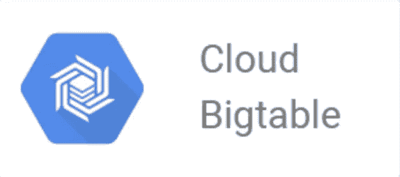

# Google Cloud BigTable:Pb 级 NoSQL 数据库

> 原文：<https://medium.com/analytics-vidhya/google-cloud-bigtable-petabyte-scale-nosql-database-c50256dcec41?source=collection_archive---------9----------------------->

如果你有**Pb 级**的数据，并且想要以**毫秒**的速度获得读写性能，那么 BigTable 就是 GCP 的选择。在这篇博客中，我们将简单地探索 BigTable。

> **请订阅我的** [**youtube 频道**](https://www.youtube.com/channel/UCCUK52Wh4gEHYKZJ0-_06Cg) **获取科技相关视频。**

## 目录

*   介绍
*   与开放式相比的优势…