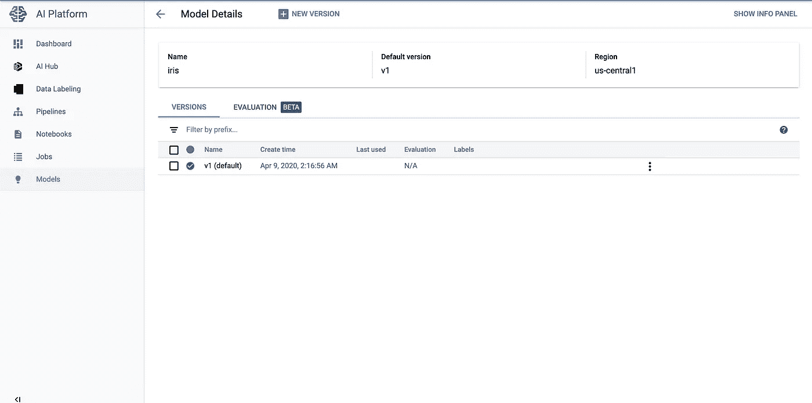

# Google 云平台定制模型上传、REST API 推理和模型版本监控

> 原文：<https://medium.com/analytics-vidhya/google-cloud-platform-custom-model-upload-rest-api-inference-and-model-version-monitoring-80216e69fbc2?source=collection_archive---------6----------------------->


谷歌人工智能平台

# **目标:**

1.  我们将建立一个自定义模型，然后上传到谷歌云人工智能平台进行推理。我们将把 IRIS 数据集用于机器学习模型。
2.  通过 POSTMAN REST API 访问模型。
3.  监控模型在谷歌云 AI 平台上的表现。

数据集:

[https://gist . github . com/387878 da 45 a 36d 32 e 4 cc ced 3c 6 CAD 3 ef . git](https://gist.github.com/387878da45a36d32e4ccced3c6cad3ef.git)

**第一步:**

让我们首先使用 python 创建一个样本模型。我们将在谷歌云平台上启动一个 jupyter 笔记本实例，并开发定制模型。

*   请在[https://console.cloud.google.com/](https://console.cloud.google.com/)登录谷歌云平台
*   导航到人工智能->人工智能平台->笔记本，并启用 API(如果尚未启用)。


启用 API

*   点击“新建实例”并选择 Python。


创建一个安装了 Python 的新实例

*   提供实例名称并保持网络不变。默认情况下，GCP 提供 4C 15GB 内存实例。您可以点击定制和更改配置来降低成本。


机器学习实例配置

*   该实例将在几秒钟内创建，如下所示。


实例已创建

*   现在点击“打开 JUPYTERLAB”按钮，它将打开一个新窗口，如下所示。


Jupyter 接口

*   点击“Python 3”启动笔记本。将笔记本从“Untitled.ipynb”重命名为“machine-learning.ipynb”。


重命名笔记本名称

*   创建一个 GCS bucket，上传 IRIS 数据集的 data.csv 文件，并在其中创建一个名为“model”的文件夹。


Google 云存储桶设置

*   现在在 jupyter 笔记本界面中执行下面这段代码。(**注意:请适当更改 BUCKET_NAME 变量。**)。该脚本将读取数据，训练模型，将其导出到本地，然后上传到 GCS bucket。

```
# Install specific version of scilit framework that gcp supports as of this writing
!pip uninstall scikit-learn --yes
!pip install -Iv scikit-learn==0.20.3#Libraries
import datetime
import os
import subprocess
import sys
import pandas as pd
from sklearn import svm
from sklearn.externals import joblib
import sklearn
print('sklearn: {}'.format(sklearn.__version__))# Cloud Storage
BUCKET_NAME = '<<BucketName>>'
FILENAME = 'data.csv'
DIRECTORY = 'gs://<<BucketName>>'
STORAGE = os.path.join(DIRECTORY, FILENAME)#Download the datafile
!gsutil cp $STORAGE .# Read the data
iris_data = pd.read_csv(FILENAME)
iris_data.head()
iris_label = iris_data.pop('species')#Train the model
classifier = svm.SVC(gamma='auto')
classifier.fit(iris_data, iris_label)# Predict some instances
print(iris_data.iloc[147:149])
classifier.predict(iris_data.iloc[147:149])# Classes
classifier.classes_#Export the model locally. The modelname should be only as mentioned below.
model_filename = 'model.joblib'
joblib.dump(classifier, model_filename)#Upload the local model to cloud bucket.
!gsutil cp $model_filename gs://$BUCKET_NAME/model
```

*   下一步是在 GCP 平台上创建一个模型版本，从这里可以对其进行服务和监控。请执行下面的脚本，该脚本将在其中创建一个模型和模型版本。(**注意:请适当修改 BUCKET_NAME & REGION_NAME 变量。**)

```
MODEL_DIR="gs://<<BUCKET_NAME>>/model"
VERSION_NAME="v1"
MODEL_NAME="iris"
FRAMEWORK="SCIKIT_LEARN"
REGION_NAME="<<REGION_NAME>>"#Enable the service if not enabled
!gcloud services enable ml.googleapis.com#Create the model in GCP
!gcloud ai-platform models create $MODEL_NAME --regions $REGION_NAME#Create a version within the above created model.
!gcloud ai-platform versions create $VERSION_NAME --model=$MODEL_NAME --origin $MODEL_DIR --runtime-version=1.14 --framework $FRAMEWORK --python-version=3.5
```

*   现在，让我们转到 GCP 平台，验证创建的模型和版本。请访问人工智能-> AI 平台->模型。


GCP 平台上托管的模型

*   现在我们可以创建模型的多个版本，并在这个模型上托管它。我们已经托管了模型的版本“v1 ”,该版本目前被标记为默认版本。如果对模型做了任何更改，它可以作为 V2 版本上传，一旦测试完成，它可以被标记为默认版本。单击型号名称，查看其中的不同版本。



GCP 平台上的车型版本

*   点击版本 V1 查看模型的实际细节。


型号版本详细信息。

*   这完成了我们上传一个定制的机器学习模型到 GCP 平台的第一个目标。注意，这里我们使用了一个 GCP 笔记本实例来创建一个样本机器学习模型。但是，您也可以在本地机器或内部创建相同的内容，然后上传到 GCP 进行推理。

**第二步:**

*   现在我们将使用 POSTMAN APIs 来调用这个模型进行推理。为了使用 API，我们需要 Auth 令牌。请在笔记本中执行以下命令，以生成相同的内容并记录下来:

```
!gcloud auth application-default print-access-token
```

*   这个模型推理的通用 API 如下。这将总是选择默认版本。

```
POST https://ml.googleapis.com/v1/projects/<<projectid>>/models/<<model>>:predict?access_token=<<access_token>>
```

*   但是，如果您想要访问上传的模型的任何特定版本，请使用下面的 API。这将选择特定的版本。

```
POST https://ml.googleapis.com/v1/projects/<<projectid>>/models/<<model>>***/versions/<<version>>***:predict?access_token=<<access_token>>
```

*   请查看模型推断需要如何发出 API 请求。


使用 API 进行模型推理

*   这就结束了我们的第二个目标。

**第三步:**

*   现在，让我们在所提供的 API 的 Google 云平台上监控模型的性能。谷歌为此提供了一个易于使用的界面。
*   转到谷歌控制台->人工智能-> AI 平台->模型
*   点击版本名 V1。
*   单击性能选项卡。您将看到如下屏幕


模型性能— 1


模型性能-2


模型性能-3

*   这就完成了我们的第三个目标。
*   如果有任何疑问，请提出意见，我很乐意帮助您。
*   感谢[何塞·米格尔·阿里埃塔](https://medium.com/u/c869de7c23a6?source=post_page-----80216e69fbc2--------------------------------)撰写本文[https://medium . com/Google-cloud/online-predictions-API-using-scikit-learn-and-cloud-machine-learning-engine-on-GCP-10f 86585 e11e](/google-cloud/online-predictions-api-using-scikit-learn-and-cloud-machine-learning-engine-on-gcp-10f86585e11e)提供了大量输入。