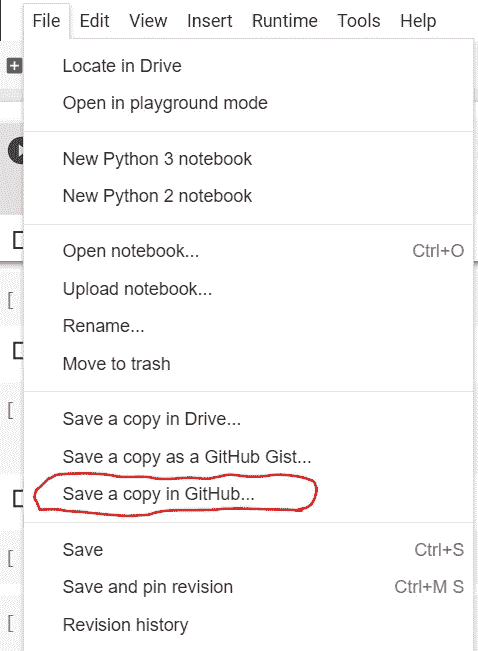
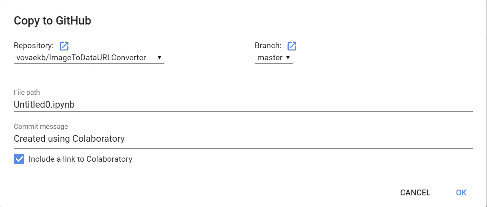

# Google Colab 提示:轻松将笔记本导出到 github

> 原文：<https://medium.com/analytics-vidhya/google-colab-tips-easy-export-notebook-to-github-ec660e4b0922?source=collection_archive---------2----------------------->

我喜欢 Google Colab 平台。Google Colab 是一个很棒的免费使用的机器学习实验平台。开始使用 Google Colab 唯一需要的是拥有 Google 帐户。Google Colab 与 Google Drive 集成，因此您可以从 Google Drive 直接在 Google Colab 应用程序中轻松打开 ipynb 笔记本。

假设你在 Google Colab 的 ipynb notebook 中有一个很棒的 ML pipeline，你想把它展示给招聘人员。Colab 提供了与 github 的良好的开箱即用集成。

打开 ipynb 笔记本。前往文件>在 Github 中保存副本…

现在，您需要授权 Google 并授予 Google Colab 访问您的 github 帐户的权限。您将会看到一个模态对话框。

在这里，您可以指定目标存储库、保存笔记本的文件路径和提交消息。去你的 github 看看笔记本已经在那里了。

很简单，不是吗。喜欢尝试机器学习和谷歌 Colab。