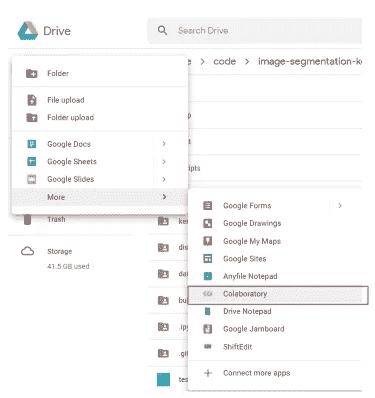
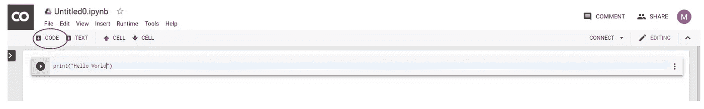
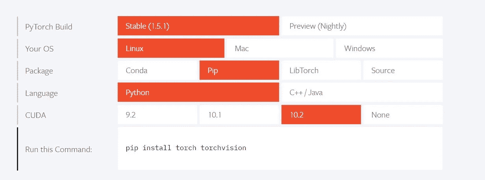
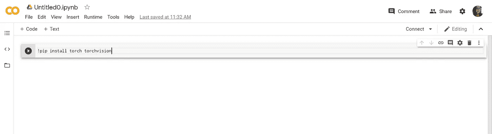
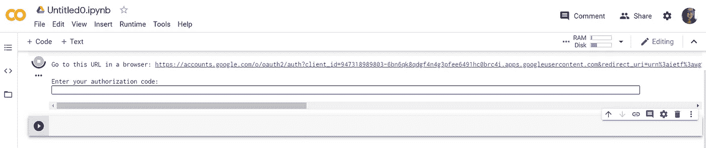
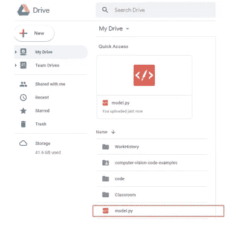
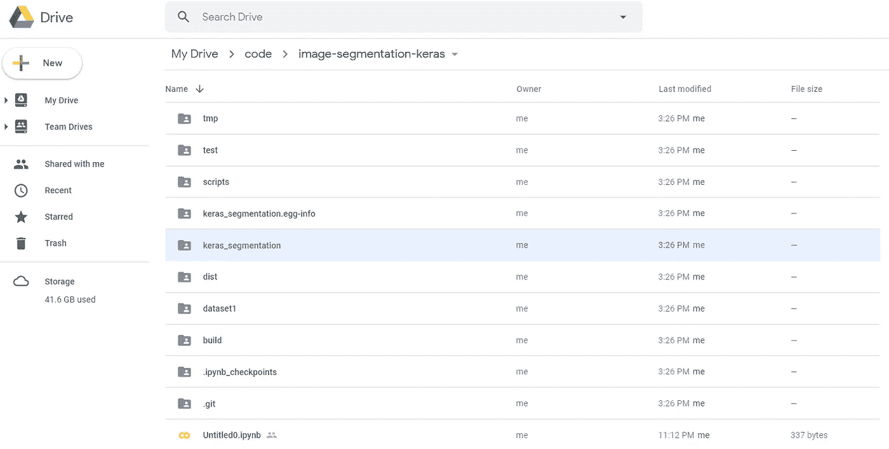
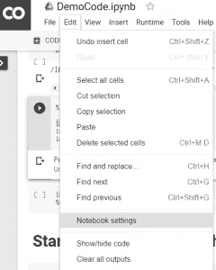
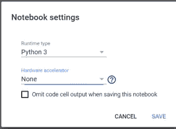

# Google CoLab 教程——如何在 CoLab 上设置 Pytorch 环境

> 原文：<https://medium.com/analytics-vidhya/google-colab-tutorial-how-to-setup-a-deep-learning-environment-on-colab-bc5ab7569f02?source=collection_archive---------4----------------------->


如果你是 Python 用户，你一定很熟悉 Jupyter Notebook。好消息是谷歌有一个名为 CoLab 的云服务。这就像在 Google Drive 上运行 Jupyter 笔记本一样。无需申请额外账户，也无需申请服务。你所需要的只是一个 Google Drive 账户，仅此而已。简单易行！最好的事情是，它给用户免费 TPU 访问运行你的任务！因此，如果您的本地机器没有足够的 GPU 能力，例如，我的 T470P 笔记本电脑只有 2G VRAM(显卡内存)，无法运行需要大约 4G 内存的培训任务，那么 Google CoLab 可以是一个解决方案。

在这篇博客中，我将介绍:

*   如何在 Google Drive 中创建 CoLab
*   如何在 CoLab 中安装库
*   如何在 CoLab 中导入模块

# **1。创建一个 Colab 文档**

如下图所示，使用创建 Google doc 的正常方式添加一个 **coLab** 文档。如果你是第一次使用它，你必须在`Connect more apps`部分添加服务，并在弹出的应用搜索框中搜索`Colaboratory`。



# 2.编辑和运行 Colab 文档



这是它在 Colab 文档中的样子。它与 JupyterNoteBook 几乎相同。它有`CODE`和`TEXT`来允许你添加一个新的单元格来写你的代码或文本，当你点击`SHIFT+ENTER`时，它会执行这个单元格。`TEXT`单元格也支持 Markdown 语法。

# **3。如何在 Colab 中安装 Python 库**

Colab 有命令行支持，所以只需在单元格中添加`!`感叹号即可运行 Linux 命令。您可以简单地运行`!pip install <package-name>`来执行 pip 安装。所以当你去 [Pytorch 官方安装网站](https://pytorch.org/?utm_source=Google&utm_medium=PaidSearch&utm_campaign=%2A%2ALP+-+TM+-+General+-+HV+-+CAN&utm_adgroup=Install+PyTorch+Using+Pip&utm_keyword=install%20pytorch%20using%20pip&utm_offering=AI&utm_Product=PyTorch&gclid=CjwKCAjw88v3BRBFEiwApwLevbJQfq_-AGl1f6xEoO0Z4N31uLJSV69Zocsi41E2tEVu4o-lty5xJxoCDGMQAvD_BwE)，选择你想要下载的 Pytorch 版本的规格，确保你选择了 Linux，pip，Python，然后是你想要安装的 CUDA 版本，你会看到一个 Pip 命令行显示在底部:



然后将该命令复制粘贴到带有前缀`!` CoLab 单元格中。因此，只需在 CoLab 单元格中运行`!pip install torch trochvision`:



然后在它运行之后，这个包就成功安装了。


**注意:**CoLab 似乎已经为您预装了 Pytorch，所以如果您运行这个命令，它会告诉您“需求已经满足”。但是，您可以使用相同的方法通过 pip install 安装任何其他 python 包。

# **4。在 Colab 中导入 Python 模块**

**安装 Google Drive**

为了让 CoLab 识别您的 Google drive 主目录，第一步是通过运行以下命令将您的 Google Drive 挂载到 Colab:

```
from google.colab import drive
drive.mount('/content/drive/') 
```

在您执行上述代码后，它将显示一个 URL 链接，其中包含授权代码，供您授予许可。点击网址，将验证码复制粘贴到这里的输入框。



现在完成了！您的 Google Drive 安装在此路径`/content/drive/My Drive/`。尝试列出目录下的所有文件。

```
!ls "/content/drive/My Drive/"
```

# **5。从我的驱动器导入模块**

现在平台可以将`"/content/drive/My Drive/"`识别为根路径。可以看到并导入这个主目录下的任何 Python 模块。例如，如果我的 Google Drive 目录下有一个 Python 文件`model.py`，那么我可以简单地在我的 Colab 中执行`import model`。



# **6。将 Google Drive 中的子文件夹添加到系统路径**

然而，有时我们想要分离我们的项目，并为不同的项目使用不同的 dir。然后我们可以将我们的项目目录添加到`sys.path`中，这使得 Python 可以看到项目目录下的所有内容。例如，如果我的项目文件夹在`code`文件夹下，然后在`image-segmentation-keras`文件夹下。绝对路径是`/content/drive/My Drive/code/image-segmentation-keras`。

然后，我们可以简单地将“code”文件夹路径添加到系统路径中:

```
import sys

# Add your absolute path of your project folder to system path.
sys.path.append("/content/drive/My Drive/code/image-segmentation-keras")

# See the full list of paths in sys.path
print(sys.path)
```

将项目文件夹添加到 sys.path 后，现在我可以导入该文件夹中的任何 Python 模块。例如，我可以在我的 Colab 中导入“keras_segmentation”模块:



```
import keras_segmentation
```

# 7。在 Colab 中设置 TPU/GPU 访问

最后一件事是`Don't forget to setup free TPU`对于你的 CoLab 页面，如果你要用它来运行一个 GPU 强化训练任务，比如深度学习任务。您可以在`Edit > Notebook settings`中设置 TPU。从下拉菜单`Hardware accelerator`中选择`GPU`或`TPU`即可！



**最后，**虽然上述步骤是你在 Google Colab 中开始使用 Pytorch 所需要的全部，但是如果你碰巧是 VSCode 用户，并且想通过 VSCode 接口访问 Google Colab，那么我发现这篇[文章](https://towardsdatascience.com/colab-free-gpu-ssh-visual-studio-code-server-36fe1d3c5243)非常有趣，可以看看。

就是这样！希望你喜欢这篇关于如何在 CoLab 上建立深度学习环境的教程！如果你觉得这个帖子有用，请给这个帖子留个“拍手”吧！也欢迎你留下你的想法、评论或反馈！感谢您的阅读！