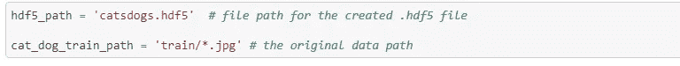
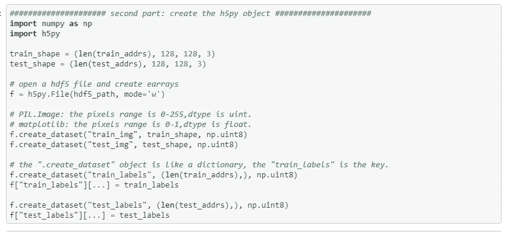
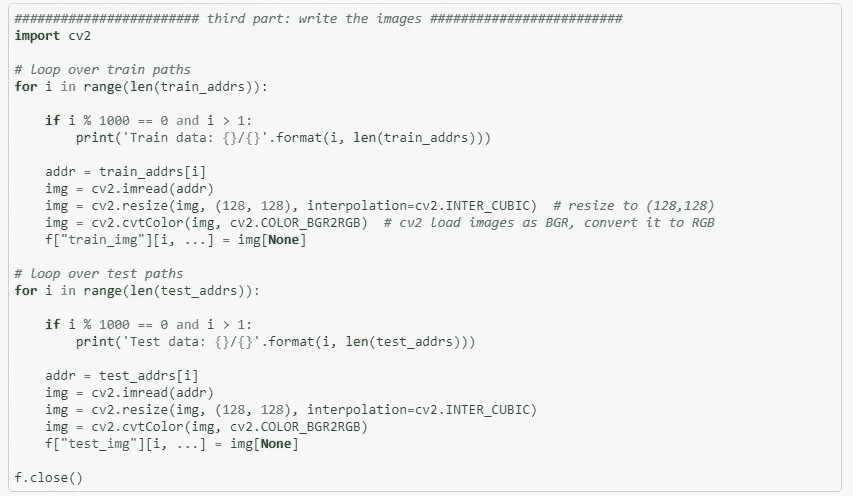
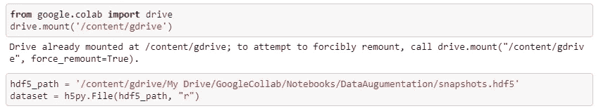
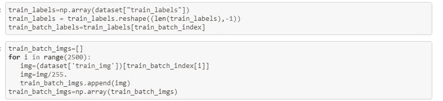
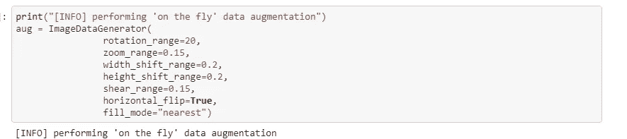
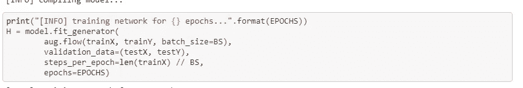

# Google Colab —采用 HDF5 的深度学习/Keras

> 原文：<https://medium.com/analytics-vidhya/google-collab-deep-learning-keras-with-hdf5-must-know-for-those-who-use-collab-for-building-img-e5aa2f6ef4fd?source=collection_archive---------0----------------------->

## 对于那些使用 Colab 构建基于图像的神经网络解决方案的人来说，必须知道

你们大多数人都知道 Google 提供的 Google Colab，它为数据科学从业者提供了基于 Jupyter 笔记本的 GPU/TPU 环境。有了这个产品，我们将能够利用 GPU 环境进行模型构建活动。

src—[https://www . how togeek . com/341538/why-is-my-internet-so-slow/](https://www.howtogeek.com/341538/why-is-my-internet-so-slow/)

但我们每个人都会面临的一个主要问题是，当我们用 google drive 上的图像数据训练模型时，执行速度会有所提高。由于 IO 操作，即使使用 GPU，Colab 笔记本也需要花费非常长的时间来访问驱动器上的数据，而每当我们使用 keras 默认数据集的数据时，它都会以极快的速度进行处理。

为了克服这一挑战，最佳方法是将数据集转换为 HDF5 文件，并用 HDF5 文件中的数据训练网络。

在这篇博客中，我将解释如何从给定的数据集生成 HDF5 文件，并在训练过程中使用 Keras 的 DataAug 模块生成的 HDF5 文件。你可以从[这里](https://github.com/VVasanth/MachineLearning/tree/master/HDF5DataAug)获得上述过程的 python 笔记本。

好，让我们从图像目录生成 HDF5 文件。

首先定义图像目录的位置。我已经提供了较少图像的目录，但是 hdf5 文件创建过程非常快，即使有 25K 图像。

然后创建 hdf5 对象。HDF5 支持创建数据集和组。我们现在关注数据集，注意我们在创建时提到了数据集的形状，这就是 HDF5 的工作方式。另外，请注意，您正在创建模式为“写入”的 HDF5。有关 HDF5 的详细信息，请参考参考部分的链接。

然后，您需要遍历这些图像，并将它们添加到您的 HDF5 数据集。完成后，关闭文件，我们就完成了 HDF5 文件的创建。

现在，让我们继续看看如何在我们的网络中利用数据增强来使用 HDF5 文件中的数据。将 HDF5 文件复制到您的 google drive 中，并将其加载到您的 Colab 笔记本中。

然后从文件中的数据集中获取数据和标签。

创建如下的“动态”增强，并将其提供给你的网络。

这一举措将极大地加快你在 Google Collab 中的培训过程，并让你充分利用 GPU 架构。

快乐训练！

参考资料:

 [## 飞鱼花火/create-a-HD F5-深度学习数据集

### 使用 Python 库 h5py 和一个简单的图像分类示例创建自己的数据集。1.著名的数据集…

github.com](https://github.com/feiyuhuahuo/create-a-hdf5-data-set-for-deep-learning)  [## Keras 图像数据生成器和数据扩充- PyImageSearch

### 在今天的教程中，您将学习如何使用 Keras 的 ImageDataGenerator 类来执行数据扩充。我也会…

www.pyimagesearch.com](https://www.pyimagesearch.com/2019/07/08/keras-imagedatagenerator-and-data-augmentation/)  [## 充分利用您的 Google Colab

### 背景

medium.com](/@oribarel/getting-the-most-out-of-your-google-colab-2b0585f82403)