# 谷歌对话流

> 原文：<https://medium.com/analytics-vidhya/google-dialogflow-355280f874dd?source=collection_archive---------21----------------------->

1.  使用以下链接登录 Google dialoflow:[https://dialogflow.cloud.google.com/](https://dialogflow.cloud.google.com/)
2.  创建新代理。

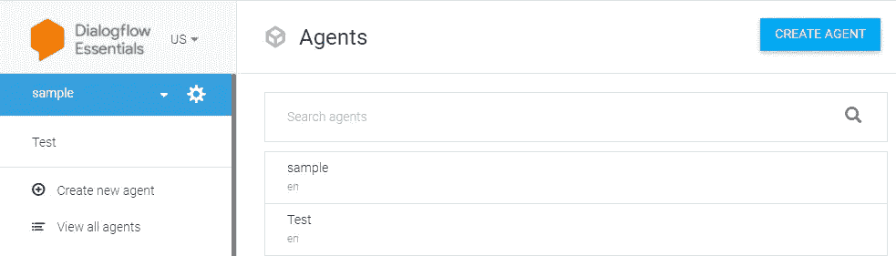

3.让我们创建在 lex(一个使用中型应用程序的机器人)中创建的相同的 3 个意图，并在响应部分给出示例响应。但是在其他方面，如果 bot 响应是通过后端适配器配置的，您需要在[实现部分](https://cloud.google.com/dialogflow/es/docs/fulfillment-overview)中启用 webhook。

为了使链接可点击，并在 bot 中有数据库操作，或者像 carousals 一样有良好的外观和感觉，需要创建 nodejs 通道适配器。

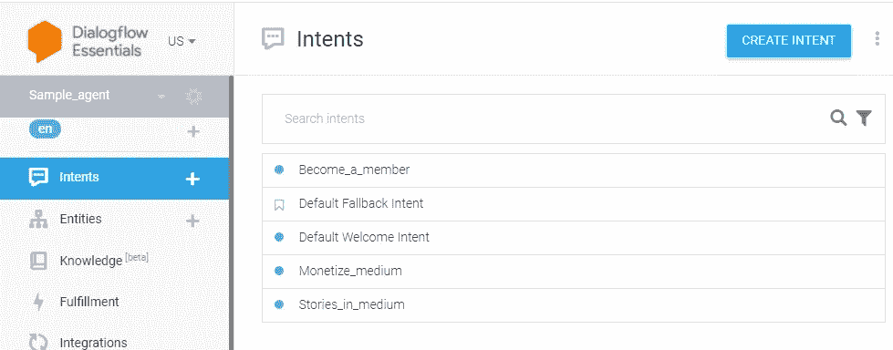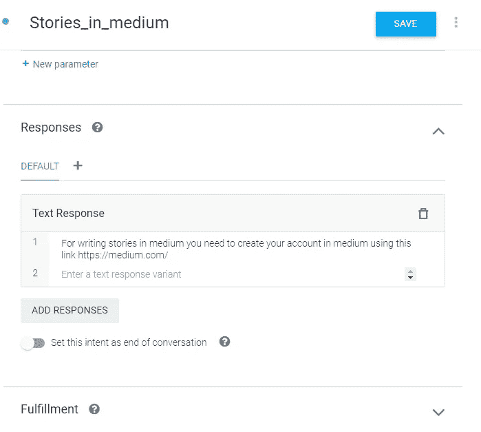

4.一个词的同义词可以添加实体。

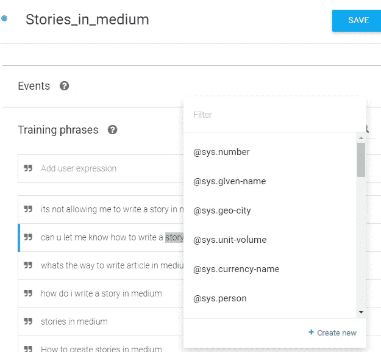

单击“新建”后，您将进入实体创建页面，向单词添加同义词。你也可以使用[内置实体](https://cloud.google.com/dialogflow/es/docs/reference/system-entities)来表示数字和其他。

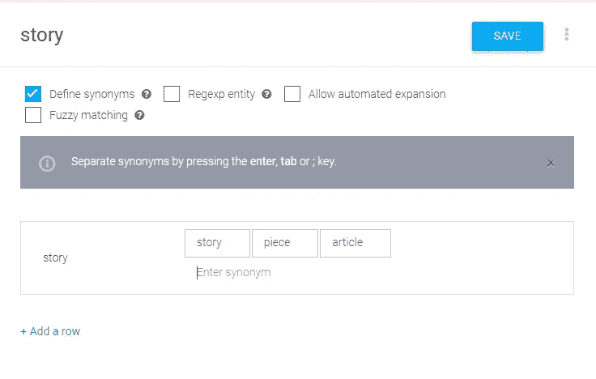

添加训练项目后，映射目标单词的所有实体，这样就不需要重复发音，因为它会替换实体同义词。

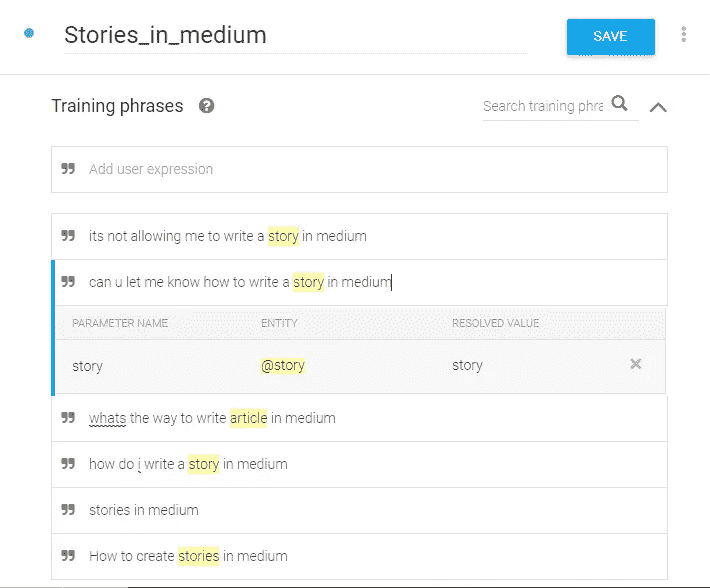

5.您可以在 context 部分提供输入上下文和输出上下文，使它们像 follow ups 一样工作。因此，这里给出的输出上下文我将把它作为输入上下文在*变成 _a_member 中给出。*和 *Stories_in_medium* intent 的输入上下文我将在默认欢迎中作为输出上下文给出。这样就创建了一个从 *default_welcome* 到 *become_a_member* 的流程，在这里您只能从上一个意图到达下一个意图，而不能直接到达该意图。

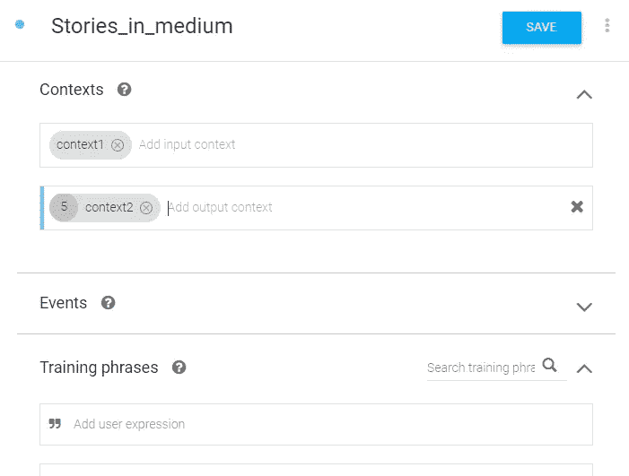

5.您也可以直接创建一个跟进，它将自动填充上下文部分。可以选择不同类型的跟进。

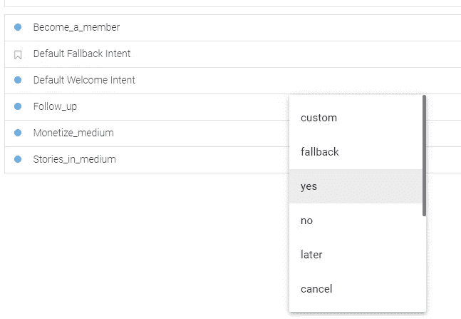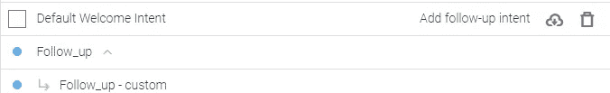

# 用密钥生成 json 文件

6.如果你点击这里的齿轮图标，它会带你到设置页面。您可以下载密钥和项目名称细节 json 文件，这些文件可用于使用 dialogflow 的 bot 适配器配置。

点击项目名称。

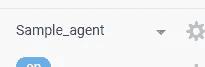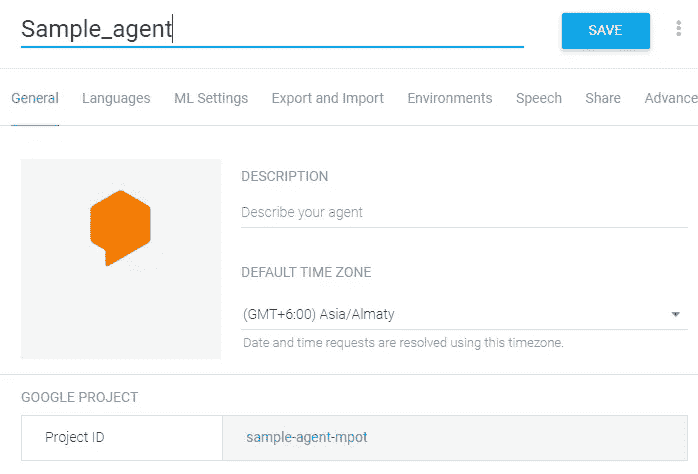

7.这将带你到谷歌云页面。您可以导航到 IAM & Admin 和服务帐户

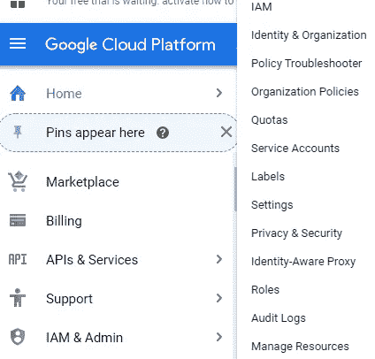

8.创建新的服务帐户。创建时，将角色添加为 dialogflow API Admin。

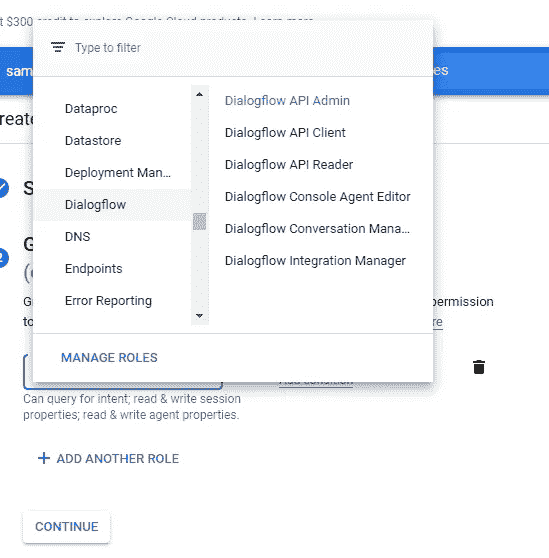

9.一旦帐户创建完毕，点击最后的 3 个点来创建密钥并生成 json 文件。

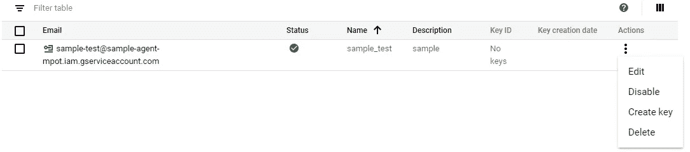

10.当您编写 nodejs 代码来使用 dialogflow api 设置适配器时，需要使用这些键。

让我们在下一篇文章中讨论一下微软的路易斯。