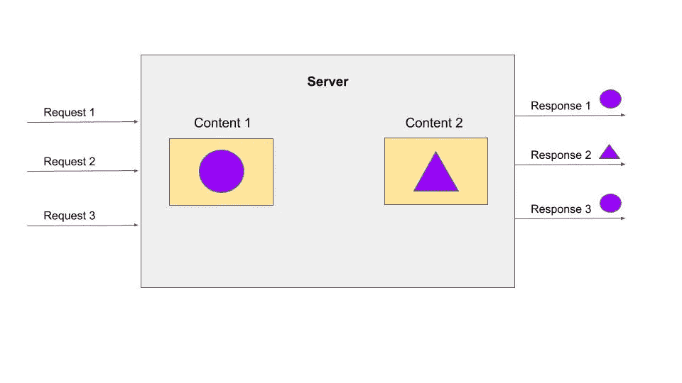

# 谷歌在服务器端优化

> 原文：<https://medium.com/analytics-vidhya/google-optimize-on-the-server-side-using-nodejs-d9552388cea6?source=collection_archive---------2----------------------->


卢克·切瑟在 [Unsplash](https://unsplash.com?utm_source=medium&utm_medium=referral) 上的照片

Google Optimize 是 Google 推出的一款在线测试工具，可以插入你的网站，让你尝试不同的内容发布方式。它有助于三种类型的测试——A/B 测试、多变量测试和重定向测试。优化通常用于转换率优化(CRO)。

这三者在客户端都非常有效，但是如果你想在服务器端运行你的实验，它并没有提供一个简单的方法。可用的文章很少，可以帮你度过。

先说手头的问题。您创建一个实验并提供变体。现在当网站加载谷歌优化代码。优化库在客户端运行它的算法，决定加载哪个变量。

为了开始使用它，你需要知道它是如何工作的。当你在 optimize 中创建一个实验时，你会得到一个实验 ID，并把它保存在剪贴板中的某个地方。

> 附注:你不能直接在优化工具上设置百分比

如果你的网站是客户端渲染的，这种方法可以无缝工作。假设您想要运行服务器端实验来了解动态生成的定制内容的转换率。那么很难直接在优化工具上设置这些变量。这只能手动完成。因为设置变体文本很容易。但是在文本中添加自定义值(如用户名、id)是很繁琐的。在这里，将 google 优化代码移到后端是有意义的。显然 google optimize 并没有为你提供一个后端库来这样做。模仿整个优化库是没有意义的。因为你必须专注于构建你的产品，而不是构建一个产品来分析你的产品。我们能做什么？

**解决或者是？**
为此有一个变通的办法。创建实验和变体的整个过程和以前一样。完成后，记下实验 Id。

假设你有两个内容要交付给你的用户。那么您的实验将有两个变量，每个变量有 50%作为度量标准。所以这里的问题是让客户端知道加载了什么变量。这可以通过在客户端可以访问的服务器端设置一个标志来实现。



一旦客户端知道加载了哪个变体，它所要做的就是通知 google optimize。

为了通知“谷歌优化”加载的变量，您可以使用谷歌分析库。

下面是客户端代码的一个简单实现。

```
<html>
<head>
<script>
  // 1\. Load the analytics.js library.
  (function(i,s,o,g,r,a,m){i['GoogleAnalyticsObject']=r;i[r]=i[r]||function(){
  (i[r].q=i[r].q||[]).push(arguments)},i[r].l=1*new Date();a=s.createElement(o),
  m=s.getElementsByTagName(o)[0];a.async=1;a.src=g;m.parentNode.insertBefore(a,m)
  })(window,document,'script','https://www.google-analytics.com/analytics.js','ga');

  // 2\. Create a tracker.
  ga('create', 'UA-XXXXX-Y', 'auto');

  // 3\. Set the experiment ID and variation ID.
  ga('set', 'exp', '$experimentId.$variationId');
  // 4\. Send a pageview hit to Google Analytics.
  ga('send', 'pageview');
</script>
</head>
<body>
<!-- Content -->
</body>
</html>
```

如果你遵守上面的代码。您会注意到我们传递了实验 Id 和变量 Id。

```
ga('set', 'exp', '$experimentId.$variationId');
```

实验 ID 是您在创建实验时记下的 Id。现在 VariantId 可以是(0，1，2，…。n)其中 n 是实验中变体的数量，0 是原始变体。

如果您正在进行多变量测试，那么变量 id 需要用连字符'-'分隔。

```
[variant for section 1]-[variant for section 2]-...-[variant for section N]
```

因此，给定一个关于颜色和字体部分的 MVT 实验(一个颜色部分有四个变量:0 =原始，1 =红色，2 =绿色，3 =蓝色，一个字体部分有三个变量:0 =原始，1 = 10pt，2 = 12pt):

*   “0–0”表示原始颜色和字体
*   “1–0”表示红色和原始字体
*   “2–1”表示绿色和 10pt 字体

例如，以下代码选择 0–0(原始颜色和字体)进行实验:

```
ga('set', 'exp', '$experimentId.0-0');
```

**服务器端分发**

现在，我们需要找到一种在您的服务器上分配流量的方法。你可以用你自己定制的算法来做。

一种方法是随机分发内容。但是在任何给定的点上，你的渲染都不符合你在创建实验时设置的标准。假设您基于优先级提供了竞争者，那么您的样本集也将被不正确地分配。

另一个好方法是平均分配流量，直到达到某个阈值。阈值代表最低的可交付结果。示例:您必须以 7:2 的比例分发内容，其中，向服务器发出的 10 个请求中，7 个用户看到了**内容 1** ，2 个用户看到了**内容 2。**

阈值为θ，此处为 4，即(**变量数)*(最低交付变量**)。因为 7:2 是这个比例。其中 2 < 7。则 2 成为最低的传递变量，并且因为有 2 个变量(内容 1 和内容 2)，所以θ = 4(即 2*2)。

我们不断从收到的每个请求中扣除θ，直到θ变成 0。到达服务器的请求被同等对待，并以替代内容进行响应。一旦θ(阈值)达到 0。它(θ，此处为 4)从每个变体可交付成果中扣除，因此它从 7:2 变为 5:0。我们需要忽略这些零。再次重复相同的步骤，直到只剩下一个变量，它将作为新的θ结束。现在，接下来的 5 个请求将由内容 1 提供服务，因为没有其他竞争者。一旦该值变为 0，比率就被重置回原始值(7:2 ),并重复该过程。与随机方法相比，这将给出更精确的度量。请在下面找到一个简单的实现。

> 一旦你选择了你的分配逻辑。在 cookies 中设置变量类型和实验 id，以便您的客户端代码可以访问它。

**结论**:

这是在服务器端使用谷歌优化的一个变通办法，可能有其他几种方法可以做到这一点。在大多数情况下，您可能不需要在服务器端运行这些实验。但是如果你需要运行它们，希望这有所帮助。

欲了解更多信息，请访问:

[https://developers . Google . com/optimize/dev guides/experiments](https://developers.google.com/optimize/devguides/experiments)