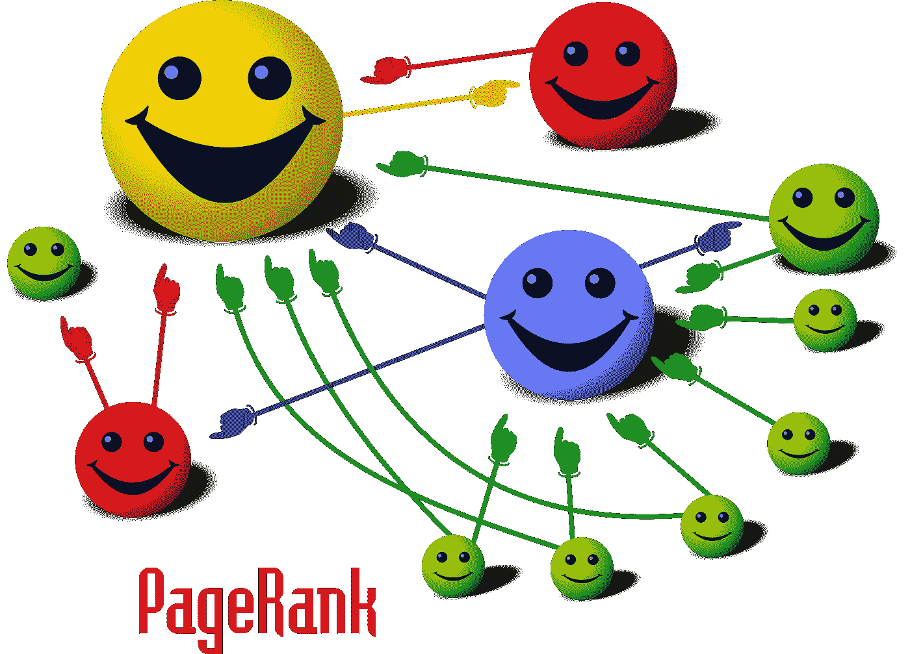

# 谷歌网页排名和马尔可夫链

> 原文：<https://medium.com/analytics-vidhya/google-page-rank-and-markov-chains-d65717b98f9c?source=collection_archive---------2----------------------->

无论你在谷歌上搜索什么，你都会得到基于网页排名的网页。PageRank 算法就是这种搜索结果排序的幕后推手。

谷歌页面排名是对网页进行评级的客观方式。我们将计算一个称为 PageRank Vector 的向量，它被定义为 Google 类别矩阵的特征向量。

> PageRank Vector:是包含 PageRank 值的向量。

图片来源:维基媒体