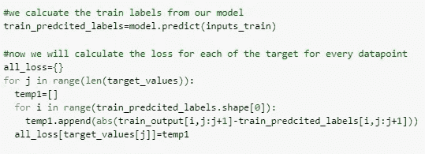

# Google Quest 挑战问答标签

> 原文：<https://medium.com/analytics-vidhya/google-quest-challenge-q-a-labelling-9df4aff317d5?source=collection_archive---------28----------------------->

**业务问题:**

计算机非常擅长用单一的、可验证的答案来回答问题。但是，人类通常更善于回答关于观点、建议或个人经历的问题。

人类更擅长解决需要对背景有更深层次、多维度理解的主观问题——这是计算机还没有训练好的……目前为止..问题可以有多种形式——有些是多句子的阐述，有些可能是简单的好奇或者是一个完全成熟的问题。他们可以有多种意图，或者寻求建议和意见。有些可能是有帮助的，有些可能是有趣的。有些是简单的对错。

**问题陈述概述:**

1.  当谈到问题和答案时，人类有不同的理解和回答问题的方式。在本案例研究中，我们将借助顶级网站的(问答)数据集来理解相同的内容。
2.  人类有独特的方式来回答任何问题。我们首先理解问题，问题背后的直觉，问题的意义等等。机器就不同了。
3.  在这个问题中，我们将借助来自不同网站的问答数据集来帮助机器理解问题的这些方面。
4.  在我们的数据集中，我们有 30 个不同方面的问答，如“问题 _ 对话”、“问题 _ 正文 _ 关键”、“回答 _ 有用”等。
5.  我们的目标是在训练数据集的帮助下找到这些方面的分数。在我们的训练数据集中，我们在[0，1]的范围内具有与这些标签中的每一个相关联的分数。我们将让我们的模型学习这些方面，并尝试对我们的测试数据集进行同样的评估。

**数据来源:**

此竞赛的数据包括来自各种 StackExchange 属性的问题和答案。我们的任务是为每个问答配对预测 30 个标签的目标值。

30 个目标标签的列表与 sample_submission.csv 文件中的列名相同。前缀为 question_ 的目标标注与数据中的 question_title 和/或 question_body 要素相关。前缀为 answer_relate 的目标标注与答案要素相关。

每一行包含一个问题和该问题的一个答案，以及附加功能。训练数据包含带有一些重复问题(但答案不同)的行。测试数据不包含任何重复的问题。

这不是二元预测挑战。目标标签由多名评核人汇总而成，可以具有范围[0，1]内的连续值。因此，预测也必须在该范围内。

你可以从这里下载数据集:[**https://www.kaggle.com/c/google-quest-challenge/data**](https://www.kaggle.com/c/google-quest-challenge/data)

**现有解决方案&思路:**

在这个挑战中，我们必须找出 30 个不同目标变量的值。这是一个回归问题，我们的预测值介于 0 和 1 之间。由于我们有文本数据和几个类别作为输入，最好的方法之一是使用预单词嵌入，然后找到标签。

因为这是一个难题，所以很少有内核使用最先进的模型，如通用语句编码器、Al-BERT、Ro-bert、BERT 等。

1.  **基于 BERT 的方法:**

 [## [任务]伯特基础 TF2.0

### 使用 Kaggle 笔记本探索和运行机器学习代码|使用来自多个数据源的数据

www.kaggle.com](https://www.kaggle.com/akensert/quest-bert-base-tf2-0) 

该解决方案使用基于 BERT 的方法，给出了良好的结果，得到的相关分数为:0.382

2.**通用语句编码器 Keras** :

 [## 使用+功能+ OOF

### 使用 Kaggle 笔记本探索和运行机器学习代码|使用来自多个数据源的数据

www.kaggle.com](https://www.kaggle.com/abazdyrev/use-features-oof) 

在这个模型中，作者使用了使用模型中的单词嵌入，得到了大约 0.32 的 spearman 相关结果

3.罗伯塔:

 [## 罗伯塔[法斯泰，拥抱脸🤗变形金刚]

### 使用 Kaggle 笔记本探索和运行机器学习代码|使用来自多个数据源的数据

www.kaggle.com](https://www.kaggle.com/melissarajaram/roberta-fastai-huggingface-transformers) 

这里作者使用 Ro-BERTa 并得到 0.352 左右的相关分数。

从上面的三个解决方案中，我们得到一个想法，我们可能必须使用预训练的模型来获得单词嵌入。在这里，我们正在寻找问题和答案背后的关系和直觉。因此，决定哪个模型表现最好或者应该使用哪个模型的只是需求和模型构建部分的问题。

因此，更重要的是理解为什么选择特定的模型并进行误差分析。我们将使用一个预先训练的模型来解决这个问题，并进行误差分析，看看我们是否可以识别任何类型的模式，并进一步尝试改善结果。

**我们现有解决方案的方法:**

与其直接跳到预先训练好的模型，不如让我们先试着确定，我们是否真的需要它们，以及我们为什么需要它们。因此，我们将首先从使用 LSTM 层的基线模型开始，看看我们的模型表现如何。

这将激励我们使用预先训练好的模型之一:

让我们从数据集的探索性数据分析开始，并尝试理解数据集。

**训练数据集:**

训练数据集

**训练数据集中的所有列:**

我们的训练数据中有 41 列

**测试数据集:**

测试数据集的头

**测试数据集中的所有列:**

测试数据集中有 11 列

我们必须预测训练数据中的 30 个目标标签。我们的数据集中有三个文本字段，即“ ***问题 _ 正文*** ”、“ ***问题 _ 标题*** ”和“ ***答案*** ”。除此之外，我们的数据集中还有分类特征。在所有可用的分类特征中，让我们看看“ ***宿主*** ”和“ ***类别*** ”是否有某种模式。

**类别分布:**

列车数据中类别的分布

我们可以看到，我们的大部分数据来自技术领域。

**宿主分布:**

对于我们的大多数数据点，stackoverflow.com 是主机。这很有意义，因为这里通常人们会问与新技术相关的问题，而我们的大部分数据都是关于技术的。

**目标变量关系:**

我们必须预测大约 30 个目标变量的值。因此，让我们看看这些目标之间是否存在任何关系。这将帮助我们更好地理解我们的模型。

代码片段

目标变量配对图

与上面的输出一样，我们将得到所有 30 个目标变量的输出。这些目标变量之间没有太大的关系。因此，我们必须单独预测它们，因为没有办法从另一个中推断出一个的值。

有关更详细的解释和完整的代码访问，请参考下面的链接。

 [## mansi 2596/ka ggle-Google-Quest-Challege

### 计算机非常擅长用单一的、可验证的答案来回答问题。但是，人类通常更擅长…

github.com](https://github.com/mansi2596/Kaggle-Google-Quest-Challege/upload/master) 

**字云:**

现在，让我们来看看所有三种文本特征的单词在我们的训练数据集中的分布，并看看是否有一种模式:

**相关黑白目标变量:**

目标变量相关性

现在，我们已经完成了 EDA 部分，让我们来训练第一个基线模型。在给出输入之前，我们对文本特征做了一些过滤。这包括将 ***不能*** 改为 ***不能*** ， ***不会*** 改为 ***不会*** 等等。你可以在上面提到的 github 链接上查看相同的内容。

**训练我们的基线模型:**

这里，我们在 LSTM 层的帮助下创建了一个简单的神经网络。

基线模型的张量流代码

模型摘要

当我们训练和运行这个模型时，在几个时期之后，我们的模型停止学习，因为分数没有提高:

这表明我们的模型表现不好，因此，我们切换到预先训练的模型。现在，我们训练的任何模型都应该比这个模型表现得更好。这个基线模型给了我们一个必须得到的分数的想法。

**使用通用语句编码器:**

现在，让我们使用 USE 来训练我们的模型。这是一个预先训练好的模型。这将为我们所有的数据点提供单词嵌入。然后这些嵌入我们将在一个简单的网络中得到结果。让我们看看这个模型是如何为我们工作的:

模型架构的代码截取

这里我们有三种不同的输入，分别为 ***问题 _ 标题*** ， ***问题 _ 正文*** 和 ***答案*** 。这些输入中的每一个都在 USE 的帮助下被转换成 512 维向量。然后我们将其输入一个简单的神经网络。

模型架构

模型架构

模型训练

当我们使用这个模型训练时，我们的分数会提高。这肯定比以前好，但它仍然不显得很高，虽然损失相当低。让我们深入研究一下，找出这背后的原因。

**错误分析:**

一旦经过训练，我们必须能够知道，我们的模型何时表现良好，何时表现不佳。误差分析将帮助我们识别模型中的松散部分。让我们看一下做同样事情的基本步骤:

**步骤 1:** 分别计算每个数据点的损失。确定具有高损失值的数据点，并对其进行分析，寻找可能导致高损失值的模式。

计算每个数据点的平均绝对误差

第二步:绘制目标变量的损失图。这里我们有 30 个目标，因此我们必须为每个目标绘制损失图。这可以使用给定的代码片段来完成:

代码片段

从上面的图中，我们注意到，在大多数情况下，我们的损失范围大多在 0.0 到 0.2 之间，其中大多数点也仅位于 0.0 和 0.1 之间。因此，现在我们将分析这些具有较高损失值的数据点，看看我们能否在其中找到一个模式。

来自我们数据集的另一个重要观察结果是，对于目标 ***问题 _ 非 _ 真 _ 问题*** 来说，损失值非常低，但是相关分数也非常低，大约为 0.042。因此，这意味着对于这个特定的目标，我们的模型不能预测正确的值。***question _ type _ spelling***和***question _ type _ result***也是如此。我们可能需要研究它们的分布，以确定为什么会发生这种情况。

**第三步**:分析行为异常的目标。如上所示，让我们看看损失分数低但相关性很小的值的分布。

损失值较少的目标分布

我们可以看到，对于这些值，我们所有要预测的标签都是 0。因此，即使我们的模型预测正确，两者之间也没有关联。这就是为什么我们会得到如图所示的结果。

**观察:**

在我们的最终得分中，我们取所有目标变量得分的平均值。这就是为什么我们得到同样的低值，尽管对于许多目标标签，预测值是高的。

因此，通过很少的误差分析，我们能够发现我们的度量在评估我们的模型时是否有效，以及在什么情况下它失败了。

**其他错误分析方法:**

除了上面提到的，你还可以尝试其他的方法来进一步了解你的模型的表现。

1.  查看具有高损失值的点的分类分布，并查看是否存在得分较高的类别。对于给定的数据集，您可以对 ***主机*** 和 ***类别*** 进行此分析。
2.  使用词性标注从我们的数据中导出其他特征，如句子的长度、单词的数量、名词和动词的数量。很多时候 ***命名实体*** 并没有给模型足够的信息来学习特定的数据点。因此，如果您发现具有高丢失值的数据点具有高频率的命名实体，那么您可以从您的数据集中移除命名实体。
3.  你也可以进行相似性测试。找出数据的文本特征之间的相似性，并查看丢失率较高的数据点的相似性得分是否不同。您可以使用余弦相似性或模糊逻辑来尝试相同的方法。

4.您还可以检查 Tfidf 得分，并查看得分值是否出现偏差。

上面提到的错误分析部分都已经完成了，你可以在 github 链接中找到。但是在直接跳到代码之前，先自己尝试一下，我打赌你会喜欢的。

**未来工作:**

1.  这里我们只使用基于使用的模型。我们可以尝试不同的预训练模型，看看我们的模型在这些模型上表现如何。

**参考文献:**

1.  [https://www.kaggle.com/abazdyrev/use-features-oof](https://www.kaggle.com/abazdyrev/use-features-oof)
2.  [https://tfhub.dev/google/universal-sentence-encoder/2](https://tfhub.dev/google/universal-sentence-encoder/2)
3.  [https://arxiv.org/abs/1803.11175](https://arxiv.org/abs/1803.11175)
4.  [https://Applied ai course . com/course/11/Applied-Machine-learning-course](https://www.appliedaicourse.com/course/11/Applied-Machine-learning-course)