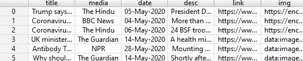
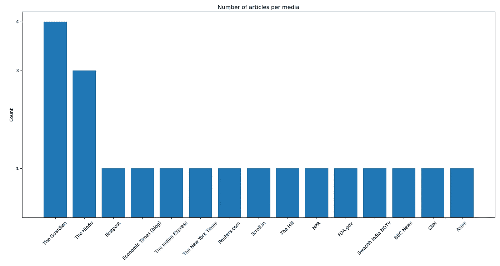

# GoogleNews API——使用 Python 从 Google News 获取实时新闻

> 原文：<https://medium.com/analytics-vidhya/googlenews-api-live-news-from-google-news-using-python-b50272f0a8f0?source=collection_archive---------2----------------------->


大家好。我已经有了一些令人兴奋的东西和一个更简单的方法来搜索来自世界各地的新闻。我们知道如何使用 BeautifulSoup 和 Selenium 来抓取新闻文章。但是有了这个 api，您不需要将自己限制在几个来源或出版物上。

让我告诉你一个我工作的愚蠢方法，这样你就不会犯同样的错误。但是他们说愚蠢对你的职业有好处。我得到了一个项目，收集新闻文章，并在文章上应用一些数据可视化，并创建一个仪表板。如果你们想知道我是如何创建仪表板的，我很乐意与你们分享。所以，回到这个故事，我当时不知道我们有这么简单的方法来获取实时新闻文章。我坚持使用一些特定数量的出版物，访问每个出版物的网站，对每个搜索查询应用 beautifulsoup 和 selenium 来获取链接，然后使用报纸模块来解析文章。在我完成这个项目后，我发现了最简单的 api，它可以让我们的生活变得更容易，而且一点也不耗时，至少与我以前获得相同甚至更精确结果的方法相比是这样的。所以，我们继续吧，不要再浪费你的宝贵时间了。

第一个任务是安装 GoogleNews 和 newspaper3k 来解析文章，这可以通过下面的语句来完成。

！pip 安装 GoogleNews

！pip 安装报纸 3k

是时候导入一些库来获取我们现在要获取的文章列表了。

```
**from** GoogleNews **import** GoogleNews
**from** newspaper **import** Article
**import** pandas **as** pd
```

下一个任务是获取数据。给定您想要搜索新闻文章的时间段和查询，我们将获得一个列表，其中包含日期、标题、媒体、描述、文章发布的链接以及 img 属性下的图像链接。

您将在下面的代码中看到，googlenews.result()将返回我们上面讨论的所有内容的列表

```
googlenews=GoogleNews(start=**'05/01/2020'**,end=**'05/31/2020'**)
googlenews.search(**'Coronavirus'**)
result=googlenews.result()
df=pd.DataFrame(result)
print(df.head())
```



我们已经在开始和结束变量中指定了时间段。我们将在调用搜索函数时提供查询作为参数。此 api 中的新闻数量有搜索限制。我们最多能收集 10 条新闻。现在，我们将努力获取更多。

```
**for** i **in** range(2,20):
    googlenews.getpage(i)
    result=googlenews.result()
    df=pd.DataFrame(result)
```

我们可以在 for 循环中写尽可能多的数字来得到页码。它将停止，直到它得到所有的文章，关于在特定时间段的搜索。

让我们来看看给定出版物中 20 篇文章的图表示例。



现在，您还没有使用本模块获得完整的文章。谷歌新闻的描述属性不会给你完整的文章。所以我们现在将尝试从 python 的报纸模块中提取并解析文章。我们已经导入了文章库。

```
**for** ind **in** df.index:
    dict={}
    article = Article(df[**'link'**][ind])
    article.download()
    article.parse()
    article.nlp()
    dict[**'Date'**]=df[**'date'**][ind]
    dict[**'Media'**]=df[**'media'**][ind]
    dict[**'Title'**]=article.title
    dict[**'Article'**]=article.text
    dict[**'Summary'**]=article.summary
    list.append(dict)
news_df=pd.DataFrame(list)
news_df.to_excel("articles.xlsx")
```

我们将遍历前面创建的数据框架，并创建一个新的数据框架，其中也可以包含完整的文章和摘要。前面数据帧中的链接列包含文章发布的链接，通过文章包，我们可以获取文章和摘要。标题列已经存在，因此您可以从前面的数据框架中访问它，也可以从文章包中访问它。我们也可以把这个数据框转换成 excel 表格。

以下是完整的代码:

```
**from** GoogleNews **import** GoogleNews
**from** newspaper **import** Article
from newspaper import Config
**import** pandas **as** pd
import nltk#config will allow us to access the specified url for which we are #not authorized. Sometimes we may get 403 client error while parsing #the link to download the article.nltk.download('punkt')

user_agent = 'Mozilla/5.0 (Macintosh; Intel Mac OS X 10_11_5) AppleWebKit/537.36 (KHTML, like Gecko) Chrome/50.0.2661.102 Safari/537.36'
config = Config()
config.browser_user_agent = user_agentgooglenews=GoogleNews(start=**'05/01/2020'**,end=**'05/31/2020'**)
googlenews.search(**'Coronavirus'**)
result=googlenews.result()
df=pd.DataFrame(result)
print(df.head())**for** i **in** range(2,20):
    googlenews.getpage(i)
    result=googlenews.result()
    df=pd.DataFrame(result)
list=[]**for** ind **in** df.index:
    dict={}
    article = Article(df[**'link'**][ind],config=config)
    article.download()
    article.parse()
    article.nlp()
    dict[**'Date'**]=df[**'date'**][ind]
    dict[**'Media'**]=df[**'media'**][ind]
    dict[**'Title'**]=article.title
    dict[**'Article'**]=article.text
    dict[**'Summary'**]=article.summary
    list.append(dict)
news_df=pd.DataFrame(list)
news_df.to_excel("articles.xlsx")
```

希望有所帮助。编码快乐！