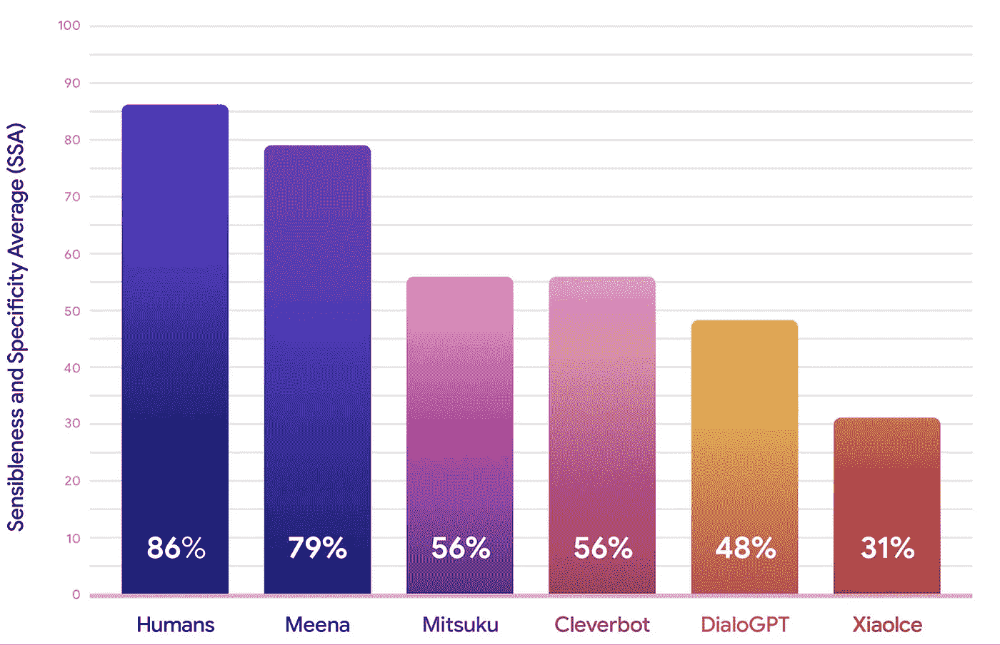

# 谷歌的 Meena:为什么它是一个突破

> 原文：<https://medium.com/analytics-vidhya/googles-meena-why-it-s-a-breakthrough-19238b1d5023?source=collection_archive---------13----------------------->

电影[中的一个镜头她的](https://www.imdb.com/title/tt1798709/)

就像我一样，如果你也对斯派克·琼斯导演的《她》感到惊讶，主角西奥多(由[乔阿金·菲尼克斯](https://www.google.com/search?client=firefox-b-d&sxsrf=ACYBGNRSjKKTZUunbY-Mg4qI3u8mDVFPjQ:1580656994486&q=Joaquin+Phoenix&stick=H4sIAAAAAAAAAONgFuLSz9U3yCk0S0syVeIEsQ0tUpIstHh888syU0PyHZNL8osWsfJ75ScWlmbmKQRk5KfmZVbsYGUEADusTqI8AAAA&sa=X&ved=2ahUKEwi06auVlrPnAhVGyzgGHfVaCDoQxA0wNXoECB4QBQ)饰演)爱上了人工智能萨曼莎(由[斯嘉丽约翰逊](https://www.google.com/search?client=firefox-b-d&sxsrf=ACYBGNRSjKKTZUunbY-Mg4qI3u8mDVFPjQ:1580656994486&q=Scarlett+Johansson&stick=H4sIAAAAAAAAAONgFuLSz9U3yCk0S0syVeIEsY0MDU1KtHh888syU0PyHZNL8osWsQoFJycW5aSWlCh45Wck5hUX5-ftYGUEALTjhPo_AAAA&sa=X&ved=2ahUKEwi06auVlrPnAhVGyzgGHfVaCDoQxA0wNXoECB4QCQ)饰演)。事实上，这部电影是催眠我选择计算机科学(尤其是机器学习&人工智能)作为我的职业生涯的原因之一，所以每当在该领域取得这样的突破，对我来说就像是个人收获，这就是我决定写这篇博客的原因。

# 概观

***什么是 Meena？***

***它的历史是什么？***

***其影响会是什么？***

***为什么说多回合聊天机器人是正确方向的突破？***

***现在期待什么？***

> ***米娜是什么？***

eena 是谷歌最近发布的聊天机器人，声称它是目前最好的语音助手。我们已经有一些非常受欢迎的聊天机器人，如苹果的 Siri、谷歌的谷歌助手、亚马逊的 Alexa、微软的 Cortana 等。但它们还不够好，因为所有虚拟助手 AI 的追求是匹配类似人类的体验，在查看 Meena 的结果后，这似乎非常接近。

**那么，这个敏感性和特异性平均值(SSA)是多少？**

这是一个人的评价标准，决定了你的回答有多人性化(理智和具体)。这一指标是由谷歌设计的，谷歌认为 SSA 捕捉了自然对话的基本而重要的属性。

> ***它的历史是什么？***

聊天机器人已经出现了超过 15 年，谷歌、脸书、亚马逊、微软、IBM 等科技巨头都在这上面下了大赌注，聊天机器人框架的出现，如谷歌的 [DialogueFlow](https://dialogflow.com/) 、IBM 的 [Watson](https://www.ibm.com/watson/how-to-build-a-chatbot) 、微软的 [Bot 框架](https://dev.botframework.com/)、RASA (一个开源框架)以实现技术奇点的名义吸引着开发者和爱好者不断关注它。

***ELIZA*** 被认为是计算机科学史上第一个聊天机器人，由麻省理工学院的 *Joseph Weizenbaum* 开发。ELIZA 通过从其提供的关键字中识别句子和关键字来操作，以使用来自预编程响应的那些关键字来再现响应。比如，有人说“我爱我的公司”，然后伊莱扎会捡起“公司”这个词，并通过问一个开放式的问题来回答“哇！告诉我一些关于你们公司的情况。这感觉像是自动聊天，但它只是一个编程的反应，仅此而已，但这就是聊天机器人的起源和我们对像聊天这样的人的探索，后来又有了*爱丽丝(一个*自然语言处理驱动的机器人)和史蒂夫·沃斯维克的*三津*

现在，你甚至可以用上面提到的这些框架来创建你自己的聊天机器人，只需要很少的努力。我强烈鼓励你继续尝试(尤其是如果你不是计算机科学出身的话。)

> ***其影响会是什么？***

自从 **Meena** 模型拥有 26 亿个参数，并在 341 GB 的文本上进行训练，这些文本是在 TPU v3 pod(2048 个 TPU 核)上从公共领域社交媒体对话中过滤三十(30)天的。与现有的最先进的生成模型 [OpenAI GPT-2](https://openai.com/blog/better-language-models/) 相比，Meena 的模型容量增加了 1.7 倍，训练数据增加了 8.5 倍。

更多的数据意味着更好的结果。

> ***为什么说多回合聊天机器人是正确方向上的突破？***

尽管谷歌、亚马逊和微软的助手取得了巨大的成功，但它们与电影《她》中的萨曼莎相去甚远:-)

我们期望如此之高的另一个原因是，谷歌最近实现了量子推进，因此他们比任何对手都更容易、更快、更有效地实现类似人类的聊天机器人。

> ***现在期待什么？***

虽然谷歌声称它是最好的，但它的核心是 [seq2seq](https://en.wikipedia.org/wiki/Seq2seq) 架构，这不是完全革命性的东西，在社区中很常见，但由于谷歌拥有量子能力，允许他们向 Meena 提供大量数据以实现更好的结果，这意味着我们已经取得了很大的进步，但显然还没有达到那一步。