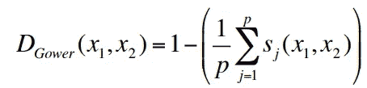
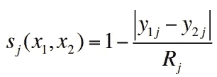
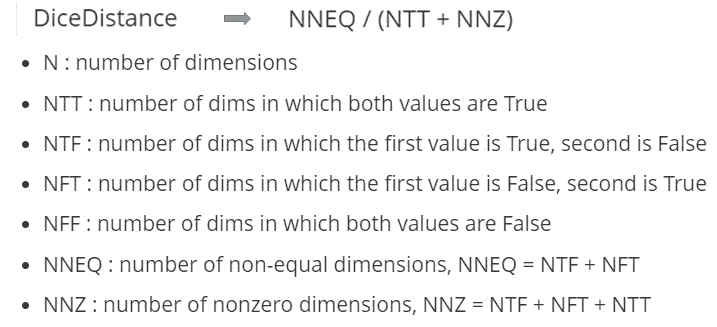
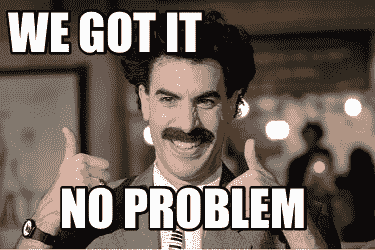
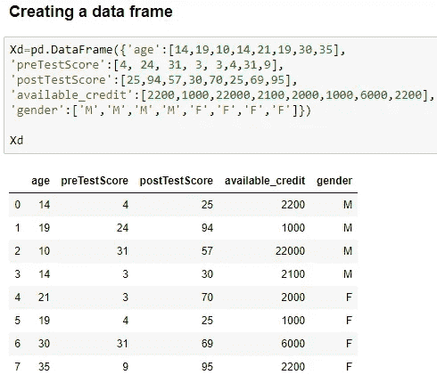
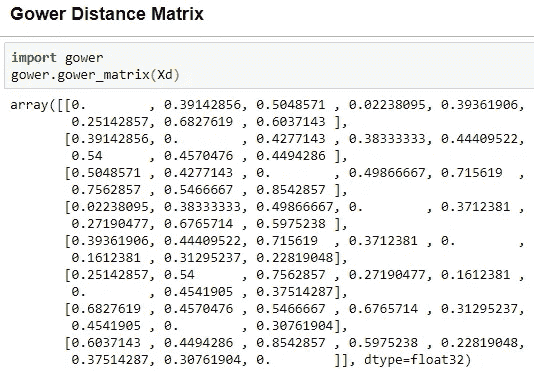
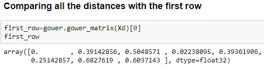
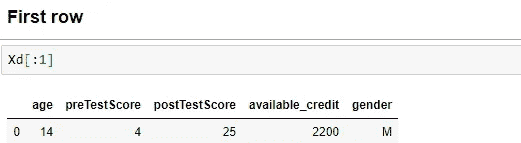
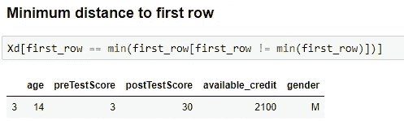
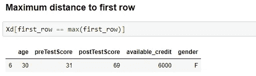

# 高尔距离

> 原文：<https://medium.com/analytics-vidhya/gowers-distance-899f9c4bd553?source=collection_archive---------1----------------------->

> 距离的概念是人类经验的基础。在日常生活中，它通常意味着两个物理对象或概念的某种程度的接近，而术语度量通常被用作测量的标准。我们可以考虑观察值之间的距离或定量或定性变量之间的距离。

距离

对数据进行聚类时，最重要的任务之一是决定使用什么度量来计算每个数据点之间的距离。在通常使用聚类分析的各种现实生活领域中，如生物学、社会科学或市场调查，经常应用带有定量和分类变量的数据集。这种类型的数据称为**混合数据**。存在许多距离度量，其中之一是当数据是混合数据时使用的**高尔距离** (1971)。

# 高尔的距离是多少？

高尔的距离是多少？？？？

高尔的距离可以用来衡量两个记录的不同程度。记录可以包含逻辑、分类、数字或文本数据的组合。该距离始终是介于 0(相同)和 1(最大差异)之间的数字。每种数据类型所用的指标描述如下:

*   定量(区间):距离归一化[曼哈顿距离](https://en.wikipedia.org/wiki/Taxicab_geometry)
*   序数:首先对变量进行排序，然后使用曼哈顿距离，并对关系进行特殊调整
*   名义上: *k* 类别的变量首先被转换成 *k* 二进制列，然后使用[骰子系数](http://stats.stackexchange.com/a/55802/21654)

# **高尔的距离是如何运作的？**

高尔距离被计算为个体间部分差异的平均值。该系数的一般形式如下:

高尔距离公式，其中 **sj(x1，x2)** 作为为每个描述符单独计算的部分相似性函数

**对于定量描述符**，

数据为数值时 **sj(x1，x2)的公式**

**对于定性描述符，**计算骰子距离。每当这些值相等时，骰子距离= 0，当它们不相等时，这就是 sklearn 计算骰子距离的方式。

# 用 Python 实现高尔距离

# **释义**

行 1 和行 3 之间的距离是 0.02，行 1 和行 6 之间的距离是 0.68。

这表明行 1 与行 3 最相似。我们可以验证行的年龄和性别相同，并且前测得分、后测得分以及 available_credit 密切相关。同样，也可以区分第 1 行和第 6 行。

# 结论

在这篇文章中，我们介绍了 Gower 的距离，以及它如何计算两个数据集上的变量对之间的距离，然后将这些距离组合成每个记录对的单个值，以及用 python 实现相同的内容。

最后，我在集群中使用了这个指标。欢迎任何反馈。