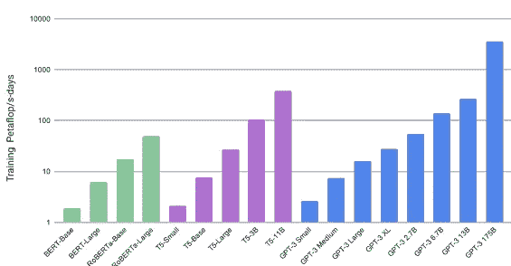
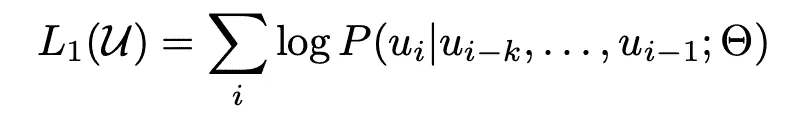
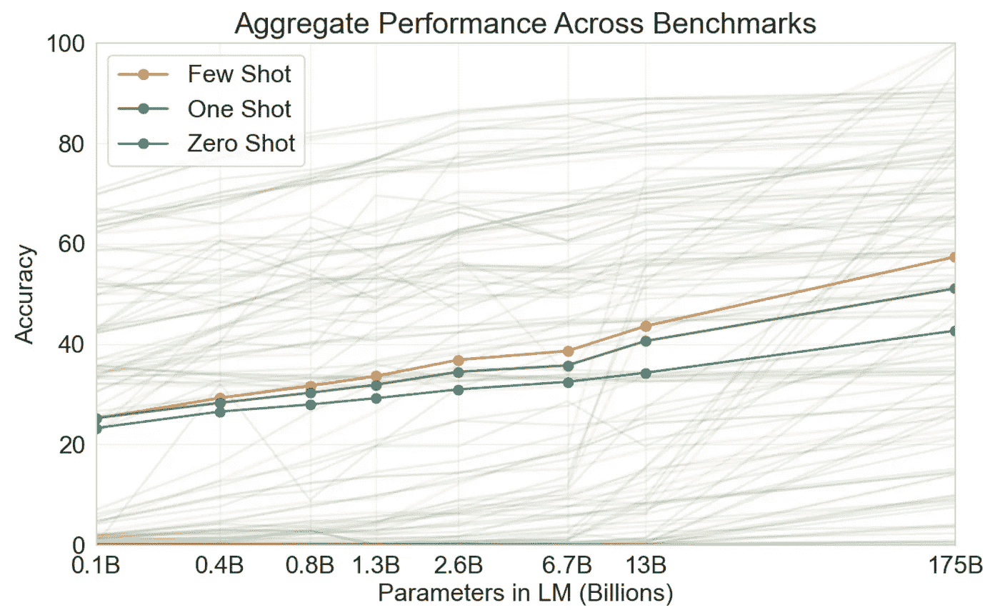
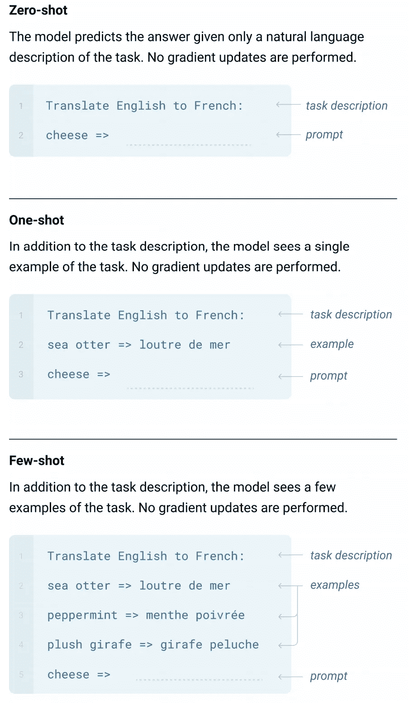

# GPT-3:什么，怎么样&要点是什么

> 原文：<https://medium.com/analytics-vidhya/gpt-3-whats-hows-where-bdc15d204867?source=collection_archive---------12----------------------->

GPT 3 号是巨大的！！

当我第一次听说 GPT-3 时，我的第一印象是它一定是 GPT-2 +更多计算+更多数据。鉴于 GPT-2 本身就是 GPT +更多的计算+更多的数据+很少的聪明黑客，这不是一个坏的预期。事实证明，GPT 3 号也是如此。但是，这并没有削弱 GPT 3 号和它的前辈在过去 3 年中取得的成就。盲目地向语言模型注入更多的东西在达到一定限度后是没有好处的，并且会吸引大量的工程/数据/合规性挑战来处理。

这篇文章讨论了以下内容:

*   GPT-3 在实现基于文本的任务的通用性方面是一个值得称赞的尝试，并且是对 AGI 的一个有希望的贡献，它使用了新的学习范式— [变压器架构](https://arxiv.org/pdf/1706.03762.pdf)和语境学习([元学习](https://arxiv.org/pdf/1703.03400.pdf)
*   从文献中改编一些最佳实践和线索，这对从事实际应用语言建模的 ML 从业者来说会很方便

# 关于 GPT-3 的思考

除了 GPT 命名法之外，看看相应白皮书的名称，我们可以了解 GPT 模型是如何随着时间的推移而发展的，以及它们相对于前辈的贡献。

*   [提高语言理解](https://s3-us-west-2.amazonaws.com/openai-assets/research-covers/language-unsupervised/language_understanding_paper.pdf) (GPT) — **117M 参数** — **~400MB 大小**
*   [语言模型是无监督的多任务学习器](https://cdn.openai.com/better-language-models/language_models_are_unsupervised_multitask_learners.pdf)(GPT-2)——**1.5B 参数**——**~ 5GB 大小**
*   [语言模型是少拍学习器](https://arxiv.org/pdf/2005.14165.pdf) (GPT-3) — **175B 参数**—**500 GB 大小**

出人意料(还是没有？)，学习组件的核心在所有迭代中保持不变— **一个单向的语言建模目标**，尽管最近对它进行了改进(例如 [BERT](https://arxiv.org/pdf/1810.04805.pdf) )

将符号上的联合概率学习为条件概率的乘积

为了完整起见，引用架构变更:

**GPT 到 GPT-2**

> 该模型在很大程度上遵循了开放人工智能 GPT 模型(拉德福德等人，2018 年)的细节，并进行了一些修改。层标准化(Ba 等人，2016 年)被移动到每个子块的输入，类似于预激活残差网络(he 等人，2016 年)，并且在最终自注意块之后添加了额外的层标准化。使用修正的初始化，该初始化考虑了剩余路径上的累积和模型深度。我们在初始化时将残差层的权重缩放 1/ √ N，其中 N 是残差层的数量。词汇量扩大到 50257。我们还将上下文大小从 512 个令牌增加到 1024 个令牌，并使用了更大的批量 512。

GPT 2 号对 GPT 3 号

> 我们的基本预训练方法，包括模型、数据和训练，类似于新 GPT 协议中描述的流程，相对直接地扩大了模型大小、数据集大小和多样性以及训练长度。我们对情境学习的使用也类似于 GPT 新协议，但在这项工作中，我们系统地探索了情境中不同的学习设置。我们使用与 GPT-2 [RWC+19]相同的模型和架构，包括其中描述的修改的初始化、预规范化和可逆令牌化，除了我们在变换器的层中使用交替的密集和局部带状稀疏注意模式，类似于稀疏变换器。

从可用性的角度来看:

*   GPT-2 侧重于**零触发**设置，在该设置中，语言模型执行某些任务的能力在针对所述语言建模目标进行优化后直接进行测试
*   GPT-3 专注于更实用和可扩展的范例——**单镜头**和**少镜头**设置以及零镜头。这使得 GPT-3 在 SOTA 排行榜上遥遥领先于大多数特定任务的微调模型

更多关于元学习、零元学习、少元学习的内容在另一篇文章中。

## GPT-3 及其推广

在高层次上，特定于任务的学习者针对 **p(输出|输入)**进行优化，并且通过针对 **p(输出|输入，任务)进行优化来实现泛化。**最近的架构通过将输入、输出和任务规范都指定为符号序列来实现这一点。例如，翻译请求可以表述为(*翻译成法语、英语文本、法语文本)*，阅读理解任务可以表述为(*回答问题、文档、问题、答案)—* **上下文学习**

GPT-3 在 42 个标记任务上的综合表现——证明其在环境中的学习能力

GPT-3 基于最近的主张，即足够大的转换器架构改善了文本合成和跨多个任务的下游性能，以及与许多下游任务密切相关的日志丢失遵循随着规模而改善的平稳趋势的证据。GPT-3 假设并证明了*由于情境学习涉及吸收模型参数中的许多技能和任务，因此情境学习能力可能会随着规模扩大而显示出类似的强劲增长。*

显示 GPT-3 推理时间行为的零发、一发和少发插图

*   在推理过程中，模型期望一组示例(上下文、样本输入和输出)将模型引导到当前的问题设置中
*   GPT-3 使用这些例子来推断新的查询输入，而不在过程中反向传播梯度
*   模型的推理时间行为取决于问题类型
*   例如，在涉及从几个选项中选择一个正确完成的任务上，我们提供 K 个上下文和正确完成的例子，后面是仅一个上下文的例子，并且比较每个完成的 LM 可能性。对于大多数任务，我们比较每个令牌的可能性(以归一化长度)，但是在少数数据集(ARC、OpenBookQA 和 RACE)上，我们通过归一化每个完成的无条件概率，通过计算 *P(完成|上下文)/P(完成|答案上下文)*，获得了额外的好处，其中答案上下文是字符串“答案:”或“A:”并用于提示完成应该是答案，但在其他方面是通用的。

# **给传销从业者的建议**

## **面向潜在的 GPT-3 用户**

虽然列出 GPT-3 可以使用和不可以使用的广泛情况是不可行的，但在接听电话时考虑这些要点是值得的。这些建议是基于这样一个假设，即我们不会很快获得输入文本的 GPT-3 特征向量，除非他们开源整个 GPT-3 模型。

*   如果您的用例与互联网上可用的免费文本有很大关系，并且/或者用于 GPT-3 培训的数据集与您的用例相关，则该用例类似于 GPT-3 显示出可观结果的那些任务，您可以尝试一下
*   如果您的用例需要开放+专有数据，并且用例符合 GPT-3 协议的设置，那么 GPT-3 协议的使用可能是有限的或特定于用例的
*   对于完全由专有数据驱动的案例，OOTB GPT-3 可能没有太多实际帮助

## 对于 ML 工程师和黑客来说

对我来说，关键的一点是 GPT-3 的核心是经典语言建模客观，但在很少/没有监督的情况下击败 SOTA 图表确实令人鼓舞

*   当你有足够的数据来微调具有语言模型目标的 GPT 式架构时，我们可以在定制数据集上取得惊人的结果
*   LM 自适应需要仔细照看微调过程，并识别提高微调模型性能的无监督辅助任务
*   它极大地有助于建立日志丢失和目标用例之间的关联。正如在 GPT-3 和其他最近的论文中观察到的，日志丢失与大多数文本下游任务相关——这应该涵盖了我们今天解决的大多数问题
*   对于人工检查不容易访问数据的用例，通过观察日志丢失和辅助任务的性能来盲调语言模型是一种可行的嗅探测试，也是一种利用数据的方法，而不是在受限数据上使用 OOTB 语言模型。要获得更多关于选择辅助任务和参考论文的帮助，请查看附加的帖子(有点过时，但应该是一个好的起点)
*   建立一个可靠的特征提取器是大多数文本任务的关键，其中标记数据是稀疏的。GPT-3 及其前身概述了如何实现这一目标。参考 [GPT](https://s3-us-west-2.amazonaws.com/openai-assets/research-covers/language-unsupervised/language_understanding_paper.pdf) 论文了解方法，参考 [GPT-2](https://cdn.openai.com/better-language-models/language_models_are_unsupervised_multitask_learners.pdf) 、 [GPT-3](https://arxiv.org/pdf/2005.14165.pdf) 了解有用的技巧和改进

 [## 【Part-1】你需要哪方面的关注(架构)？

### 面向 NLP 任务的变压器架构最新进展综述

medium.com](/ether-labs/https-medium-com-ether-labs-attention-architecture-1-60caf491fc8e)  [## 【Part-2】你需要哪方面的关注(架构)？

### 面向 NLP 任务的变压器架构最新进展综述

medium.com](/ether-labs/part-2-which-attention-architecture-do-you-need-c327aaa771f8) 

# 结论

虽然 GPT-3 有其自身的局限性，有很多改进的空间，但就模型大小、训练数据大小和智能训练策略而言，这是一个惊人的壮举。虽然微调和处理这样的大规模模型还不是大多数 ML 实践者所能达到的，但关键的收获是 GPT-3 及其前身强化了这样一个事实，即基本语言建模范式本身足以用于大多数下游任务，其中标记数据集的可用性是一个挑战。

很乐意讨论您是否有任何可以通过语言模型和微调解决的用例。

快乐学习！！