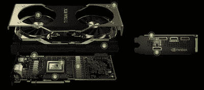

# GPU 加速计算

> 原文：<https://medium.com/analytics-vidhya/gpu-accelerated-computing-7dbe0920222e?source=collection_archive---------19----------------------->

*我不相信当有人说，“***”金钱买不到时间，你呢？😉原因如下……**

*投资一些钱买一个 GPU 可以节省很多时间。现在你还相信金钱买不到时间吗？我不这么认为。？*

*你还在做什么？面向对象的..何不知道 gpu，然后看看这里:-)*

**

***GPU** 代表**图形** **处理单元**。你还会看到**GPU**通常被称为**显卡**或**显卡**。每台电脑都使用 **GPU** 渲染图像、**视频**和 2D 或 3D 动画进行显示。GPU 执行快速数学计算，并释放 CPU 做其他事情。*

*每个现代移动设备都有某种形式的 GPU 来帮助生成图像和计算机图形，并且是每个现代移动设备的重要组成部分。GPU 在并行处理大部分数据方面也比 CPU 好得多，并允许 CPU 以更少的工作来产生详细的计算机图形*

**

## *超级计算 GPU 架构现在正在推动每个行业的突破。*

## *特定用途的 GPU*

*大多数 GPU 都是为特定用途而设计的，*实时 3D 图形*或其他*海量计算*:*

1.  *赌博*

*   *[RTX GTX GeForce](https://en.wikipedia.org/wiki/GeForce)*
*   *[英伟达泰坦](https://en.wikipedia.org/wiki/Nvidia_Titan)*
*   *[镭龙 HD、R5、R7、R9、RX、Vega 和 Navi 系列](https://en.wikipedia.org/wiki/Radeon)*

*2 .云游戏*

*   *[英伟达网格](https://en.wikipedia.org/wiki/List_of_Nvidia_graphics_processing_units#Comparison_table:_Grid_GPUs)*
*   *AMD 镭龙天空*

*3 .工作站(视频编辑、编码、解码、代码转换和渲染(数字内容创建)、3D 动画和渲染、VFX 和动画(CGI)、视频游戏开发和 3D 纹理创建、产品开发/3D CAD、结构分析、模拟、CFD 分析和科学计算……)*

*   *[英伟达 Quadro](https://en.wikipedia.org/wiki/Nvidia_Quadro)*
*   *[AMD FirePro](https://en.wikipedia.org/wiki/AMD_FirePro)*
*   *[AMD 镭龙 Pro](https://en.wikipedia.org/wiki/Radeon_Pro)*
*   *AMD 镭龙七世*

*4 .云工作站*

*   *[英伟达特斯拉](https://en.wikipedia.org/wiki/Nvidia_Tesla)*
*   *[AMD FireStream](https://en.wikipedia.org/wiki/AMD_FireStream)*

*5 .人工智能训练和云*

*   *[英伟达特斯拉](https://en.wikipedia.org/wiki/Nvidia_Tesla)*
*   *[AMD 镭龙本能](https://en.wikipedia.org/wiki/Radeon_Instinct)*

**

*英伟达泰坦 RTX*

*今天只有英伟达和 AMD 做显卡。**英伟达泰坦 RTX** 是由世界上最先进的架构——英伟达图灵为个人电脑打造的最强大的显卡。*

# ***英伟达 VS AMD***

*与英伟达相比，AMD GPUs 往往有更多的处理核心——流处理器、GPU 核心或任何你想称呼它们的东西。例如，AMD RX Vega 64 有 4，096 个 GPU 核心，而竞争对手英伟达 GTX 1080 有 2，560 个核心。RX 580 (2，304 个内核)与 GTX 1060 6GB (1，280 个内核)也是如此。Nvidia 通常通过更高的时钟速度和更好的效率来弥补核心数量的不足。*

****

*英伟达 GeForce — AMD 镭龙*

*今天，在原始性能方面，哪种 GPU 更快是毫无疑问的。英伟达的 GTX 1080 Ti 及以上轻松击败 AMD 最快的 GPU，该公司的新 RTX 2080 Ti 卫冕冠军。*

***英伟达在整个 GPU 市场份额中遥遥领先***

# *深度学习为什么需要 GPU？*

*深度学习需要大量的计算能力来运行。*

*GPU 速度很快，因为它们有高带宽存储器和硬件，执行 C 浮点运算的速度比传统 CPU 快得多。*

*但是在 2007 年，NVIDIA 创造了 CUDA( **计算统一设备架构)**。CUDA 是一个**并行计算平台**，为开发者提供 API，允许他们构建能够利用 GPU 进行**通用处理**的工具。*

*对于任何神经网络，深度学习模型的训练都是最耗费资源的任务*

*在训练过程中，神经网络接收输入，然后使用在训练过程中调整的*权重*在隐藏层进行处理，然后模型给出预测。调整权重以找到模式，从而做出更好的预测。*

*如果你的神经网络有 1000，100，000 个参数，cpu 将能够处理这些，但如果神经网络有数十亿个参数，那么它将需要几个月的时间来训练，你的计算机可能会中途放弃。*

**

**“一个神经网络接受搜索输入，并从 1 亿个输出或产品中进行预测，通常每个产品会有大约 2000 个参数。所以你把它们相乘，神经网络的最后一层现在是 2000 亿个参数。我没有做过任何复杂的事情。我说的是一个非常非常死简单的神经网络模型。”**

**—莱斯大学学生**

*只需使用 gpu 来训练您的模型，就可以更快地完成训练。*

*使用 CPU 还是 GPU 来训练深度学习模型:*

*   *数据大小:通常深度学习模型使用大型数据集，因此在训练模型时会进行大量计算，因此 GPU 是最佳选择*
*   *架构:如果你的神经网络比较小，没有 gpu 也可以做。*

*买不起 GPU 怎么办？*

*云 GPU 实例:*

*如果你不想买一堆昂贵的 GPU，你可以通过云托管公司如 AWS，微软 AZURE，谷歌云平台(GCP)，甲骨文云按需获得 GPU。它们将使您无需配置硬件，最重要的是，它们并不昂贵。*

*使用时，费用从每小时 0.225 美元(AWS p2 . x large-EMR)不等。*

*图片来源:nvidia.com 谷歌*

*其他来源:维基*

*结论:金钱可以买到时间。*

***下篇预告:***

*   **colab 简介**
*   **colab 的免费服务**
*   **在 google colab 上启用和测试 GPU**
*   **py torch 中的 Cuda**
*   **使用 Pytorch、Tensorflow、Xgboost 测试 GPU**
*   **TPU**

**

*国家政治保卫局。参见 OGPU*

*快乐学习。*