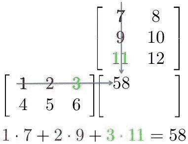

# GPU 是深度学习的必要条件

> 原文：<https://medium.com/analytics-vidhya/gpu-an-essential-requirement-for-deep-learning-7a379911af01?source=collection_archive---------14----------------------->

GPU 或图形处理器是一种擅长处理计算的处理器。

好吧！！但同样的事情是由 CPU 或(中央处理单元)来完成的，关于 CPU 或(中央处理单元)，我们从学生时代就已经了解到它是“计算机的大脑”。

因此，一个重要的问题是，GPU 和 CPU 的区别在哪里？

为了回答这个问题，让我们稍微调整一下我们之前的定义——
GPU 擅长处理“**专门计算**”，CPU 擅长处理“**一般计算**”。

另一个问题是，特殊和一般计算的例子是什么？
训练深度学习模型时，会执行两个主要操作:

1.  **向前传球**
2.  **向后传球**

在前向传递中，输入通过神经网络传递，在处理输入之后，产生输出。而在后向过程中，我们根据前向过程中得到的误差来更新神经网络的权重。

这两种运算本质上都是矩阵乘法。简单的矩阵乘法可以用下图来表示

在这里，我们可以看到第一个数组的一行中的每个元素都与第二个数组的一列相乘。因此，在神经网络中，我们可以将第一个数组视为神经网络的输入，而将第二个数组视为网络的权重。

这似乎是一个简单的任务。现在只是让你了解一下深度学习的规模——vgg 16(深度学习应用中经常使用的 16 个隐藏层的卷积神经网络)有大约 1.4 亿个参数；也就是权重和偏见。现在想一想，要将一个输入传递到这个网络，您必须做的所有矩阵乘法！如果我们采用传统的方法，将需要数年时间来训练这种系统。

如何更快的训练自己的神经网络？
我们看到，神经网络的计算密集型部分由多个矩阵乘法组成。那么如何才能让它更快呢？

我们可以通过同时执行所有操作而不是一个接一个地执行来简单地做到这一点。简而言之，这就是为什么我们使用 GPU(图形处理单元)而不是 CPU(中央处理单元)来训练神经网络。

神经网络的训练是一种专门的计算，这里 GPU 比 CPU 快，但并不总是如此。你自己可以通过一个简单的标量乘法的例子来验证这一点，你会发现 CPU 比 GPU 快。标量乘法是一般计算的一个例子。

**现在你可能想知道为什么 GPU 在神经网络中速度更快？**

答案是:-

1.  **更大的内存带宽**
2.  **他们使用并行化**
3.  **快速(或更多)内存访问**

在 CPU 中，少量数据以较快的速度提取，而在 GPU 中，大量数据以较慢的速度提取。内存带宽是指在一次往返内存的行程中传输的数据量。因此，我们可以说 GPU 比 CPU 有更高的内存带宽。

将 GPU 与并行化相结合，我们提高了 GPU 的速度。

GPU 拥有更快的内存，因为 GPU 的 L1 和 L2 缓存小于 CPU 的 L1 和 L2 缓存，更小的缓存意味着它们的访问速度更快。此外，流线型处理器由超快的寄存器组成。

参考资料:-

 [## 为什么 GPU 比 CPU 更强大？

### 回答(40 题中的第 1 题):这些人在采茶:我们不知道他们中是否有人特别擅长采茶，但是…

www.quora.com](https://www.quora.com/Why-are-GPUs-more-powerful-than-CPUs)  [## 为什么 GPU 对于训练深度学习模型是必要的？

### 引言你们中的大多数人应该听说过利用深度学习发生的令人兴奋的事情。你也会听说…

www.analyticsvidhya.com](https://www.analyticsvidhya.com/blog/2017/05/gpus-necessary-for-deep-learning/)  [## CUDA — GPU 内存架构

### 大多数台式电脑和笔记本电脑都由一个连接到大量系统内存的 CPU 组成，这些内存在…

medium.com](/@ashanpriyadarshana/cuda-gpu-memory-architecture-8c3ac644bd64) 

**如果你从这个博客中获得了任何信息，别忘了**👏！！