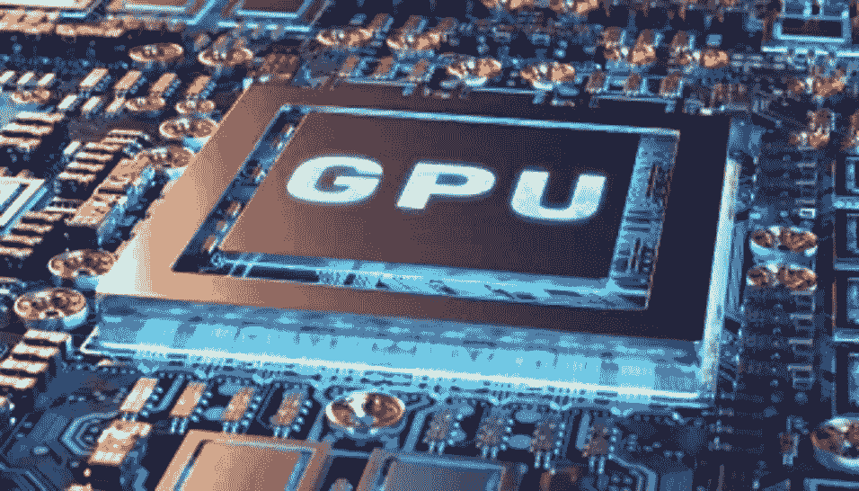

# 用于深度学习的 GPU

> 原文：<https://medium.com/analytics-vidhya/gpu-for-deep-learning-7f4ef099b702?source=collection_archive---------12----------------------->

围绕深度学习的讨论经常误导外行人认为这是一项新发明的技术，但当他们知道深度学习的基础早在 20 世纪 40-50 年代就已经奠定时，他们感到震惊。深度学习有很长的历史,其中大多数流行的深度神经网络架构和理论在整个 20 世纪下半叶就已经提出了。如果是这样的话，那么你…