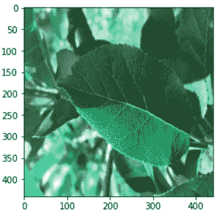
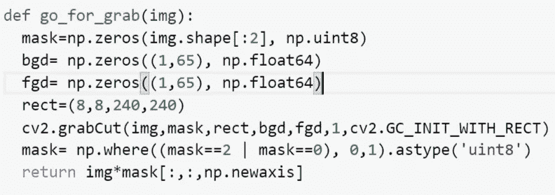
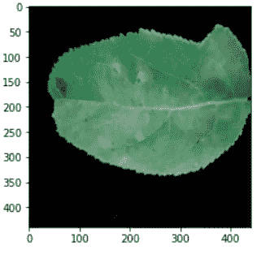
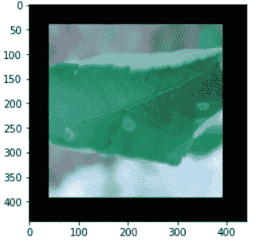
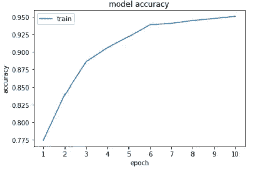
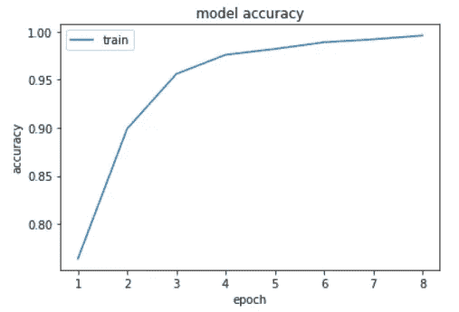

# Grabcut 算法 OpenCV 的一个特性，可以极大地提高图像处理模型的性能。

> 原文：<https://medium.com/analytics-vidhya/grabcut-algorithm-an-opencv-feature-that-might-improve-image-handling-models-performance-greatly-cfc39de90d58?source=collection_archive---------18----------------------->

这个故事背后的目标不是从数学上说明 Grabcut 背后的算法，而是演示该功能可以如何极大地提高模型的性能。请记住，这个故事并没有从任何意义上推断出该特性在所有图像处理模型上都可以很好地工作。最近，在参加由 5 个不同问题陈述组成的计算机视觉黑客马拉松时，我决定阅读著名的 OpenCV 文档。在尝试使用不同的工具进行数据预处理时，我最初选择了 Grabcut。我将讨论我的模型性能有和没有 Grabcut。

问题陈述是将叶子的图像分类为健康和非健康类别。虽然我最初打算使用一个更大更好的模型，但是五个小时的时间限制使我无法这样做。数据集由带有一些背景细节的树叶图片组成。然而，ROI(感兴趣区域)主要是叶子的表面。

来自数据集的样本图像

背景不需要推断结果的原因是，我决定去掉它，而没有明确地训练一个模型来这样做。因此，我决定使用 Grabcut。如前所述，这个故事不会涉及算法的复杂性，除了关键点，我不会讨论功能。代码中的 ***rect*** 变量存储图像中里约的尺寸。所以，这个要明智的选择。

用于实现 Grabcut 的函数

使用该算法后，我可以很容易地获得没有背景的图像。看下面。

图像后剪切

对于算法移除了完整叶子的图像，我选择了那些使用*图像阈值*的图像，并在它们周围创建了一个简单的黑色边框。见下图。

Grabcut 无法正常工作的图像

结果，我得到了高度改进的模型精度。前一个模型在 95%的准确率时饱和，而后者在较短的时期内达到了 99%以上。

前一种模式

后一种模式

这就是我如何在时间限制内建立一个图像分类模型。但是，请不要忘记以类似的方式增加测试数据:-)。特别感谢谷歌的免费 TPU 帮助我在黑客马拉松中排名前十。