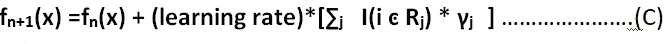

# 梯度增强——最广泛使用的最大似然算法之一的鸟瞰图

> 原文：<https://medium.com/analytics-vidhya/gradient-boosting-a-birds-eye-view-into-widely-used-ml-algorithm-a95db080d256?source=collection_archive---------19----------------------->

杰佛森·桑多斯在 [Unsplash](https://unsplash.com?utm_source=medium&utm_medium=referral) 上拍摄的照片

梯度推进是最广泛使用集成方法。它是用于解决许多复杂问题的许多机器学习算法之一。广义上讲，集成方法可以分为两类，即 boosting 和 bagging。顾名思义，梯度推进属于第一类，即推进。

梯度增强背后的直观想法很简单。根据响应值拟合第一个模型，然后根据各自的负梯度拟合后续模型，然后将其集成以获得最终预测值。

根据上述直觉，很容易认为梯度推进算法背后模型与梯度下降非常相似，其中:

L 是损失函数，L(fn(x)，y)是集合 n 个基本模型后的损失。

也就是说，我们首先在响应变量(y)上拟合模型，该响应变量由 f0(x)预测，然后 ***在 gradient -d[L(f0(x)，y)]/d[fn(X)]*【T7]上拟合模型，并集合它以获得 f1(X)并迭代地进行该过程。虽然从广义上讲这就是梯度推进算法的工作方式 ***但这并不完全正确*** 。**

为了更深入地理解梯度增强，我们首先要理解 ***“在 gradient -d[L(f0(x)，y)]/d[fn(x)]”***实际上是什么意思 ***。这里我们将考虑一个场景，其中我们的基础模型是决策树。也就是说，我们在响应值/负梯度上拟合决策树，然后集成它。***

任何机器学习算法背后的思想都是识别一个适当的损失函数，然后将其最小化。对于回归任务，损失函数可以是均方误差(MSE)或平均绝对误差(MAE ),对于分类，损失函数可以是分类交叉熵、铰链损失等。

这里，我们考虑损失函数为 L(fn(x)，y)的一般情况，其中，

y 是观察到的响应值。

fn(x)是 n 个决策树集成后的预测值

l 是损失函数。

假设我们的特征向量空间是 m 维的，也就是说，

在梯度推进算法中，我们主要解决两个优化算法

第一种优化算法将 m 维特征向量空间 x 分成不同的最佳区域，每个区域具有 m 维(树节点的分裂)。

第二种优化算法评估每个区域的最佳预测值(评估每个叶子的预测值)。

**寻找最佳区域**

第一个优化问题的目标函数是

在哪里

**gi= d[L(fn(x)，y)]/d[fn(x)]** 对于 i=1，2，3，4……..p，p 是训练集中数据点的数量。

**T(x,ʘ)** 是该地区ʘ.的预测值

所以基本上上面的目标函数 ***实现的是找到区域(ʘ)*** ，最小化目标函数 **A.**

注意目标函数是(A)是平方损失。这被称为 ***弗里德曼损失函数*** 。

***注意，我们解决的是分类问题还是回归(梯度推进分类或梯度推进回归)问题并不重要，使用这个弗里德曼损失函数总能找到最佳区域。***

这就是所谓的 ***【渐变上拟合模型】***

在标准决策树中，当我们解决类似于(a)的优化问题时，我们也已经获得了该区域(ʘ)的预测值 T(x,ʘ，在这种情况下，不需要解决第二个优化问题。

然而，在梯度推进算法中，很酷的事情正在发生。这里，一个区域被识别，第二优化算法被优化以评估预测值。

**获得预测值**

第二个优化问题的目标函数是

在哪里

j= 1，2，3，4……q(树的总区域/末端叶)

Rj 是第 j 个末端叶片。

一.在 Rj 地区的观察

fni (x)是在 n 个基础模型(在这种情况下是树)被集合用于第 I 次观察之后的预测值

求解优化问题(B)我们在 n+1 个基础模型被集成之后得到预测值，并且它被给出为:

在哪里

γj 通过优化区域 j 的目标函数 B 来获得

I(i ͼ Rj)是指示函数，如果 i ͼ Rj 为 1，否则为 0。

j= 1，2，3，4……q(树的总区域/末端叶)。

求解这两个算法完整的解释了梯度提升算法。为了更好地理解，需要强调梯度增强的某些特征。

1.无论我们的任务是什么，为了找出最优区域(决策树的叶子),我们总是使用弗里德曼损失函数，这是一个平方损失函数。我们之所以用这个，是因为我们有很多不同的方法来优化平方损失函数。

2.然而，为了评估预测值，我们使用损失函数 **L** ，损失函数的选择取决于我们使用的是分类问题还是回归问题。这样做的好处是，它在某种程度上也正规化了。

以上文章试图简要解释梯度推进算法如何工作。这是一种广泛用于解决许多 ML 问题的算法，并且经常通过超参数调整给出好的结果。我会在下一篇文章分享用 python 中的 *sklearn 包*实现梯度提升算法。