# 梯度增强——最广泛使用的最大似然算法之一的鸟瞰图

> 原文：<https://medium.com/analytics-vidhya/gradient-boosting-a-birds-eye-view-into-widely-used-ml-algorithm-part-2-6684c68fc262?source=collection_archive---------16----------------------->

## 第 2 部分:可视化、直觉和梯度推进的实际演示

在 [Unsplash](https://unsplash.com?utm_source=medium&utm_medium=referral) 上由 [Carlos Muza](https://unsplash.com/@kmuza?utm_source=medium&utm_medium=referral) 拍摄的照片

在我的上一篇文章中，我简要解释了梯度推进算法背后的数学原理。尽管理解任何最大似然算法的本质对于它的应用都是必不可少的，但它还不足以充分发挥它的潜力。在这篇文章中，我将使用可视化来提供梯度推进算法的良好直觉，以及每个估计器(在这种情况下是决策树)如何在预测的最终集成中做出贡献。

在我以前的文章中，我已经解释了“适合梯度”是什么意思。你可以在下面找到文章的链接:

[https://medium . com/@ palash . jhr/gradient-boosting-a-birds-eye-view-into-wide-used-ml-algorithm-a95db 080d 256](/@palash.jhr/gradient-boosting-a-birds-eye-view-into-widely-used-ml-algorithm-a95db080d256)

在损失函数为均方误差(MSE)的典型回归任务中，以下等式成立:

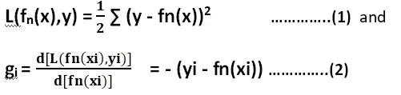

请注意，我将 1/2 乘以平方损耗，这不会产生任何影响，因为最小化平方损耗与最小化一半平方损耗是一样的。

正如我在上一篇文章中解释的

 [## 梯度推进——对广泛使用的 ML 算法的鸟瞰

### 理解梯度增强背后的数学。

medium.com](/@palash.jhr/gradient-boosting-a-birds-eye-view-into-widely-used-ml-algorithm-a95db080d256) 

通过优化找出区域，

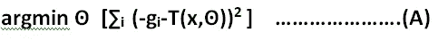

并且通过优化给出预测，

如果损失函数是 MSE，那么在这种情况下，

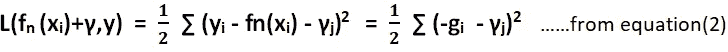

因此，等式(B)现在可以写成:

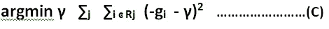

现在，每个实例***【I】***将属于某个区域 Rj(树的末端叶子)，并且对于每个 Rj 将有一个预测值。这些值是通过等式(c)获得的 **γj** 和通过等式(a)获得的 T(x,ʘ。因为等式(A 和 C)都在优化每个区域平方损失函数，

我们可以这么说，

γj = T(xi,ʘ)为 i ͼ Rj

因此，等式(C)现在可以写成:

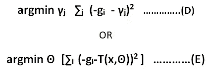

**其中，**

T(x,ʘ)是ʘ.地区的预测值

因此，现在用于生长下一棵树的后续优化目标函数是:

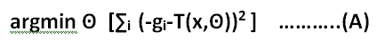

*为了找到最佳区域，*

**和**

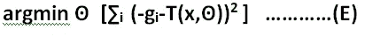

*用于评估对一个地区的预测。*

这些等式(A 和 E)与生成决策树是一样的。然而，请注意，这里后续的树是在梯度为负的 **(-gi)上生长的，该梯度等于来自先前基本估计器的残差**(来自等式 2)。

因此，使用 MSE 作为损失函数的梯度推进等价于在来自先前估计器的残差上拟合随后的基础估计器(决策树)。

# **逐步实施梯度推进**

下面是我在本文中用于演示的样本数据图:

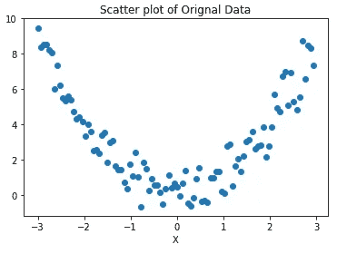

在这一节中，我已经展示了不同的估计量如何拟合先前的残差，以及这些基本估计量的集合如何逐渐拟合数据。为了实现这一点，遵循以下步骤:

1.使用解释变量 x 和响应变量 y 拟合第一个决策树。

2.评估第一个决策树(resd_1)的残差，并使用解释变量 x 和响应变量 resd_1 拟合第二个决策树。

对来自第一决策树和第二决策树的预测求和，以产生总预测。

3.评估第二个决策树(resd_2)的残差，并使用解释变量 x 和响应变量 resd_2 拟合第三个决策树。

将来自第一、第二决策树和第三决策树的预测相加，以产生总预测。

4.类似地，对随后的树进行上述计算。

*遵循上述程序，观察到以下结果*

**集合中树的数量为 1 时的模型拟合**

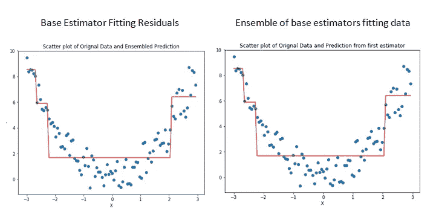

**集合中的树数为 2 时的模型拟合**

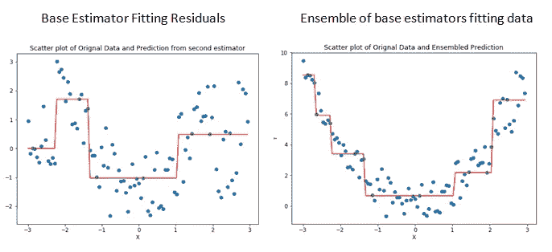

**集合中的树数为 3 时的模型拟合**

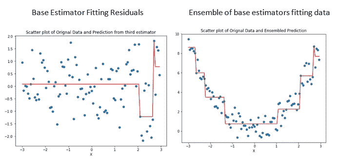

**集合中的树数为 4 时的模型拟合**

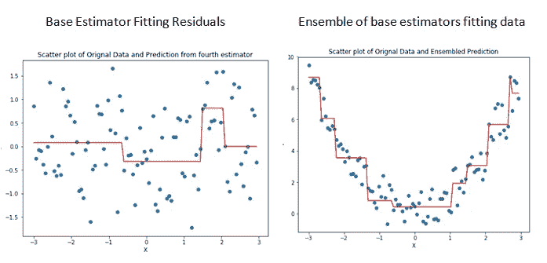

可以看出，每个估计器拟合来自先前估计器的残差，并且它们的集合逐渐拟合原始数据。

# **Scikit 学习梯度增强的实现**

在本节中，我使用了 scikit learn 实现梯度增强。虽然由于 scikit-learn 实现中使用了不同的 hyper 参数，结果与上述结果不完全相同，但是先前实现和 scikit-learn 实现之间的结果模式的相似性足以给出梯度增强算法如何在幕后工作的合理直觉。

使用的超级参数有:

**学习率** = 0.1

**最大深度** = 2

**n _ 估计量** = 250

以下是 MSE v/s 拟合树数的图表:

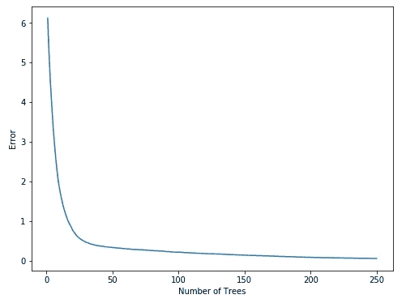

**MSE V/S 树木数量**

可以看出，MSE 在大约 100 棵树处弯曲。虽然随着树木数量的增加，MSE 会进一步降低，但继续增加树木数量并不是明智的选择。*(其原因是数据过度拟合的可能性，偏差方差权衡，这将在不同的文章中讨论)*

因此，对于所选的超参数，看起来树的数量接近 100 是最佳的。

注意，这里我使用了最大深度 2。也就是说，每棵树将只有 4 个终端节点 ***。在任何提升算法中，需要控制每个估计器的复杂度。boosting 的思想是每个估计器的表现应该比随机情况稍好，然后我们使用 boosting 来改进每个阶段的预测，然后集合每个估计器的预测来产生最终预测。***

下面我展示了不同数量的树的集合是如何拟合 scikit-learn 实现的数据的。

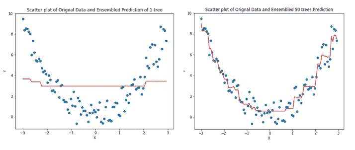

**树的数量是 1(左边)，树的数量是 50(右边)**

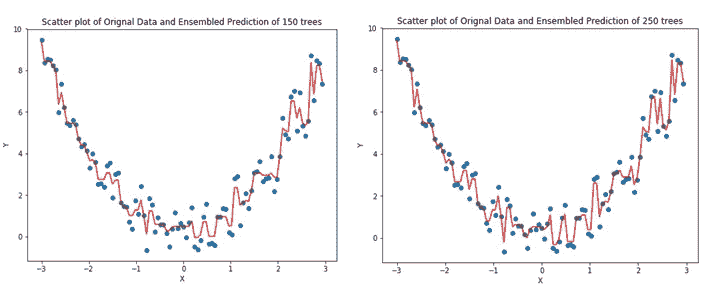

**左侧的树数是 150，右侧的树数是 250**

可以看出，随着估计数的增加，模型更适合数据。然而，当估计器的数量达到 150，250 时，它开始模拟噪声，这似乎对任何最大似然模型都不好。因此，识别学习率、最大深度和估计器数量的正确组合是适当调整梯度推进模型的关键。

梯度推进非常灵活，通常可以很好地执行各种 ML 任务(分类和回归)。有大量的 hyper 参数*(查看 sklearn 文档)*需要调整，这可能会给初学者带来一些麻烦。然而，sklearn 中有各种模型选择方法，如 GridsearchCV、RandomizedSearchCV 等，可以用来对算法进行微调。

损失函数的选择也是选择的重要参数。有许多损失函数可以使用。一些例子是指数(分类)、偏差(分类)、最小绝对偏差(回归)、MSE(回归)。使用不同的损失函数会导致不同的算法性能。例如，如果我们使用指数损失函数，那么梯度增强将与 AdaBoost 算法相同。甚至，当选择指数损失函数时，梯度推进调用 SAMME。r 算法，用于 AdaBoost 分类器。

我想用一句告诫的话来结束我的文章。提升算法和梯度提升算法很容易很快过度拟合数据，因此在使用这些算法和部署这些算法以生成真实世界问题的预测时必须非常小心。有不同的方法来检查我们是否真的过度拟合了数据，尽管这是不同文章的主题。