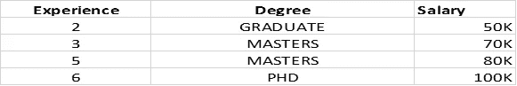
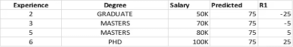
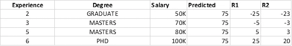

# 梯度推进:算法背后的直觉

> 原文：<https://medium.com/analytics-vidhya/gradient-boosting-intuition-behind-the-algorithm-e567ed908100?source=collection_archive---------10----------------------->

如果你是一个 ML 爱好者，那么你一定听说过梯度推进这个名字。嗯……如果不是，那么没问题，你是在正确的地方着陆了。

*梯度增强非常流行，广泛应用于 ML 领域。这是一种可以应用于分类或回归问题的提升技术。*

> 增强是一种创建合奏的方法。首先，将初始模型(例如，树或线性回归)与数据进行拟合。然后建立第二个模型，该模型着重于准确预测第一个模型表现不佳的情况。这两种模式的结合有望优于单独的任何一种模式。然后你重复这个升压的过程很多次。每个连续的模型试图校正所有先前模型的组合增强系综的缺点。

该算法背后的主要直觉是，当与先前的模型相结合时，最可能的下一个模型使整体预测误差最小化。关键思想是为下一个模型设定目标结果，以最小化误差。让我们用一个回归问题的数据例子来理解这一点。

在这个问题中，我们希望根据候选人的经验和学位(独立变量)来预测工资(目标)。

在回归的情况下，我们首先创建我们的基本模型，它将是所有实际输出的平均值。

在我们的例子中，它将是 50 + 70 + 80 + 100 / 4 = 75

因此，这个基础模型将为任何下一个预测提供 75k 的输出。

接下来，我们将计算伪残差，即

**实际(工资)—预测。**

下一步，我们将创建一个决策树，将自变量(经验、程度)作为输入，剩余 R1 作为输出。

在这一步之后，我们将有两个模型。第一个是基础模型，第二个是我们用剩余的 R1 创建的。现在，我们可以通过将两个模型的值相加来进行当前预测。让我们看看(经验=2，学位=毕业)的预测值

**基本模型+ M(R1) = 75 + (-25) = 50(等于实际值)**

我们可以看到，预测值等于实际值意味着模型过度拟合，或者我们可以说我们的模型具有低偏差和高方差。

为了克服这个问题，算法使用称为学习率的参数α(@)。学习率的值介于(0，1)之间。因此，应用这一点，我们的下一个预测假设(@ = 0.1)将是:-

**基本模型+ (@) * M(R1) = 75 + (0.1)(-25) = 72.5(实际= 50)**

在下一步中，我们将再次计算残差，然后使用所有弱学习器预测值。让我们看看下面的下一步

从这个状态来看，我们的预测是

**基础模型+(@)* M(R1)+(@)* M(R2)= 75+(0.1)(-25)+(0.1)(-23)= 70.2(实际= 50)**

你已经观察到，随着我们走得更远，添加更多的弱学习者，我们的残差越来越小，我们的预测值正在接近实际值，这是我们对这个问题的座右铭。为了概括这一点，我们可以写一个等式

f(x)= h0(x)+@ 1 * h1(x)+@ 2 * H2(x)………………+ @n * hn(x)。

我希望这将阐明梯度推进算法背后的直觉。我们可以进一步探索数学实现以获得更深入的研究。

如果你喜欢这篇文章，请鼓掌。