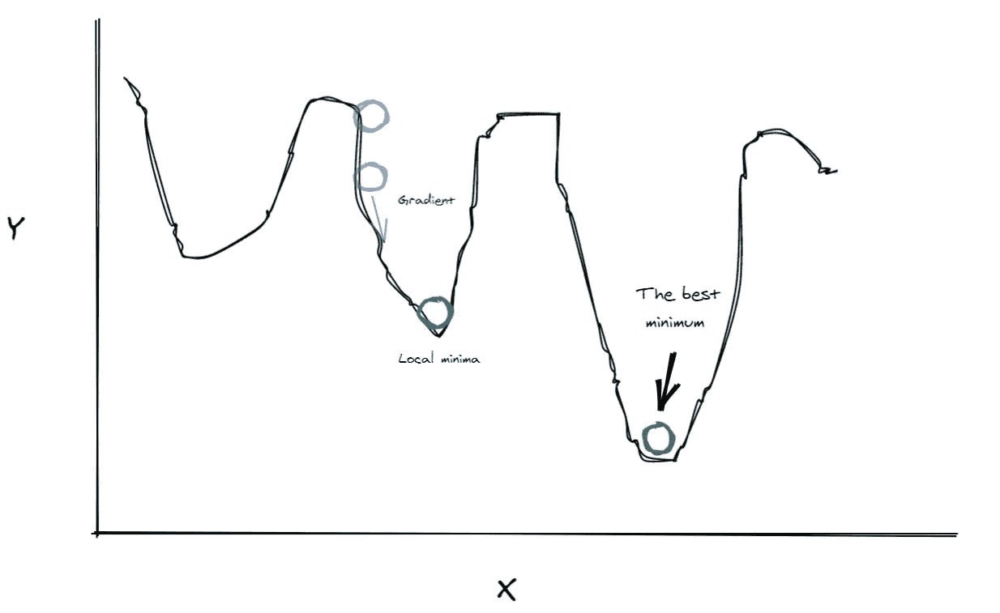
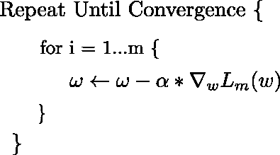
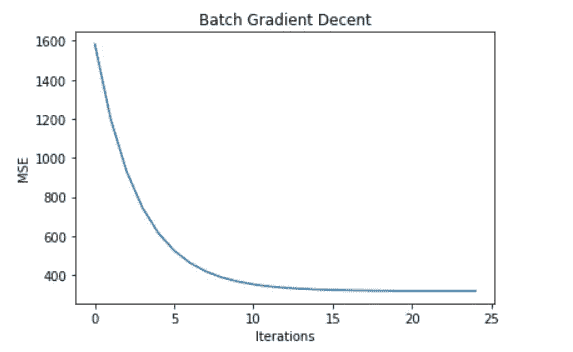
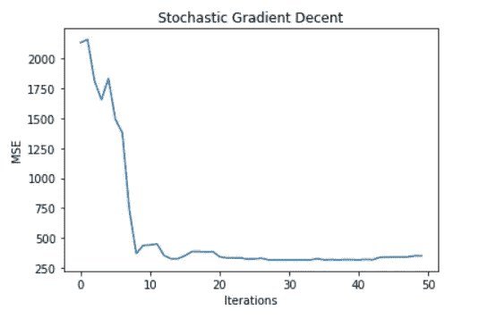
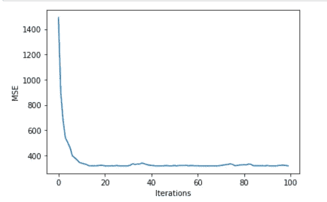

# 渐变体面动画

> 原文：<https://medium.com/analytics-vidhya/gradient-decent-animated-25f4bdd39109?source=collection_archive---------23----------------------->

卢卡斯·克拉拉在 [Unsplash](https://unsplash.com?utm_source=medium&utm_medium=referral) 上的照片

> “我们的目标是找到最大价值优化的最佳点，在这一点上，愚蠢的风险与过度的谨慎相平衡。”史蒂文·j·鲍恩

# 问题和直觉:

大多数数据科学算法实际上是优化问题，给定数据和我们定义的模型，我们试图找到“最适合数据”的最佳参数。为此，我们需要一种方法来测量误差，这是以**损失函数**的形式出现的。较高的值表明我们的参数估计很差，而较低的值表明我们做得很好。问题简化为简单地找到最小化该损失函数的参数。

一种方法是在我们的空间中搜索所有可能的参数，并找到哪一个是最优的，这对于小问题可能有效，但是随着问题的规模增加，在合理的时间内不可能做到。

幸运的是，我们可以使用一些简单的数学概念来大大减少解决问题所需的努力。这些概念中最核心的就是**渐变。**

简单来说，函数的梯度是一个指向最大增长方向的向量，所以如果我们反过来，我们会找到一个最小值，它可能不是最好的最小值。

作者对梯度下降图像的说明

在整篇文章中，我将使用一些动画来说明每种渐变体面的工作方式。这些例子是通过解决一个简单的线性回归问题产生的，以均方误差作为我们的损失函数。您可以在我的 Github repo 中获得完整的代码:

[https://github.com/tariqmassaoudi/GradientDecentAnimated](https://github.com/tariqmassaoudi/GradientDecentAnimated)

# 算法:

梯度下降将从一个随机点开始。为了进行下一步，它将计算梯度，这将为我们提供方向，但我们仍然需要知道要采取的步骤的大小，即**学习率**的来源。

学习率是我们设置的一个系数，用于确定在梯度方向上走多远。低学习率会导致收敛缓慢，而高学习率会产生更快的**收敛**，但如果步长太大，会导致我们发散。

我们重复采取更多的步骤，直到我们达到最优。

梯度下降步骤

# 梯度下降的类型

## 批量梯度下降:

这种类型的梯度下降将使用所有的训练数据来计算梯度。它需要稳定和准确的步骤，但在性能方面代价很高。

批量梯度下降误差与迭代次数的关系-作者图片

批量梯度下降线性回归收敛—作者视频

批量梯度下降误差收敛—作者视频

## 随机梯度下降；

当 Batch 使用所有数据时，random 将选择一个随机点并计算该点的梯度。它不如批量替代方法准确，但速度极快。

随机梯度下降误差与迭代次数的关系—图片由作者提供

随机梯度下降线性回归收敛—作者视频

随机梯度下降误差收敛—作者视频

## 小批量梯度体面:

迷你批处理方法带来了两个世界的最佳效果，在每次迭代中，它会随机选择几个数据点，我们选择的点越多，每步就越精确。

小批量梯度下降误差与迭代次数的关系批量大小为 10-图片由作者提供

小批量梯度下降线性回归收敛-作者视频

小批量梯度下降误差收敛-作者视频

# 如果我们设定一个大的学习率呢？

学习率设置太大会导致算法大步走，发散。

梯度体面大学习率-视频作者

# 摘要

梯度下降是一种广泛应用于机器学习的优化算法。背后的主要思想是沿着梯度的相反方向走，直到你达到一个最小值。

感谢阅读！❤

关注我，了解更多信息丰富的数据科学内容。