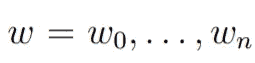
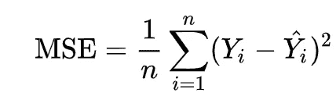
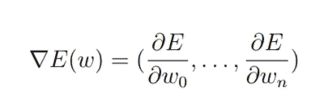
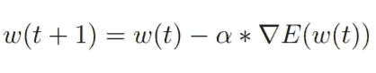
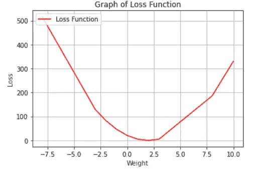
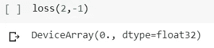
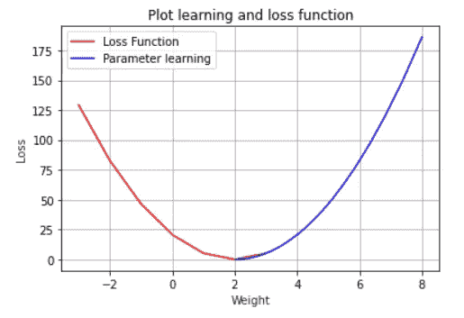

# 梯度下降——深度潜水

> 原文：<https://medium.com/analytics-vidhya/gradient-descent-a-deep-dive-355135841269?source=collection_archive---------25----------------------->

## 深入探讨最重要的算法梯度下降与实际例子使用 JAX。

最初，当我接触这种算法时，我花了一些时间来回答以下问题:

> 梯度下降算法是如何工作的？
> 
> 梯度是什么意思？
> 
> 如何计算一个梯度？
> 
> 参数是如何学习的，梯度对学习有什么帮助？

理论上，我明白它是做什么的，但我找不到一个足够好的实际例子来让我理解和回答上述问题。有人向我介绍了 JAX 库，它可以帮助我计算梯度。我想放一个玩具示例，用它来做实验，以便更好地理解算法。

以下文章的结构是这样的，它首先解释梯度下降算法及其变体。稍后它以一个使用 [JAX](https://github.com/google/jax) 的实际例子结束。在实际例子中，我试图展示梯度下降算法如何工作以及网络如何学习参数。让我们开始吧。

# **梯度下降算法—理论**

为了使用神经网络来解决现实生活中的问题，神经网络必须利用给定的数据自己学习参数。为此，使用了学习算法。

考虑**预测房价**的任务，其中网络的任务是输出与房屋相关的特定信息的价格，例如房屋的大小、房屋的位置等。向网络提供数据`x`和`y`。输入的`x`是与房屋相关的信息，`y`是其相应的价格。

这里，网络必须通过学习映射函数将`x`映射到`y`。映射函数具有作为参数的权重，并且这些参数必须使用优化器来学习。随着计算单元(神经元)数量的增加，网络将有更多的参数。首先，用随机值初始化权重，并且在训练期间，使用诸如梯度下降优化器的优化器来学习权重。

让我们考虑一个例子，其中我们的网络具有以下参数:



网络参数

为了提供更好的结果，必须学习这些参数。输入为`x` ，输出为`y` 。如果网络给出输出`y'`，我们可以通过实现一个损失函数来计算网络的表现。我们可以使用不同的损失函数，但是让我们考虑使用均方误差(MSE)。使用这个函数，我们可以计算我们的网络在预测房价时产生的误差。



均方差[1]

计算 MSE 的代码如下所示:

```
# preds = prediction made by our model. targets = actual ground #truth. n = number of samples.loss = np.sum((preds - targets) ** 2) / n
```

这里`*n*` 表示样本的数量。优化器的任务是尽可能减少误差，为了达到这个目的，我们对误差函数`E`进行偏导数。这用符号∇表示，这叫做梯度。对每个参数取偏导数，如下所示:



偏导数

使用计算出的梯度，然后如下所示更新每个参数:



梯度下降优化器[4]

我们可以看到，时间`t + 1`处的参数`w`将基于时间 t 处的误差函数的偏导数进行更新。α表示参数将被学习的学习速率。学习率是超参数之一。在开始实验之前设置的参数称为超参数。在开始实验之前，必须确定学习速率和优化器的选择。

用于更新该参数的代码将如下所示:

```
# here the parameter W will be updated with the gradient and learning
#rate. for example the learning rate here is 0.01.
W = W - ((0.01) * W_grad)
```

梯度下降优化器的性能很大程度上取决于它用来一次性优化误差函数的数据量。根据梯度下降优化器处理的数据量，有三种不同的方法来使用它。批量梯度下降、随机梯度下降和小批量梯度下降是变体[3]。

# **批量梯度下降**

这种变体也称为香草梯度下降。在这个变体中，考虑整个训练数据集来最小化误差函数和计算梯度。由于整个训练数据集仅被考虑用于参数的一次更新，这带来了时间和存储器问题。更新参数需要很多时间，此外，对存储器的依赖性很高，这使得很难在存储器中容纳整个训练数据集。它不能用于在线学习，因为更新发生在整个训练数据集，而不是单个训练数据[3]。

# **随机梯度下降**

该变体更新每个训练数据的参数，因此也可以用于在线训练。这种变体速度更快，并且不需要大量内存，因为在计算误差函数的梯度时，内存中只有单个训练数据[3]。一方面，这种变体是有希望的，但另一方面，可以确定误差收敛到局部/全局最小值是不稳定的[3]。如果学习率继续下降，这种变体似乎达到了与普通梯度下降相同的行为[3]。

# **小批量梯度下降**

它使用了随机和普通梯度下降算法的优点。它最小化了小批量训练数据集的误差函数。通常，小批量由这些值中的`8,32,64,.. and so on`组成。因此，不稳定收敛的问题得到解决，因为参数不是针对单个训练数据而是针对小型训练数据集更新的。它确实给出了与普通梯度下降[3]相似的收敛行为。

# **梯度下降算法——在实践中**

现在，我们可以在实践中检查梯度如何帮助参数以正确的方式学习。我觉得用一个实际的例子来形象化我们所学的理论更好。

考虑下面的玩具数据集[2]。

```
xs = np.array([-1.0,  0.0, 1.0, 2.0, 3.0, 4.0], dtype=float)ys = np.array([-3.0, -1.0, 1.0, 3.0, 5.0, 7.0], dtype=float)
```

上面的数据集可以通过一个简单的函数`y=2x-1`进行映射。这是一个线性函数。如果我们想预测给定的`x`的`y`,‘预测’函数看起来像这样:

```
# From the function y = 2x - 1\. Here x = W and -1 is b. A linear function.
def predict(W, b, inputs):
   return (inputs * W) + b
```

因此，该函数在给定参数`w`和`b`的情况下预测`inputs`的结果。我们希望我们的预测精确到与函数`y=2x-1`相匹配。

因此，让我们创建损失函数，即 MSE 函数:

```
# Here W and b are the parameters and 6 is actually n. From our toy # example you can see that n is 6 for our dataset.
def loss(W, b):
   preds = predict(W, b, inputs)
   loss = np.sum((preds - targets) ** 2) / 6
   return loss
```

让我们画出损失函数。如前所述`inputs`就是我们的`xs`。为了简单起见，我们将保持`b`与`-1`不变:

```
import matplotlib.pyplot as plt
import numpy as np# let us check for differnt values of W how our loss function looks like.
w = np.asarray([-8, -3, -2, -1, 0, 1, 2, 3, 8, 10])
l = []for i in range(10):
   # Keeping b constant to -1\. 
   l.append(loss(w[i], -1))plt.plot(w, l, ‘-r’, label=’Loss Function’)
plt.title(‘Graph of Loss Function’)
plt.xlabel(‘Weight’, color=’#1C2833')
plt.ylabel(‘Loss’, color=’#1C2833')
plt.legend(loc=’upper left’)
plt.grid()
plt.show()
```



图—损失函数 W = (-8，10)和 b = -1

保持`b`恒定在`-1`并取`W`的范围`(-8,10)`，我们得到上面的损失函数图。从图中可以清楚的看到，如果`W`是`2`而`b`是`-1`；我们得到最小的损失`0`。

我们可以通过直接传递给形成`y=2x-1`的损失函数`(2,1)`来证明；我们将收到的损失称为`0`。



从上面的图像和情节，你可以得到一个我们想要实现的想法。我们想学习参数`W`和`b`，这样我们接收到的损失为`0`。最符合我们数据集的参数值是`(2, -1)`。这是学习的目标，以确定最适合数据集的参数。

> 为简单起见，我们将保持参数`b`恒定为`-1`，并通过梯度下降算法学习参数`W`。

现在，一旦我们明确了我们的目标，我们将看看如何通过编程来实现它。

如果我们的计算机中没有 JAX 软件包，我们将安装它:

```
pip install --upgrade jax jaxlib
```

弄清楚我们的进口:

```
import numpy as np
import jax.numpy as np
from jax import grad
from jax import value_and_grad
```

初始化我们的玩具数据集:

```
xs = np.array([-1.0,  0.0, 1.0, 2.0, 3.0, 4.0], dtype=float)ys = np.array([-3.0, -1.0, 1.0, 3.0, 5.0, 7.0], dtype=float)
```

创建`predict`、`loss`功能。初始化参数`W`和`b`。如前所述，我们将保持参数`b`恒定为`-1`。我们将参数`W`初始化为`8`，并使用梯度下降算法使其收敛到`2`:

```
def predict(W, b, inputs):
   return (inputs * W) + b# Setting the inputs and targets.
inputs = xs
targets = ys# Creating the loss function. n = 6 as our dataset as 6 elements.
def loss(W, b):
   preds = predict(W, b, inputs)
   loss = np.sum((preds - targets) ** 2) / 6
   return loss# Finally initialize our parameters.
# Initalizing W to 8.
W = numpy.array(8, dtype=numpy.float32)
# keeping b constant to -1.
b = numpy.array(-1, dtype=numpy.float32)
```

下面的代码是代码中最重要的部分。我们现在将计算相对于`W`的梯度，并用新值更新参数。我们将在一个循环中重复这样做:

```
# Keeping the W parameter history.
W_array = []
# Keeping the loss history
L_array = []# Looping 50 times.
for i in range(50):
  print('Loop starts -----------------------------------')
  print('W_old', W)
  # Appending the W to a list for visualization later.
  W_array.append(W)
  # Calculting the gradient with respect to W.
  loss_value, W_grad = value_and_grad(loss, 0)(W, b)
  L_array.append(loss_value)if loss_value != 0:
    # learning rate is 0.01.
    W = W - ((0.01) * W_grad)

    print('W_new', W)
    print('loss is ', loss_value)
    print('Loop ends ------------------------------------')
  else:
    print('W', W)
    print('loss is ', loss_value)
    print('Loop ends ------------------------------------')
    break
```

API `value_and_grad`为我们提供了损失函数 w.r.t `W`的梯度。它还为我们提供了损失值:

```
# Calculting the gradient with respect to W.
loss_value, W_grad = value_and_grad(loss, 0)(W, b)
```

此`W_grad`用于更新参数:

```
W = W - ((0.01) * W_grad)
```

就这么简单。现在让我们看看如何接收输出。为了清楚起见，我将只显示前 3 个循环结果和后 3 个循环结果。

前三个循环的结果如下:

```
Loop starts -----------------------------------
W_old 8.0
W_new 7.38
loss is  186.0
Loop ends ------------------------------------
Loop starts -----------------------------------
W_old 7.38
W_new 6.8240666
loss is  149.54607
Loop ends ------------------------------------
Loop starts -----------------------------------
W_old 6.8240666
W_new 6.3255796
loss is  120.236694
Loop ends ------------------------------------
```

`W`以值`8`开始，经过三个循环后，它达到值`6.32`。损失值从`186.0`开始，三个循环后损失达到`120.23`。可以看到两者都有减少的趋势。

现在让我们看看最后三个循环:

```
Loop starts -----------------------------------
W_old 2.0356295
W_new 2.0319479
loss is  0.0065588956
Loop ends ------------------------------------
Loop starts -----------------------------------
W_old 2.0319479
W_new 2.0286465
loss is  0.005273429
Loop ends ------------------------------------
Loop starts -----------------------------------
W_old 2.0286465
W_new 2.0256863
loss is  0.004239871
Loop ends ------------------------------------
```

这里`W`趋向于达到`2`的值，损失趋向于达到`0`的值。

我们的参数已经被学习了。我们已经到达了从`8`开始的点，现在到达了参数`W`的`2.025`。这就是梯度下降算法如何帮助学习参数并减少损失。

让我们的学习过程更加清晰的最后一个情节。下图显示了学习是如何进行的。**红色**线显示`loss`功能，而**蓝色**线显示参数`W`的学习过程:

```
import matplotlib.pyplot as plt
import numpy as np
w = np.asarray([-3, -2, -1, 0, 1, 2, 3])
l = []for i in range(7):
  l.append(loss(w[i], -1))plt.plot(w, l, '-r', label='Loss Function')
plt.plot(W_array, L_array, '-b', label='Parameter learning')
plt.title('Plot learning and loss function')
plt.xlabel('Weight', color='#1C2833')
plt.ylabel('Loss', color='#1C2833')
plt.legend(loc='upper left')
plt.grid()
plt.show()
```



学习达到了 0 的损失。

这篇博客用一个实例展示并解释了梯度下降算法。我也上传了代码到 Github 上。随意试验不同的参数初始值。

我希望你在创作这些内容的时候和我一样喜欢阅读。我感谢你的时间，并对你如何喜欢这篇文章给予反馈，这让我有动力写更多这些。

参考资料:

1.  [https://en.wikipedia.org/wiki/Mean_squared_error](https://en.wikipedia.org/wiki/Mean_squared_error)
2.  [https://github . com/lmor oney/dlai Course/blob/master/Course % 201% 20-% 20 part % 202% 20-% 20 lesson % 202% 20-% 20 note book . ipynb](https://github.com/lmoroney/dlaicourse/blob/master/Course%201%20-%20Part%202%20-%20Lesson%202%20-%20Notebook.ipynb)
3.  塞巴斯蒂安·鲁德。“梯度下降优化算法概述”。载于:CoRR abs/1609.04747 (2016 年)。网址:[http://arxiv.org/abs/](http://arxiv.org/abs/)1609.04747。
4.  Marcin Andrychowicz 等《通过梯度下降学习梯度下降学习》。载于:CoRR abs/1606.04474 (2016 年)。网址:http://arxiv . org/ABS/1606.04474。