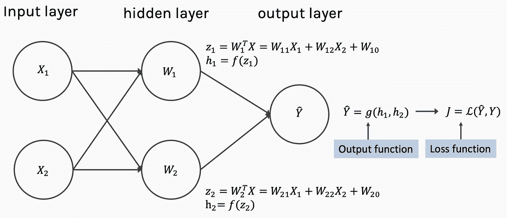

# 梯度下降-寻找全局最小值的竞赛

> 原文：<https://medium.com/analytics-vidhya/gradient-descent-a-race-to-find-the-global-minimum-a4d32e61071e?source=collection_archive---------20----------------------->

一个基本的神经网络基本上由输入层、隐藏层和带有一些网络参数(权重和偏差)的最终输出层组成。

一个简单的神经网络

我们可以从神经网络中看到损失函数的存在，即实际值(y)和预测的 value(ŷ之间的差异。
为了减少这种损失，我们使用了优化器。有各种类型的优化器，其中之一是梯度下降。

梯度下降是一种非常通用的优化算法，能够找到各种问题的最优解。
梯度下降的一般思想是反复调整参数，以最小化损失函数。

简而言之，梯度下降所做的是找出最佳权重(或参数),以便通过在网络反向传播的帮助下修改所有权重(或参数)来减少损失函数。

等式 1:修改旧权重以获得新权重

> 这里λ被称为学习率。

# 梯度下降对我们有什么帮助？

假设你在浓雾中迷失在群山之中，你只能感觉到脚下地面的坡度。快速到达谷底的一个好策略是朝着坡度最陡的方向下山。这正是梯度下降所做的:它测量误差函数关于参数θ的局部梯度，并且它沿着梯度下降的方向前进。一旦梯度为零，你就达到了最小值。

我们从用随机值填充θ开始(这称为随机初始化)，然后我们逐渐改进它，一次一小步，每一步都试图降低成本(损失)函数(例如，MSE)，直到算法收敛到最小值。

# 坡度对重量计算的影响

根据我们计算新的或优化的权重的等式(等式 1)，函数的斜率起着非常重要的作用。

假设我们在随机点上画一条切线，以确定斜率，如果切线的右侧指向下方(图 1)，那么它确定斜率为负，因此新的权重将大于旧的权重，并向曲线右侧移动。

图一

如果该切线的右手侧指向上方(图 2)，则确定斜率为正，因此新的权重将小于旧的权重，因此将向曲线的左侧移动。

图 2

# 学习率参数(λ)的影响

梯度下降中的一个重要参数是步长，由学习速率参数决定。如果学习率太小，那么算法将不得不经历多次迭代才能收敛，因此将花费很长时间。

学习率太小

另一方面，如果学习率太高，我们可能会跳过山谷，到达另一边，甚至可能比以前更高。这可能会使算法发散，值越来越大，无法找到好的解决方案。

高学习率

# 摘要

最后简化上面解释的梯度下降过程:

1.  随机初始化曲线上的点。
2.  找到最佳学习率很重要，值可以是 0.1、0.001 或 0.0001。针对问题尝试不同的学习率值，看看哪个效果最好。
3.  计算当前位置的斜率。
4.  如果斜率为负，则向右移动。
5.  如果斜率为正，向左移动。
6.  重复这个过程，直到斜率接近等于 0。