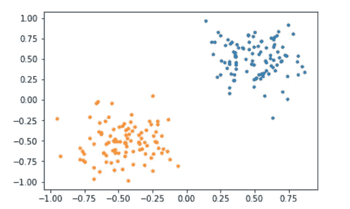
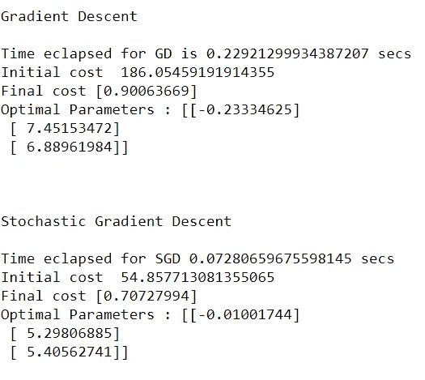
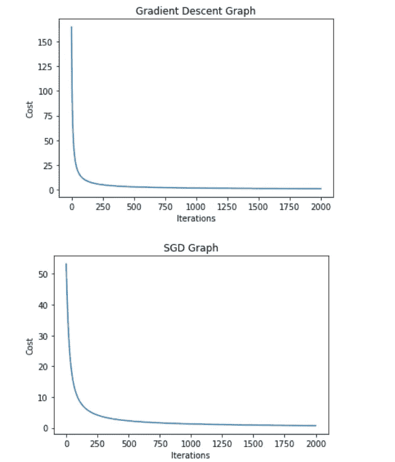
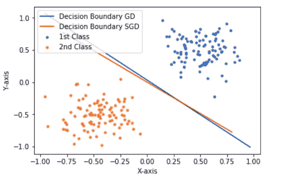

# 梯度下降和随机梯度下降从零开始 Python

> 原文：<https://medium.com/analytics-vidhya/gradient-descent-and-stochastic-gradient-descent-from-scratch-python-1cd93d4def49?source=collection_archive---------6----------------------->

在本文中，我旨在解释如何通过生成简单的数据并应用逻辑回归对其进行分类来从头构建 GD 和 SGD。为了优化/最小化损失，我们将使用 GD 和 SGD。最后，我们将对收敛所需的时间、分类器的优化和绘制决策边界的利弊进行比较研究。我们开始吧！

在我们继续之前，让我们了解一下梯度下降。它用来寻找某点 x 处的最小函数值，使得 f(x) = 0。为了得到全局最小值:函数必须遵守一些约束。它必须是凸的和可微的。

如果函数是凸的，它一定会找到达到最小值的方法。如果是可微的，为了沿着那条路径到达最小值，在那一瞬间的梯度给出了下降的方向。当我们在某个点 x 对该函数求导时，就可以找到梯度

# 伪代码

在机器学习方面，权重(w)是我们从最佳学习/描述我们数据的模型中获得的训练后的参数。x 是我们手中的数据集，y 是我们在数据中得到的标签，这是我们试图找到的答案，如果它是分类/回归问题的话。

*   从随机权重开始。
*   用这些权重计算预测值。
*   检查你错过了多少。
*   更新权重并迭代

当更新权重时，我们使用学习率，正如所讨论的，梯度给我们方向，但是下降多少由学习率决定。如果这个值很小，收敛速度就很慢，如果我们指定一个很大的值，可能会错过全局最小值。有多种方法来分配学习率的值，但我不会详细说明，因为它涉及数据的特征值和特征向量。

**先决条件**:我曾经对简单捏造的数据使用过逻辑回归，因此关于逻辑回归如何工作的知识将有助于理解代码。

从简单中捏造数据。

```
mu = 0.5
    sigma = 0.2mu1 = -0.5
    sigma1 = 0.2x_cor = np.random.normal(mu, sigma, 100)
y_cor = np.random.normal(mu, sigma, 100)x1_cor = np.random.normal(mu1, sigma1, 100)
y1_cor = np.random.normal(mu1, sigma1, 100)plt.scatter(x_cor,y_cor,s=10)
plt.scatter(x1_cor,y1_cor,s=10)
```



数据散点图

现在，我们的目标是获得决策边界，使得这两个聚类类型的数据可以被算法分类。在我们开始之前，每个最大似然算法都有我们定义的损失函数。像 MSE，RMSE，LogLoss 等。

在逻辑回归中，它致力于最小化该公式给出的负似然性(NLL)。

```
L(f)  = -(y*log f(x) + (1 − y) log(1 − f(x)))
```

我将把代码分成几个部分来解释:这是一个 sigmoid 函数，它总是位于 0 和 1 之间。由于我们的数据具有标签，如蓝色(1)和橙色(0)，因此，如果 sigmoid 函数值> 0.5，我们可以将其归类为蓝色，否则归类为橙色。

```
def sigmoid(self,X):
    # Activation function used to map any real value between 0 and 1
    return 1 / (1 + np.exp(-X))
```

接下来是损失函数，这是上面提到的直接公式应用。我们将跟踪我们执行的每一次迭代的损失。请记住，我们的目标是将损失减少到理想的零。

```
def cost_function(self,params, X, y):
   # Computes the cost function for all the training samples
   fx = self.sigmoid(X.dot(params))
   cost = -np.sum(y * np.log(fx) + (1 - y)* np.log(1-fx))
   return cost
```

接下来是梯度下降函数:神奇发生了。我将详细解释这一点。

*   Params 是权重，alpha 是学习率，X 是我们的原始数据，y 是实际标签(1 或 0)。
*   weight_new = weight_old + alpha *渐变。我希望你现在已经掌握了阿尔法和梯度的诀窍。阿尔法帮助采取步骤，梯度给方向。为什么我们要更新权重？这将帮助我们得到损失最小的函数的最小值。那是什么意思？该模型正在达到学习数据以便更好地对其进行分类的状态。
*   sigmoid 函数将是该元组的预测 y_hat，然后通过对我们丢失的量取差并乘以我们的数据(X)来进行比较。我对整个数据集都这样做了，因为 NumPy 可以方便地轻松完成这样的操作。
*   一旦我们更新了权重，我们就计算损失函数，这一直持续到我们设置终止条件。我已经设置了要执行的迭代次数，也可以设置何时损失误差< small_value say 1e-6
*   I have kept tracked of cost_history which will be the plot.

```
def gradient_descent(self,params,X,y,iterations,alpha):
   cost_history = np.zeros((iterations,1))
   for i in range(iterations):
     params = params+alpha*(X.T.dot(y-self.sigmoid(X.dot(params))))
     cost_history[i] = self.cost_function(params,X, y)
   return (cost_history, params)
```

# Comparative Study



Results for GD and SGD

Ignore the result for SGD, just to show a glimpse of Gradient descent Run time for 2000 iteration and alpha as 0.0001\. Clearly seen, we started with a huge loss and slowly we are converging to zero value.

**梯度下降和随机下降除了运行时间复杂度没有区别。GD 对整个数据集进行多次迭代。SGD“统一”地只取数据集的子集，并运行相同的算法。**



比较地块成本与迭代

**一个问题？**

为什么 SGD 比 GD 需要更多的迭代次数来收敛。答案是，在 GD 中，整个数据都暴露在模型中，以便更深入地理解细微差别，而 SGD 是数据的子集，因此每个步骤获得的信息并不完整，无法在找到最小值的方向上采取决定性的决策步骤。

# 绘图结果

最后，我们来绘制决策边界，如图所示。



SGD 和 GD 的决策边界

关于如何绘制决策边界的简单逻辑。

*   y = MX+c——是一条线的 eq，我们需要找到 x 和 y 的值，我们可以很容易地绘制出来。

求 x 值，计算类 2 的最小值点和类 1 的最大值点，基本覆盖 x 轴极值点。

要找到 y 值:正如您注意到的，weights 有三个参数，weight[0]是截距，weight[1]是与 class1 相关联的参数，weight[2]是与 class2 相关联的参数

```
y_values = - (weight[0] + weight[1]*x_values.T) / weight[2]
```

这是我有史以来第一篇关于媒介的文章，我希望我的想法被传达在纸上，如果有我解释不正确的地方，请让我知道并提出意见和建议。我会很乐意接受它。

# 结束

完整代码可以在[https://github.com/Darshansol9/](https://github.com/Darshansol9/GDvSGD_Python/)T2【GD-SGD _ from scratch _ Python 找到

如果你喜欢我的文章，我很感激放弃投票，并尽可能多地分享。