# 线性回归实例中梯度下降优化算法的说明。

> 原文：<https://medium.com/analytics-vidhya/gradient-descent-b0dc1af33517?source=collection_archive---------19----------------------->

# **梯度下降:**

梯度下降法是一种迭代优化算法，它根据我们在开始时初始化的梯度和学习率在每次迭代中提供新点。

梯度是目标函数的向量，包含函数相对于点的坐标或维度的偏导数。

学习率确定了我们的步长，也就是说我们希望以多大的步长接近最优点。步长的方向在最小化问题中是梯度的负值，在最大化问题中是梯度的正值。这些都有数学定义，但我不会在本文中提及。

如果我们很快了解了算法的原理，我们可以把梯度下降算法想象成从山顶往下走。我们要采取准确的步骤和方向，在最短的时间内到达山的最低点。我们初始化第一个起点，我们的学习速度和方向。我们开始根据这些参数向目标前进。当梯度在我们的位置为零时，这意味着我们处于最小值，因为函数的导数在局部或全局最小/最大点为零。根据函数的类型，我们可以是全局的，也可以是局部的。例如在凸函数中，梯度下降保证了全局收敛性，因为凸函数中存在唯一的最小值。在更复杂的函数中，算法将收敛到最接近的稳定(最佳点的候选。梯度为零)点。选择精确步长的条件和方法有很多，如 Armijo 条件、Wolfe 条件等。但它们不是这篇文章的主题。我们将讨论梯度下降的简单版本，并通过在简单线性回归模型中实施来最小化与回归线的截距和斜率相关的成本函数来查看该过程。

**纯梯度下降的更新步骤:**

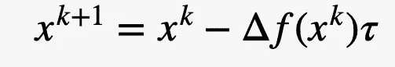

(尽量减少问题)

其中，x^(k+1)是我们要去的下一个点，x^k 是我们的当前点，函数在当前点的梯度和“τ”是学习率。

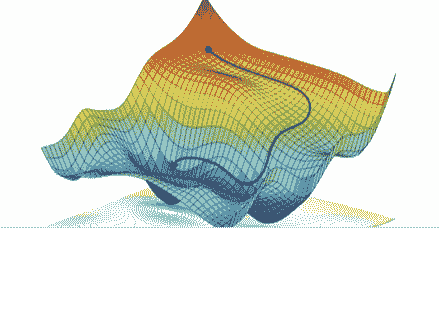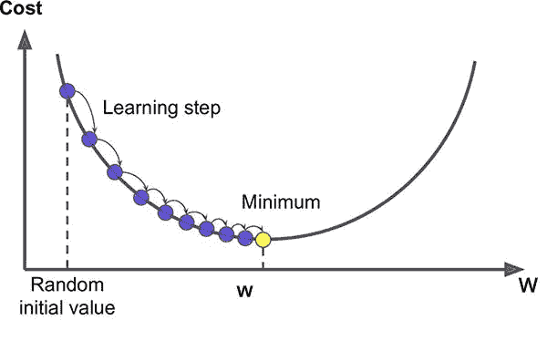

**线性回归**

线性回归是一种著名而简单的机器学习算法，如果自变量之间存在线性关系，它有助于根据自变量预测因变量的新的未知值。可以有多个独立变量或预测值，但我们将看到带有一个预测值的算法的简单版本。

**线性回归预测公式:**

其中，Yₚᵣₑ是预测值，Xᵢ是预测值，β₀和β₁分别是直线的截距和斜率。

如同在每个 ML 算法中一样，我们选择一个成本(损失、误差)函数，该函数显示我们的模型有多精确，并且我们将选择这个时间 MSE 作为成本函数。

**均方误差:**

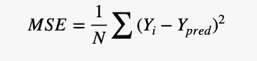

它测量误差平方和的平均值，并且更好

具有尽可能小的 MSE。有很多方法可以做到这一点，但我们将使用梯度下降来逐步最小化我们的成本函数 MSE，这是基于算法在每次迭代中生成的截距和斜率的新值。

所以，我们可以把 MSE 写成:

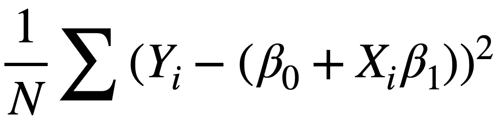

为简单起见，我们可以确定向量β = [β₀,β₁]和具有两列的矩阵 x(第一列将仅包含“1”以获得正确的计算结果),并且可以将 MSE 写为

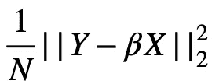

我们可以把这个函数最小化。如果我们将上述关于 GD 的知识与 MSE 函数相结合，我们将会看到，我们可以对 MSE 取偏导数来计算截距和斜率，并计算我们的新值，这将在算法的一些步骤之后提供最小值。

因此，MSE 相对于β的梯度:w.r.t .到β₀:

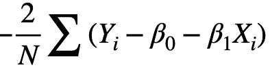

西至β₁:

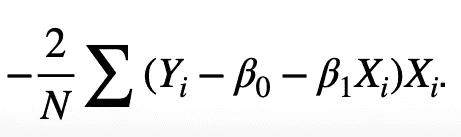

确定导数后，我们将初始化我们的学习率和随机起点。基于梯度下降的更新步骤的公式，我们将在每次迭代中更新截距和斜率，在足够的迭代之后，我们将达到 MSE 函数的最小点，并且它将在数据点之间提供一条线，该线将是最小化误差均值的最佳线。显然，当试图用大量数据点手工计算时，这些计算非常复杂和困难，但我们可以通过 python 等计算机工具非常容易地计算这些，并且可以直观地绘制最小化方式和回归图。

**应用于“Auto.csv”数据集，在 Python 中基于汽车的“汽缸”更准确地预测“mpg”:**

1)在 python 中导入必要的库:

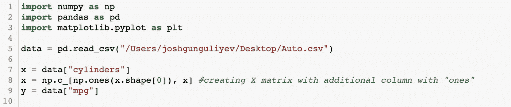

2)选择学习率 0.01 和算法的随机起点。

我们将使用 20000 次迭代来更好地可视化它，但在更少的步骤中算法可以给出最佳点。

在下面的代码中，我们定义我们的参数并创建 e 梯度下降函数，然后将此函数应用于汽车数据变量“mpg”和“cylinders”:

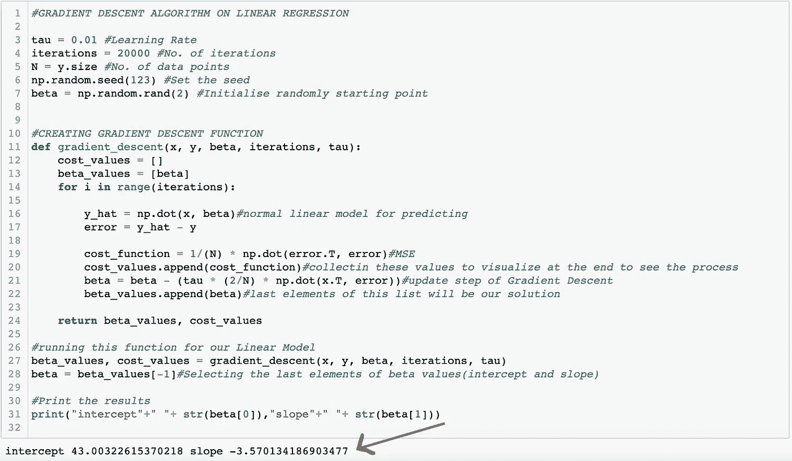

如图所示，我们分别得到截距和斜率的 43.00 和-3.57。它们是使我们的误差最小(MSE 函数的输出)并使我们的预测最精确的值。

4)在优化过程中绘制递减的成本值:

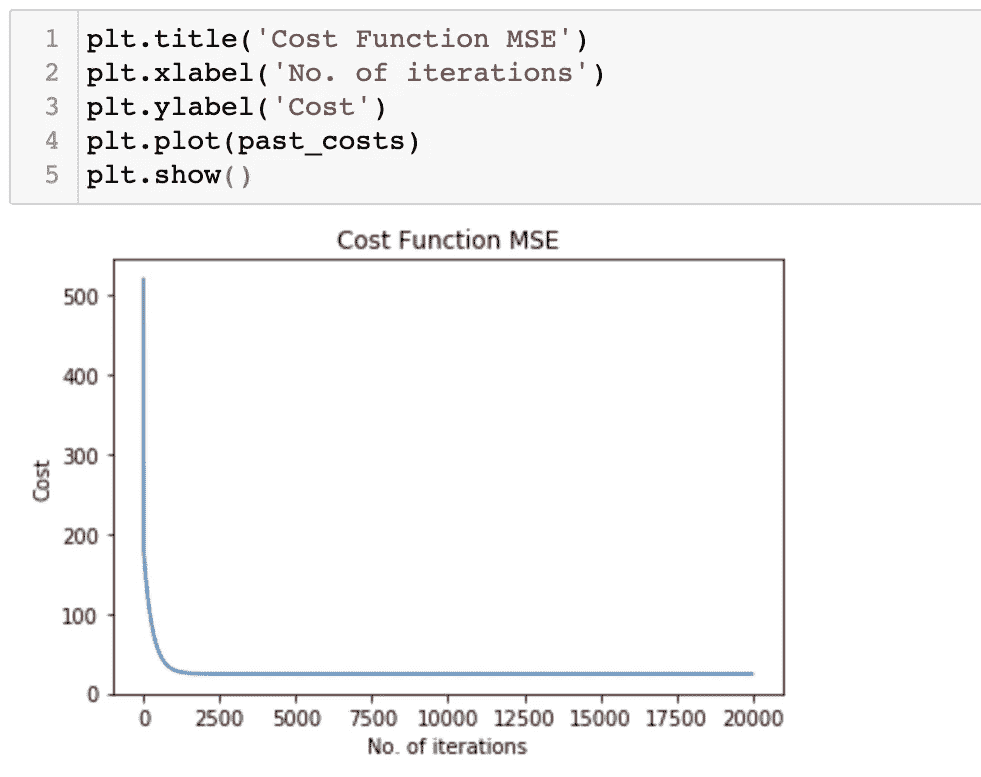

如图所示，我们的误差值已经从 500 减少到接近零。并且算法已经在早期迭代中找到最小值。

5)优化期间截距和斜率的更新:

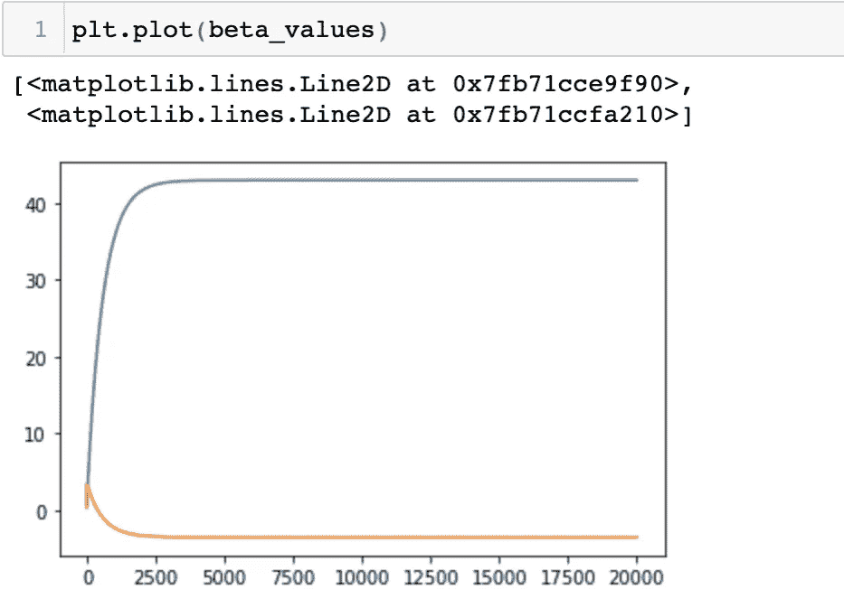

这些值和数据集只是为了举例说明梯度下降算法的工作方式。显然，这不是建立简单线性模型的唯一方法，线性回归有许多方法，也不是唯一的梯度下降类型。还有一些修改过的类型，它们在不同的场景中更有效，例如

精确线搜索，或快速求解的共轭方法，预处理下降方法，约束问题的投影方法等。这只是对这些方法的一点解释和实现。感谢阅读。

感谢阅读！！！