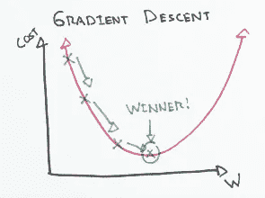

# 从零开始的梯度下降:在波士顿数据集上理解和实现算法

> 原文：<https://medium.com/analytics-vidhya/gradient-descent-from-scratch-understanding-implementing-the-algorithm-on-boston-dataset-9d916b89d697?source=collection_archive---------4----------------------->


马萨诸塞州波士顿的天际线。

梯度下降是一个非常基本的算法，每个开始机器学习之旅的人在最开始都很熟悉。

> 我们先来听听定义:梯度下降是一种寻找函数最小值的优化算法(像代价函数)。为了使用梯度下降找到函数的局部最小值，人们采取与当前点处梯度的负值成比例的步骤。



我们必须收敛到成本 w.r.t 参数(w)最小的点，才能胜出。

因为这篇文章是关于算法的实现，所以我假设你精通算法的理论和工作。尽管我们将在讨论中阐明这一点。现在就上车吧！

# **我们将在著名的波士顿数据集上实现批量梯度下降。**


让我们对批量梯度下降进行编码

## 导入基本库

```
import numpy as np
import pandas as pd
```

## 从 sklearn 导入波士顿数据集

```
from sklearn.datasets import load_boston
boston = load_boston()
boston.keys()
```


波士顿数据集中存在的键

## 让我们先将原始数据和目标值保存到一些变量中，然后再修改它们。

```
X = boston.data
y = boston.target
```

## 现在，让我们将数据转换成熊猫数据框架，并对其进行一点探索

```
boston = pd.DataFrame(boston.data, columns = boston.feature_names)boston.head()
```


*输入数据是我们的训练数据，有 13 个不同的特征列，每个列有 506 个实例。*

```
boston.describe()
```


> *我们可以清楚地看到数据的不规则规模，因为我们要实施梯度下降，当规模不合适时，需要很长时间才能收敛到参数的最优值，所以我们需要对数据进行缩放。*

```
from sklearn.preprocessing import StandardScaler
Scale = StandardScaler()
boston = Scale.fit_transform(X)#since StandardScaler returns the output it numpy array form we need to convert it into dataframe again with accurate column names.boston = pd.DataFrame(boston, columns = ['CRIM','ZN','INDUS','CHAS','NOX','RM','AGE','DIS','RAD','TAX','PTRATIO','B','LSTAT'])boston.describe()
```


与之前的比例相比，现在的数据比例看起来更好(现在观察要素的标准差、最大值和最小值)

看起来更好！现在，在应用梯度下降之前，我们必须在数据集中添加一个所有值都等于 1 的列，为什么要添加一个额外的列呢？因为对于每个特征(x1，x2，x3…)在参数向量(θ)中都有一个参数(weight-m1，m2，m3…)。我们还必须注意(y = m1.x1 + m2.x2 + …)中的**偏置项(b)** 。+ ' **b** ')用于每个特征 x[j]。类似地，在参数向量中，每个特征都有一个权重(m1，m2…)和一个偏差项“b”的权重。

```
boston['bias']=1
boston
```


偏置列被添加到最右边

> 现在我们将数据分为训练数据和测试数据

```
from sklearn.model_selection import train_test_split
X_train, X_test , y_train, y_test = train_test_split(X, y, test_size = 0.2, random_state = 42)
```

***现在我们来谈谈！我们已经做了一些必要的预处理，让我们写下将使用梯度下降优化参数的代码，以便最小化成本函数*** 。

这里的成本函数是什么？


**这是我们的成本函数**

这是均方误差，因为第一个“Y”项是我们计算的目标值，并且我们知道使用线的等式，Y = m.x + c

因此，我们可以将“成本”函数定义如下


如果你学过均方误差函数，我希望你熟悉这些符号。让我们再回忆一下。

大写& **粗体**(有些是粗体，有些只是斜体)的符号是向量，而小写&斜体的符号是标量。

*m*’:实例数

*(一):*第 I 个数据实例

*y(i):* 它是第 I 个实例对应的实际目标值

X: 它是输入向量。 **X(i)** 是输入的第 I 个实例。

**θ(Theta)**:**θ**是对应于每个特征(m1，m2，m3…..mn，b)**θ**向量取转置形式，以便取其与输入向量***(y(I)= m . X(I)+b)*的点积**

> **在进入编码部分之前，让我们讨论一下这个算法的关键。**

**梯度下降的基本思想是迭代地调整参数，以便最小化成本函数。梯度下降测量误差函数相对于参数向量θ的局部梯度，它沿着梯度下降的方向前进。一旦梯度为零，我们就到达了最小值。**

**我们如何从这里开始？我们从取一些随机值到θ向量(包含权重 m1，m2…)开始，这也叫做*随机初始化。*我们使用随机初始化的θ计算成本函数。我们肯定会收到一个非常不可取的和巨大的 MSE(成本)值。然后，我们将逐步改进它，每次采取微小的步骤，旨在降低成本函数，直到它最终收敛到最小值。
这张图更符合我们目前的讨论:**

****

**取成本函数 w.r.t 的梯度作为参数(θj)意味着计算如下:**

****

****这是成本函数的偏导数或参数 j 的‘梯度’****

> **看这里:对*成本*求偏导数就是术语*梯度*的含义。
> 将成本降至最低，重量(θ)就是梯度下降的意义所在。**

**还有一点需要注意的是，这个非常重要的家伙叫做*学习率，用η表示。这是梯度下降中的一个超参数，它基本上控制着我们在每一步从当前梯度值下降多少(向最小值的递增步骤——见上图)。很明显，如果您认为η越小，算法将花费更多时间收敛到最小值(或更多迭代/步骤)。同样，η越大，它可能收敛得更快，但也有跳到曲线另一侧的风险。***

*****从那以后，我们谈了很多。现在让我们进入正题，对我们讨论的所有内容进行编码。*****

```
*X_train = np.array(X_train)*
```

***首先，让我们定义我们的成本函数:***

```
*def cost(X, y, theta):
    k = X.shape[0]
    total_cost = 0
    for i in range(k):
        total_cost += 1/k * (y[i] - ( theta.dot(X[i,:]) )**2
    return total_cost*
```

> ****因此，如果我们试图写出它的方程式*，这个成本函数就是我们上面讨论过的。***

***现在，我们将首先为梯度下降的 1 个步骤编写代码，随机初始化参数，使用它们计算梯度，然后通过从它们中减去梯度来更新参数值。我们称这个函数为*阶跃梯度****

```
*def step_gradient(X, y, learning_rate, theta):
    k = X.shape[0]
    n = X.shape[1]
    gradients = np.zeros(n)
    for i in range(k):
        for j in range(n):
            **gradients[j] += (-2/k) * ( y[i] - (theta.dot(X[i,:])) ) * X[i,j]**
    theta = theta - learning_rate * gradients
    return theta*
```

> *****这里发生了什么:**上面的函数是算法的关键，看看它清楚地做了什么，对于存储在“theta”中的每个权重(下标“j”)，它使用我们上面讨论的相同等式计算梯度(gradient[j])，即成本 w.r.t .对该权重或参数(j)的偏导数。运行完整的循环将得到完整的梯度向量，它包含 14 个值，分别对应于 14 个参数(存储在θ中),您刚刚根据这些参数计算了这些梯度。
> 一旦我们有了梯度向量，它指向抛物线上的某个位置，如上图所示，我们只需要沿着相反的方向向下下降，朝着成本最小的地方下降(参考图片)，这就是我们通过从θ减去梯度在数学上所做的。我们也用学习率来控制我们需要下降或减少多少。***

***现在，那只是我们下降的 1 步，它不会在仅仅 1 次迭代中收敛！
我们现在需要编写主梯度下降函数，该函数将为定义的迭代次数(也称为历元)调用阶跃梯度函数。
此外，还记得我们讨论过θ的随机初始化，这里我们将初始化我们的θ，它将在上面的阶跃梯度函数中使用。***

```
*def gradient_descent(X, y, learning_rate, iterations):
    k = X.shape[0]
    n = X.shape[1]
    theta = np.zeros(n)                *#random initialization*
    for i in range(iterations): theta = step_gradient(X, y, learning_rate, theta)
        print(i, 'cost:', cost(X, y, theta)) return theta*
```

***搞定了。我们已经记下了主要业务。我还做的是，在每次迭代之后，我将打印更新的成本值，以查看我们如何改进。
现在，让我们巧妙地定义一个“运行”函数，我们可以使用它来运行我们上面编码的所有内容，它将为算法提供参数和训练数据。***

```
*def run(X, y):
    learning_rate = 0.04
    iterations = 300
    theta = gradient_descent(X, y, learning_rate, iterations)
    return theta*
```

***让我们在我们的数据上试试这个***

```
*theta = run(X_train, y_train)*
```

******

***太棒了。它工作得非常好。就看看它是怎么开始的，随机初始化参数，成本是 490。我们逐渐开始大幅度降低成本，经过 300 次迭代后(下图),我们成功地将成本降低到 21。***

******

***所以，这是一个好的开始和一个好的结局。我试着按照别人教我的方式写下每一件事。自己实现它会给你很多清晰的东西，这是你仅仅通过学习概念或使用 Scikit-Learn 所不能得到的。如果你觉得在某个地方卡住了，或者有任何不清楚的地方，请随时通过 Linkedin 联系我。谢谢你。***

****都是乡亲们！:)****