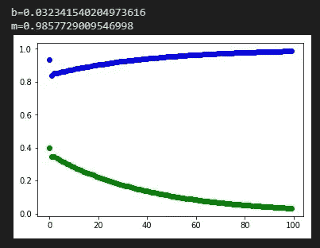

# 3 个单元格中的梯度下降

> 原文：<https://medium.com/analytics-vidhya/gradient-descent-in-3-cells-f308a7c0f0bf?source=collection_archive---------18----------------------->

朱庇特笔记本。

## 免责声明:

在我关于[梯度下降](https://bogdansamoletskyi.medium.com/gradient-descent-algorithm-d94890985137)的文章中，我描述了一个梯度下降理论。在这里，我将创建一个简单的 3 细胞 Jupyter 笔记本实现的算法。