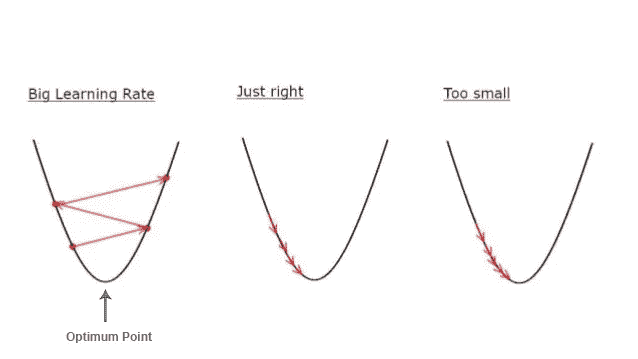
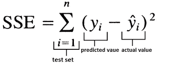

# 简而言之，梯度下降

> 原文：<https://medium.com/analytics-vidhya/gradient-descent-in-a-nutshell-b51cd65a1692?source=collection_archive---------8----------------------->

你可能会问或搜索什么是梯度下降和它是如何工作的，在这篇文章中，我将简要地告诉你到底什么是梯度下降，让我们开始吧。

假设我们有一个由三个特征组成的数据集，我们想知道哪些特征更重要。

因此，首先我们将为每个功能赋予一个**权重**，该权重显示了该功能的重要性。如果权重较大，则该功能很重要；如果权重较小，则该功能不那么重要，并且不会影响输出。

这些权重首先被随机初始化，并且将在数据集上的每次迭代之后被更新以获得最佳权重。

所以你现在可能会问**梯度下降在哪里？？**梯度下降是一种更新这些权重并获得其最佳值和最小化误差的方法。

我们将使用误差平方和(SSE)来计算我们希望最小的误差值。

为了更好地理解什么是梯度下降，请跟随我学习如何使用梯度下降来更新要素的权重。

## 梯度下降的分量:

*   学习率。
*   激活功能。
*   随机初始化权重。

# **第一步**:

我们有 3 个特征，所以我们将假设 3 个权重，每个特征一个任意数字。W1 = 0.3443，W2 = 0.3213，W3 = 0.5642

# 第二步:

挑一个合适的学习率！！

你可能会问什么是学习率？！

学习率是你移动到最小损失的深度，如果它太小，我们将花费更多的时间来训练我们的模型，如果它太大，我们可能达不到最小损失点。这个图将更好地说明我的意思，把这条曲线想象成..所以我们选择 0.001 或 0.01 这样的学习率。

选择合适的学习速度

# 第三步:

计算“Y”系统的输出我们通过点积特征和权重来计算“Y”。

> Y = X1*W1 + X2*W2 + X3*W3 + X4*W4

# 第四步:

选择一个激活函数，这里我们将使用一个 **Sigmoid 函数**，因此我们需要将输出‘y’更新为一个新值。因为我们用的是 sigmoid 函数，那么 Y = 1/1+e^-x.

# 第五步:

使用梯度下降更新权重。

> 新权重 1 =旧权重 1 +学习率*特征 1 * (d-y) * y * (1-y)

*   *旧权重 1* 是我们在步骤 1 中初始化的 W1。
*   *学习率*我们在步骤 2 中挑选的那个。
*   *特征 1* 是第一个特征(因为我们正在更新权重 1)。
*   *(d-y)是误差损失*其中‘d’是我们想要的输出(0，1，等等..)y 是我们从上一步得到的值，它等于 1/1+e^-x，我们使用它是因为我们使用了 Sigmoid 函数“x ”,这里是特征 1。
*   *y*(1-y)* 因为我们使用的是 **Sigmoid 函数。**

# 第六步:

使用整个测试数据的误差平方和计算误差，我们将减去预测值(来自步骤 4)和实际值(所需输出)。

同ＳＯＵＴＨ-ＳＯＵＴＨ-ＥＡＳＴ