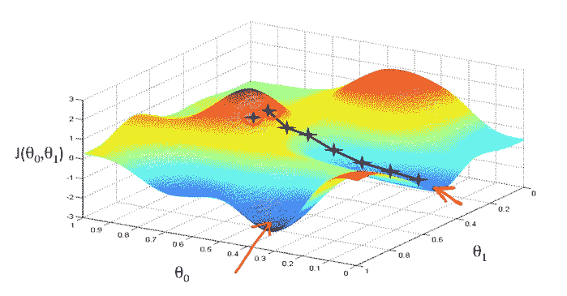

# 梯度下降 python 中的介绍和实现

> 原文：<https://medium.com/analytics-vidhya/gradient-descent-intro-and-implementation-in-python-8b6ab0557b7c?source=collection_archive---------3----------------------->



梯度下降在行动

# 介绍

梯度下降是机器学习中的一种优化算法，用于通过迭代地向函数的最小值移动来最小化函数。

当我们必须找到满足给定成本函数的最小可能值时，我们基本上使用这种算法。在机器学习中，更多的时候我们不是试图最小化**损失函数**(像 [**均方误差**](https://en.wikipedia.org/wiki/Mean_squared_error) )。通过最小化损失函数，我们可以改进我们的模型，梯度下降是用于此目的的最流行的算法之一。


成本函数的梯度下降

上图显示了梯度下降算法的工作原理。

我们首先在成本函数中取一个点，并开始逐步向最小点移动。步长的大小，或者说我们必须多快收敛到最小点，是由**学习速率定义的。我们可以以更高的学习率覆盖更多的区域，但有超过最小值的风险。另一方面，小步/更小的学习率会消耗大量时间到达最低点。**

现在，算法必须前进的方向(向最小值)也很重要。我们通过使用导数来计算。你必须熟悉微积分的导数。导数基本上是根据图形在任何特定点的斜率来计算的。我们通过在该点找到图形的切线来得到它。切线越陡，将意味着需要更多的步骤来达到最小点，越陡将意味着需要更少的步骤来达到最小点。

我们举个例子。

成本函数 **f(x) = x -4x +6**

f(x)的导数[x_derivative]， **f'(x) = 3x -8x** (这将给出任意点 x 沿 f(x)的斜率)

从 x 的任意值开始。假设 0.5，learning_rate = 0.05

迭代多次，继续计算 x 的值。

**x = x-(x _ 导数*学习率)**

x = 0.5 - (-3.25*0.05) = 0.6625

在第二次迭代中使用 x = 0.6625

x = 0.6625+(3.983*0.05) = 0.86165

依此类推，直到我们看不到 x 值的任何变化。

迭代次数可以是固定的，由用户给定。或者，如果你心中有一个精度(~0.001)。一旦达到这个精度值，就可以停止计算。

我们将探索这两种方法。

# Python 实现

我们将使用 python 实现一种简单形式的梯度下降。让我们取上一节中的多项式函数，将其视为成本函数，并尝试找到该函数的局部最小值。

成本函数 **f(x) = x - 4x +6**

让我们首先导入所需的库并创建 f(x)。同样生成从-1 到 4 的 1000 个值作为 **x** 并绘制出 **f(x)** 的曲线。

```
# Importing required libraries
import numpy as np
import matplotlib.pyplot as pltf_x = lambda x: (x**3)-4*(x**2)+6
x = np.linspace(-1,4,1000)#Plot the curve
plt.plot(x, f_x(x))
plt.show()
```


f(x) = x - 4x + 6

让我们找出 f(x)的导数。

d f(x)/dx = 3x - 8x。让我们用 python 为导数创建一个 lambda 函数。

```
f_x_derivative = lambda x: 3*(x**2)-8*x
```

让我们创建一个绘制梯度下降的函数和一个计算梯度下降的函数，方法是将固定次数的迭代作为输入之一。

```
def plot_gradient(x, y, x_vis, y_vis):
    plt.subplot(1,2,2)
    plt.scatter(x_vis, y_vis, c = "b")
    plt.plot(x, f_x(x), c = "r")
    plt.title("Gradient Descent")
    plt.show()plt.subplot(1,2,1)
    plt.scatter(x_vis, y_vis, c = "b")
    plt.plot(x,f_x(x), c = "r")
    plt.xlim([2.0,3.0])
    plt.title("Zoomed in Figure")
    plt.show()

def gradient_iterations(x_start, iterations, learning_rate):

    # These x and y value lists will be used later for visualization.
    x_grad = [x_start]
    y_grad = [f_x(x_start)]
    # Keep looping until number of iterations
    for i in range(iterations):

        # Get the Slope value from the derivative function for x_start
        # Since we need negative descent (towards minimum), we use '-' of derivative
        x_start_derivative = - f_x_derivative(x_start)

        # calculate x_start by adding the previous value to 
        # the product of the derivative and the learning rate calculated above.
        x_start += (learning_rate * x_start_derivative)        

        x_grad.append(x_start)
        y_grad.append(f_x(x_start))print ("Local minimum occurs at: {:.2f}".format(x_start))
    print ("Number of steps: ",len(x_grad)-1)
    plot_gradient(x, f_x(x) ,x_grad, y_grad)
```

现在我们已经定义了这些函数，让我们通过传递 **x_start = 0.5，迭代次数= 1000，学习速率= 0.05** 来调用 gradient_iterations 函数

```
gradient_iteration(0.5, 1000, 0.05)
```


渐变迭代(0.5，1000，0.05)

我们能够在 **2.67** 找到局部最小值，因为我们已经给定迭代次数为 1000，算法已经进行了 1000 步。它可能在更早的迭代中达到值 2.67。但是由于我们不知道在给定的学习速率下，我们的算法将在什么点达到局部最小值，所以我们给出一个高的迭代值，以确保我们找到我们的局部最小值。

这听起来不是很理想，因为即使在找到局部最小值之后，循环迭代的次数也是不必要的。

让我们采用另一种方法，通过使用 precision 来固定迭代次数。

在这种方法中，由于我们知道数据集，我们可以定义我们想要的精度级别，并在达到该精度级别时停止算法。

对于这个例子，让我们写一个新的函数，它采用精度而不是迭代次数。

```
def gradient_precision(x_start, precision, learning_rate):

    # These x and y value lists will be used later for visualisation.
    x_grad = [x_start]
    y_grad = [f_x(x_start)]while True:

        # Get the Slope value from the derivative function for x_start
        # Since we need negative descent (towards minimum), we use '-' of derivative
        x_start_derivative = - f_x_derivative(x_start)

        # calculate x_start by adding the previous value to 
        # the product of the derivative and the learning rate calculated above.
        x_start += (learning_rate * x_start_derivative)

        x_grad.append(x_start)        
        y_grad.append(f_x(x_start))
        # Break out of the loop as soon as we meet precision.
        if abs(x_grad[len(x_grad)-1] - x_grad[len(x_grad)-2]) <= precision:
            breakprint ("Local minimum occurs at: {:.2f}".format(x_start))
    print ("Number of steps taken: ",len(x_grad)-1)
    plot_gradient(x, f_x(x) ,x_grad, y_grad)
```

现在我们调用这个函数，参数 **x_start = 0.5，精度= 0.001，学习率= 0.05**

```
gradient_precision(0.5, 0.001, 0.05)
```


渐变精度(0.5，0.001，0.05)

本地最小值= 2.67

步骤数= 20

我们的梯度下降算法能够在仅仅 20 步内找到局部最小值！因此，在前面的方法中，我们不必要地运行了 980 次迭代！

既然我们能够成功地使 **f(x)** 最小化，即找到 x 的最小值，其中 **f(x)** 最小，那么让我们研究学习率值，看看它如何影响算法输出。

## 学习率= 0.01

```
gradient_precision(0.5, 0.001, 0.01)
```


x_start = 0.5，精度= 0.001，学习率= 0.01

因为学习率较低，这意味着达到局部最小值所需的步数较高(85)。正如我们在图中看到的，85 x 值用蓝色标出，这意味着我们的算法在寻找局部最小值时速度较慢。

## 学习率= 0.05

```
gradient_precision(0.5, 0.001, 0.05)
```


x_start = 0.5，精度= 0.001，学习率= 0.05

对于相同的精度值和 x_start 值，但是学习率= 0.05，我们看到我们的算法能够在仅仅 20 个步骤中找到局部最小值。这表明通过增加学习速率，算法更快地达到局部最小值。

## 学习率= 0.14

```
gradient_precision(0.5, 0.001, 0.14)
```


x_start = 0.5，精度= 0.001，学习率= 0.14

通过将学习率增加到 0.14，该算法能够在仅仅 6 个步骤中找到局部最小值。

停下来。不要陷入这样的陷阱:增加学习率总是会减少算法寻找局部最小值的迭代次数。我们就把学习率提高 0.01 看看结果吧。


x_start = 0.5，精度= 0.001，学习率= 0.15

哎呦！这次走的步数增加了！。看起来学习率= 0.14 是精度= 0.001 的最佳点。

需要注意的一点是，这种实现将适用于成本函数只有一个变量 **x** 的情况。如果有多个变量(x，y，z…)实现会改变，可能会在另一篇文章中发布。也有不同的[类型的梯度下降](https://www.geeksforgeeks.org/gradient-descent-algorithm-and-its-variants/)

**批量梯度下降
随机梯度下降
迷你批量梯度下降**

我们将在以后的文章中深入了解这些不同类型的梯度下降。

这个帖子到此为止！。这个的 jupyter 笔记本在我的 [github](https://gist.github.com/fahadanwar10/e8636d73c6ee9150cd108576f57e7c73) 里。

请查看我在[线性回归介绍(电商数据集](/@fahadanwar10/introduction-to-linear-regression-e-commerce-dataset-cfa65b2c1213)上的帖子，秀一把爱。

[](/@fahadanwar10/introduction-to-linear-regression-e-commerce-dataset-cfa65b2c1213) [## 线性回归简介—电子商务数据集

### 在这篇文章中，我们将了解什么是线性回归，它背后的一点数学知识，并试图拟合一个…

medium.com](/@fahadanwar10/introduction-to-linear-regression-e-commerce-dataset-cfa65b2c1213) 

在你看到我的博客之前，不要忘记看看我的博客并订阅它来获取内容。[https://machinelearningmind.com/](https://machinelearningmind.com/)