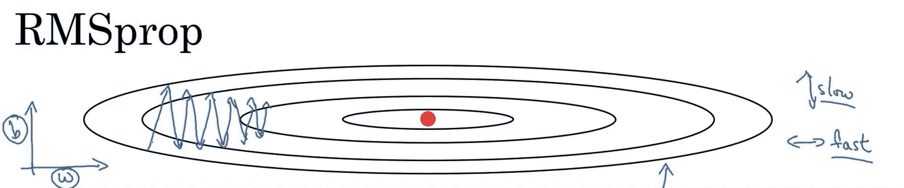

# 梯度下降优化技术。

> 原文：<https://medium.com/analytics-vidhya/gradient-descent-optimization-techniques-4316419c5b74?source=collection_archive---------9----------------------->

梯度下降是执行优化的最流行算法之一，也是迄今为止优化神经网络的最常见方法。同时，每个最先进的深度学习库都包含各种算法的实现，以优化梯度下降。这篇博文旨在为你提供关于优化梯度下降的不同算法行为的直觉，这将有助于你使用它们。

梯度下降是通过在目标函数 ***∇.的梯度的相反方向上更新参数来最小化由模型参数参数化的目标函数***【j(θ)***的方法*j(θ)**w . r . t .为参数。学习率 ***η*** 决定了我们达到(局部)最小值所采取的步长。换句话说，我们沿着由目标函数创建的表面坡度的方向下坡，直到我们到达一个山谷。

梯度下降有三种变体，不同之处在于我们使用多少数据来计算目标函数的梯度。

# 批量梯度下降

普通梯度下降，也称为批量梯度下降，计算整个训练数据集的成本函数相对于参数θθ的梯度:

> θ= θ−η⋅∇J(θ)


批量梯度下降的收敛性

因为我们需要计算整个数据集的梯度来执行一次更新，所以批量梯度下降可能非常慢，并且对于不适合内存的数据集来说是难以处理的。批量梯度下降也不允许我们在线更新我们的模型，即 BGD 不会在持续更新的数据集上执行

在代码中，批量梯度下降看起来像这样:

```
for i in range(nb_epochs):
  params_grad = evaluate_gradient(loss_function, data, params)
  params = params - learning_rate * params_grad
```

# 随机梯度下降

相反，随机梯度下降(SGD)对每个训练示例 x(i)x(i)和标签 y(i)y(i)执行参数更新:

> ***θ=θ−η⋅∇j(θ；x(一)；y(i))***


批量梯度下降对大型数据集执行冗余计算，SGD 通过一次执行一次更新来避免这种冗余。因此，它通常要快得多，也可以用于在线学习。
SGD 频繁执行高方差更新，导致目标函数大幅波动。

```
for i in range(nb_epochs):
  np.random.shuffle(data)
  for example in data:
    params_grad = evaluate_gradient(loss_function, example, params)
    params = params - learning_rate * params_grad
```

而 SGD 的波动，一方面，使它能够跳到新的和可能更好的局部最小值。另一方面，这最终会使收敛复杂化到精确的最小值，因为 SGD 会持续超调。然而，已经表明，当我们缓慢降低学习速率时，SGD 显示出与批量梯度下降相同的收敛行为。

# 小批量梯度下降

小批量梯度下降最终取两者之长，并对 n 个训练示例的每个小批量执行更新:

> ***θ=θ−η⋅∇j(θ；x(I:I+n)；y(I:I+n))***


这样， *a)* 减小了参数更新的方差，这可以导致更稳定的收敛；和 *b)* 可以利用高度优化的矩阵优化，这是最先进的深度学习库中常见的，使计算梯度 w.r.t .成为非常高效的小批量。常见的小批量大小范围在 50 到 256 之间，但可以根据不同的应用而变化。当训练神经网络时，小批量梯度下降通常是选择的算法，并且当使用小批量时，通常也使用术语 SGD。注意:在这篇文章后面对 SGD 的修改中，我们省略了参数 x(I:I+n)；y(i:i+n)为简单起见。

在代码中，我们现在迭代大小为 50 的小批量，而不是迭代示例:

```
for i in range(nb_epochs):
  np.random.shuffle(data)
  for batch in get_batches(data, batch_size=50):
    params_grad = evaluate_gradient(loss_function, batch, params)
    params = params - learning_rate * params_grad
```

# 挑战

然而，普通的小批量梯度下降并不能保证良好的收敛性，但也带来了一些需要解决的挑战:

*   选择一个合适的学习速度可能很困难。学习率太小会导致收敛速度非常慢，而学习率太大会阻碍收敛，并导致损失函数在最小值附近波动，甚至发散。
*   此外，相同的学习率适用于所有参数更新。如果我们的数据很稀疏，并且我们的要素具有非常不同的频率，我们可能不希望将所有要素更新到相同的程度，而是对很少出现的要素执行更大的更新。

# 梯度下降优化算法

在下文中，我们将概述一些被深度学习社区广泛使用的算法。以下是最常用的和基础成型优化

# 动力

SGD 在通过峡谷时有困难，峡谷是指表面在一个维度上比在另一个维度上弯曲得更陡峭的区域，这在局部最优值附近很常见。在这些场景中，SGD 在峡谷的斜坡上振荡，同时沿着底部朝着局部最优值缓慢前进。


动量是一种有助于在相关方向加速 SGD 并抑制振荡的方法。这是通过将过去时间步长的更新向量的一部分γ加到当前更新向量来实现的:


本质上，当使用动量时，我们把球推下山。球在下坡滚动时积累动量，在途中变得越来越快(如果有空气阻力，即γ<1，则直到达到其极限速度。同样的事情也发生在我们的参数更新上:对于梯度指向相同方向的维度，动量项增加，而对于梯度改变方向的维度，动量项减少。因此，我们获得了更快的收敛和减少振荡。

# 内斯特罗夫加速梯度

然而，一个滚下山坡的球，盲目地顺着斜坡，是极不令人满意的。我们希望有一个更聪明的球，一个知道自己要去哪里的球，这样它就知道在山坡再次向上倾斜之前减速。


内斯特罗夫加速梯度(NAG)就是一种赋予我们动量项这种先见之明的方法。我们知道，我们将使用动量项γvt1 来移动参数θ。因此，计算(θγv 1)可以给出参数下一个位置的近似值，以及参数的大致位置。现在，我们可以通过计算相对于当前参数θθ的梯度，而不是相对于当前参数θ的梯度，来有效地预测未来参数的大致位置:


再次，我们将动量项γγ设置为大约 0.9 的值。现在，我们能够使我们的更新适应我们的误差函数的斜率，并依次加速 SGD，我们还想使我们的更新适应每个单独的参数，以根据它们的重要性执行更大或更小的更新。

# 阿达格拉德

Adagrad 是一种基于梯度的优化算法，它可以做到这一点:它使学习率适应参数，对与频繁出现的特征相关联的参数执行较小的更新
(即低学习率)，对与不频繁出现的特征相关联的参数执行较大的更新(即高学习率)。因此，它非常适合处理稀疏数据。研究人员发现，Adagrad 极大地提高了 SGD 的鲁棒性，并将其用于训练谷歌的大规模神经网络，其中包括学习识别 Youtube 视频中的[猫。此外，Pennington 使用 Adagrad 来训练手套单词嵌入，因为不常用的单词比常用的单词需要更多的更新。](https://www.wired.com/2012/06/google-x-neural-network/)


Adagrad 优化技术

之前，我们一次对所有参数θ进行更新，因为每个参数θi 使用相同的学习速率η。由于 Adagrad 在每个时间步长 t 对每个参数θi 使用不同的学习速率，


**优点**-Adagrad 的主要优点之一是它消除了手动调整学习速度的需要。大多数实现使用默认值 0.01，并保持不变。

Adagrad 的主要弱点是它在分母中平方梯度的累积:因为每个增加的项都是正的，累积和在训练期间保持增长。这进而导致学习速率收缩，并最终变得无穷小，此时算法不再能够获得额外的知识。以下算法旨在解决这一缺陷。

# 阿达德尔塔

Adadelta 是 Adagrad 的扩展，它试图降低其激进的、单调递减的学习速率。不是累积所有过去的平方梯度，而是将累积的过去梯度的窗口限制到某个固定大小 w


阿达三角洲上升

梯度的和被递归地定义为所有过去的平方梯度的衰减平均值，而不是低效地存储 w 个先前的平方梯度。时间步长 t 处的移动平均值 E[g2](t)然后仅取决于(作为类似于动量项的分数γ)先前平均值和当前梯度:

Adadelta 更新规则:


使用 Adadelta，我们甚至不需要设置默认的学习速率，因为它已经从更新规则中删除了。

# RMSprop

RMSprop 是 Geoff Hinton(也被称为深度科学之父)提出的一种未发表的自适应学习速率方法。



RMSprop 和 Adadelta 都是在同一时间独立开发的，因为需要解决 Adagrad 的学习率急剧下降的问题。RMSprop 实际上与我们上面导出的 Adadelta 的第一个更新向量相同:


RMSprop 也将学习率除以梯度平方的指数衰减平均值。Hinton 建议将γ设置为 0.9，而学习率η的一个好的默认值是 0.001。

# 圣经》和《古兰经》传统中）亚当（人类第一人的名字

自适应矩估计(Adam)是另一种计算每个参数的自适应学习率的方法。除了存储过去平方梯度 v(t)的指数衰减平均值(如 Adadelta 和 rms prop ), Adam 还保存过去梯度 mtmt 的指数衰减平均值，类似于动量。动量可以被视为一个沿斜坡向下运行的球，而亚当的行为就像一个有摩擦力的重球，因此更喜欢误差面上平坦的极小值。Adam 在差异较小的数据集上表现最佳。


稀疏数据集上的 adam

m(t)和 v(t)分别是梯度的一阶矩(均值)和二阶矩(无中心方差)的估计值，因此该方法得名。由于 m(t)和 v(t)被初始化为 0 的向量，Adam 的作者观察到它们偏向于 0，尤其是在初始时间步长期间，尤其是当衰减率较小时(即β1 和β2 接近 1)。

然后，它们使用这些来更新参数，就像我们在 Adadelta 和 RMSprop 中看到的那样，这产生了 Adam 更新规则:


作者提出了β1=0.9、β2=0.999 和ϵ=10^-8.的默认值

> 他们展示了 Adam 在实践中的表现，并与其他自适应学习算法相比较。


# **鞍点不同优化器对比**


我希望每个人都了解基础知识，并且必须知道优化器功能的直觉。

对于任何建议联系-【ayushpradhan181998@gmail.com】