# 神经网络中的梯度下降问题及其解决方案

> 原文：<https://medium.com/analytics-vidhya/gradient-descent-problems-and-solutions-in-deep-learning-8002bbac09d5?source=collection_archive---------3----------------------->

来源:https://deeplizard.com/learn/video/qO_NLVjD6zE

# 里程碑

*   **简介**
*   **神经网络故事简而言之**
    反向传播的症结
*   **梯度下降**直觉
    为什么在 NN 中求导？
    渐变下降是如何工作的？
    梯度下降问题
    梯度问题的原因
    避免梯度问题的解决方案

# 介绍

梯度问题是神经网络训练的障碍。通常你可以在涉及基于梯度的方法和反向传播的人工神经网络中找到这一点。但是今天，在深度学习时代，各种替代解决方案被引入，根除了网络学习的缺陷。这个博客将让你对各种梯度问题有一个深入的了解，详细描述其因果情况和解决方案。此外，博客将推断一个关于神经网络架构和学习过程以及关键计算的想法。

# 神经网络故事简而言之

神经网络是具有权重、偏置和激活功能的相互连接的神经元的网络。学习从输入的线性(仿射)变换到非线性变换开始，使用激活函数通过正向传播和反向传播阶段。现在让我们把它带到核心。

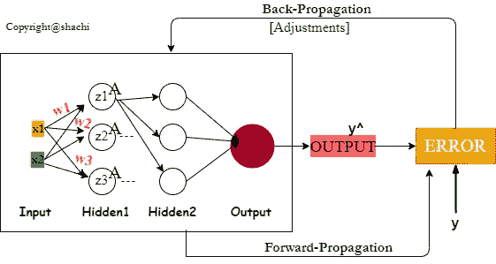

图 1

整个学习过程分为递归的前向和后向传播。

**正向传播:**

输入被传递给隐藏层的神经元，带有一些随机初始化的权重和偏差，如下面所示的**线性变换**。

> z =(输入*重量)+偏差

为了解决复杂问题，**引入非线性变换**，通过**激活函数**实现。线性变换(z)的输出，即输入的加权和，被提供给下面的激活函数。

> A = f(z)

假设对于 Sigmoid 激活函数，

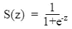

每一层都应用这些线性方程，然后是非线性方程。因此，每一层的最终输出将是激活函数的输出。

您将在输出图层(y^)中获得预测输出，在每个图层中执行相同的过程。

**反向传播:**

预测 output(y^)可能与实际产量(y)不同，因此，使用**损失(成本)函数(J)** 计算损失。这说明我们的预测与实际情况有多大的偏差。让我们用**损失平方和均值**函数来表示损失。

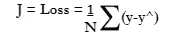

版权

这种损失被传播回初始层，同时更新每层中每个神经元的权重。用最佳权重反向传播误差的过程被称为反向传播。同时计算**每个权重如何影响“误差”**。想法是最小化在成本函数(误差)中贡献更多的神经元的权重。

现在，**降低了成本函数(没有损失)，权重应该调整**。这可以通过跨训练迭代的反复试验来完成，这非常麻烦。因此，需要优化器来调整权重，以便最小化成本函数(损失)。为了理解重量是如何影响输入的，计算成本函数的导数，即相对于重量的损失率( **dJ / dw** )。于是，*来了* ***渐变下降*** 。

如上所述，反向传播用于计算成本函数 J(w)的偏导数，其值将用于梯度下降算法。最终结果将是优化的权重，该权重将按照下面的等式进行更新。

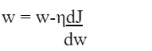

版权

术语“向后”是指梯度计算从网络向后开始。首先计算最后一层的权重梯度，而第一层在最后。

再次前馈激活输出，获得损耗，并重复直到获得满意的结果。

## 反向传播的症结

具有输入(x)的一组输入神经元与具有特定权重(w)的下一层神经元相连接，该组输入神经元被相乘并被传递给给出特定输出的激活函数。计算误差时要记住实际输出，实际输出是使用成本函数的某些导数反向传播的。让我们讨论一下。

考虑下面的网络。

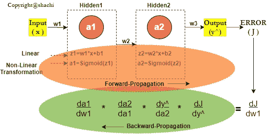

基本上，反向传播是为了在下一次迭代中更新权重以减少损失。将重量公式更新为:

因此，我们需要有导数(dJ/dw ),于是，链式法则的微分概念就出现了，即复合函数的导数。

为了计算相对于第一重量的误差导数，通过链式法则反向传播(如图所示)。

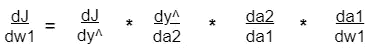

上面显示的是由于重量引起的误差函数变化是由于激活引起的误差函数变化(最终)输出乘以由于重量引起的激活变化。整个网络的输出是 Hidden2 神经元(a2)的激活，因此是 Hidden2 层的 Sigmoid 函数的导数。

汇总所有导数将放入图中的权重更新方程，给出新的权重。

# 梯度下降

## 直觉

在一项研究中有一个美丽的解释:

[来源](http://cs231n.stanford.edu/slides/winter1516_lecture3.pdf)

假设你被蒙上眼睛，必须到达山的最低点的一个湖。由于能见度为零，你只能通过触摸地面和获得坡度的想法来达到。无论地面下降到哪里，我们都向下走一步，以便更快地到达湖边。这个向斜坡下降的过程充当梯度下降算法，这是一个**迭代方法**。

> 当我们说梯度时，它是指损失函数相对于网络中的权重的梯度。

**梯度**是一个有方向和大小的矢量。梯度是凸曲线的斜率(**导数** w.r.t 权值)。它是在反向传播期间计算的，之后参数(权重)得到更新。

## 为什么要用 NN 中的导数？

导数一般**用于**优化问题，如梯度下降到**优化权重**(增加/减少)以达到最小成本函数值。
在 NN 中，在反向传播期间计算成本函数相对于权重(w)的导数。这是指计算梯度下降时权重参数变化的影响。

## **梯度下降的工作原理**

在 NN 中，通过梯度下降算法**计算应该向后传播的最佳权重，该算法又通过偏导数**计算**，如图 3 所示。**

下面说说图吧。
成本函数与权重之间的图表显示了它如何实现其达到全局成本最小点的目标。朝向极小点的每个**步长**由梯度(斜率)即**导数**决定**，而步长取决于 **learn_rate** 。选择不适当的 learn_rate 和激活函数会导致各种梯度问题，这些问题将在后面的章节中讨论。**

[来源](https://www.youtube.com/watch?v=b4Vyma9wPHo)

**梯度下降算法**

1.  随机初始化权重 w
2.  使用成本函数的导数 wrt 权重 J(w)计算梯度 G

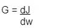

3.权重更新等式: *w = w-ηG*
*这里，η是一个 learn_rate，它不应该太高或太低而跳过或根本不收敛到最小点。*

4.重复步骤 2 到 3，直到它变成一个常数变化。

# 梯度问题

## 一.消失梯度

消失梯度是神经网络学习过程中的一个场景，其中**模型根本不学习**。这是因为当梯度变得太小，几乎为零，导致权重卡住，永远不会达到最小损失的最优值(全局最小值)。从而网络无法学习和收敛。尤其是在链式规则微分期间，从最后一层到初始层的反向传播可能根本不会导致权重的更新。

## 二。爆炸梯度

与消失梯度完全相反，当模型不断学习时，权重不断更新，但模型永远不会收敛。计算相对于权重的**梯度**(损失)，该权重在早期层中变得非常大，以至于**爆炸**。继续振荡，采取大的步长，如上面第三个图所示，并在远离收敛点时偏离收敛点。

## 三。鞍点(极小极大点)

损失函数曲面上的鞍点是这样的外交点，从一个维度看，临界点似乎是最小值，而从其他维度看，它似乎是最大值点。

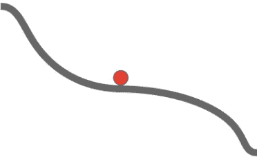

[来源](https://srdas.github.io/DLBook/GradientDescentTechniques.html)

鞍点是围绕学习大惊小怪，因为它导致了混乱。当模型学习在达到“最小值”时停止，因此斜率=0，这实际上是来自其他维度的最大成本值。这导致了非最佳点。

当梯度下降在多维中运行时，鞍点进入视野。

这是临界点的场景。

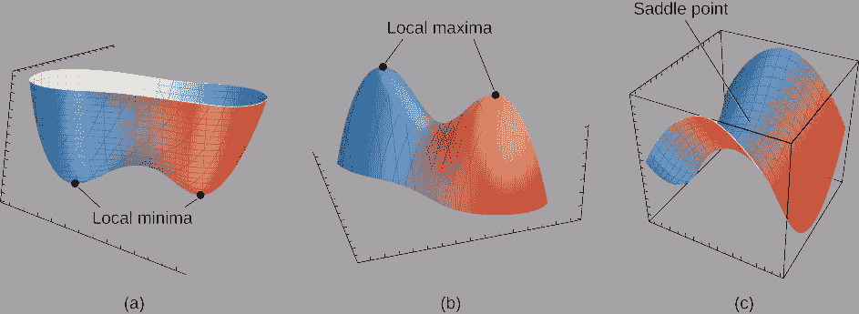

[来源](https://math.libretexts.org/Bookshelves/Calculus/Map%3A_University_Calculus_(Hass_et_al.)/13%3A_Partial_Derivatives/13.7%3A_Extreme_Values_and_Saddle_Points)

# 梯度问题的原因

在进入梯度问题的原因之前，让我们看看其他参数是如何导致我们的神经网络模型不能收敛的。

1.  学习率
2.  梯度下降

## 学习率

学习率是指权重减少/增加的速率。低学习率导致如此多的更新，并且模型将永远无法达到实际上是低成本函数(损失)值的全局最小点。高学习率将随着太大的权重更新而爆炸，并且可能跳过模型收敛点。因此，设置最佳值将使我们的模型达到最小点(低成本值)。

如果梯度项( **dJ/dw** )太小或太大，模型也不会收敛，该梯度项是权重更新方程(梯度下降公式)中误差函数的导数。

当与学习率相乘时，计算的梯度( **dJ/dw** )太小，导致值变小。如果学习率也很低，效果会更小。用重量减去这个较小的值几乎不会导致重量的任何变化。导致模型不收敛。
或者相反，较高梯度与学习率的乘积导致较高的值，当从权重中减去时，导致每个时期中巨大的权重更新，因此可能反弹最优值。这两种情况都不允许模型收敛。

**但问题是，**

# **为什么梯度会太低或太高？**

梯度下降法是一种权重优化算法，它包括代价函数和激活函数。怎么会？好吧，让我们看看反向传播过程中梯度下降的链式法则。

这里，J 指的是成本函数，其中项(dJ/dw1)是成本函数 w.r.t 权重的**导数。通俗地说，我们看看 w1 对误差函数有什么影响。项(dy^/da2)是输出层**的激活函数的**导数。另一项(da2/da1)是隐藏层激活函数**、*的**导数，假设输出和隐藏层都是 Sigmoid 激活函数。***

**Sigmoid 导数的范围**为 **(0，1/4)**。当 sigmoid 函数导数链乘以最大值的 1/4 时，会产生更多更小的值。

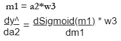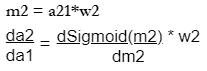

这两个术语的乘积:

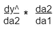

Sigmoid 导数范围(例如，1/4)乘以范围的权重(-1，1)会得到更小的值。简单的数学表明两个较小的数会导致更多的较小的数。因此，这种导数链推断(dJ/dw)为微小值。这就是为什么梯度会太低以至于几乎消失。同样，对于激活函数双曲正切( **tanh** )，其**导数范围为【0，1】**，也是更小的有限值，结果与上述相同。不管怎样，Sigmoid 和 tanh 的最大输出范围分别是(0，1)和(-1，1)。

[来源](https://towardsdatascience.com/why-data-should-be-normalized-before-training-a-neural-network-c626b7f66c7d)

> 在 Sigmoid 和 Tanh 激活函数的情况下，当从输出层传播到初始层时，梯度呈指数下降。因此，学习非常缓慢或根本不学。

**当 Sigmoid 激活函数或替代的双曲正切函数由于其导数的范围而出现时，梯度问题就出现了。更明确地说，sigmoid 导数的范围(0，1/4)和 tanh [0，1]是问题的根本原因。**

# 避免梯度问题的解决方案

为了避免渐变问题，最好为隐藏层选择一个合适的激活函数。对于隐藏层，可以使用除 sigmoid 和 tanh 之外的任何激活函数。例如，ReLU、LeakyReLU 等。但是他们将如何解决梯度问题呢？

## ReLU:

在 Sigmoid 和 tanh 函数的缺点之后，ReLU 变得相当流行。这在隐藏层中非常有用。

输入范围从(-infinite，infinite)分别产生范围为(0，Input)的输出。小于 0 的输入的 ReLU 函数的导数为 0，而等于或大于 1 的为 1。

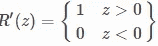

[来源](https://ml-cheatsheet.readthedocs.io/en/latest/activation_functions.html#sigmoid)

由于 ReLU 函数不像 sigmoid 和 tanh 那样在(0，1)的范围内，所以梯度不会很小，从而解决了消失梯度问题。

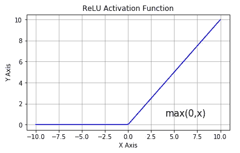

[来源](https://analyticsindiamag.com/most-common-activation-functions-in-neural-networks-and-rationale-behind-it/)

然而，ReLU 有一个导致**死亡神经元**的缺点，这不在本博客的讨论范围之内。为了克服它的缺点，eLU 被引进了。

# **一些很棒的参考是:**

[https://ayearofai . com/rohan-4-the vanishing-gradient-problem-ec68f 76 FFB 9b](https://ayearofai.com/rohan-4-the-vanishing-gradient-problem-ec68f76ffb9b)

[https://brilliant.org/wiki/backpropagation/](https://brilliant.org/wiki/backpropagation/)

[https://www.jeremyjordan.me/nn-learning-rate/](https://www.jeremyjordan.me/nn-learning-rate/)

快乐阅读！

***可以通过***[***LinkedIn***](https://www.linkedin.com/in/kaul-shachi)***与我取得联系。***

欢迎在评论区分享你的观点或任何误导性的信息。:)