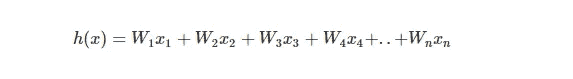
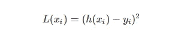
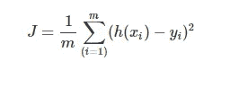
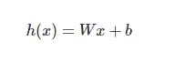
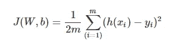
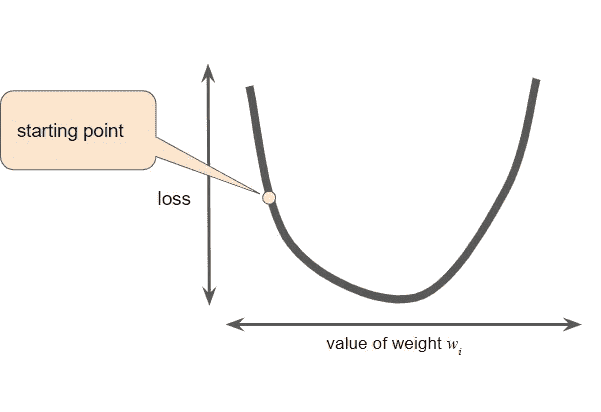
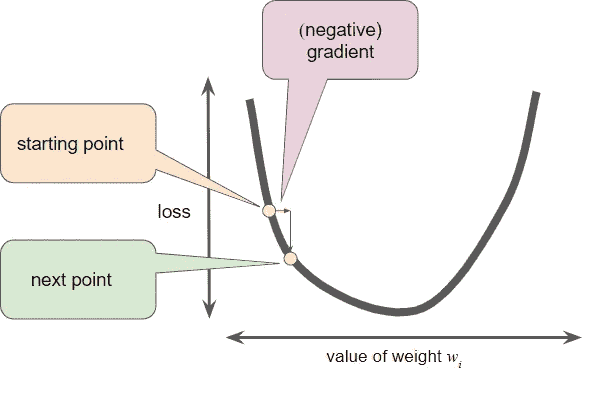
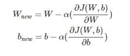
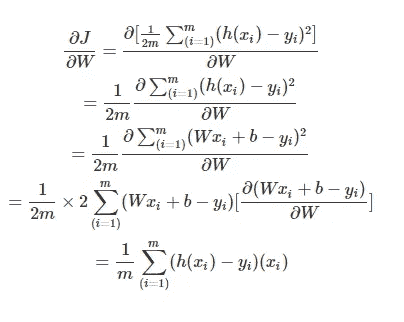
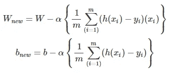

# 通过数学棱镜的梯度下降

> 原文：<https://medium.com/analytics-vidhya/gradient-descent-through-the-mathematical-prism-418cb3bca473?source=collection_archive---------11----------------------->

## 一个最广泛使用的最优化问题之一，梯度下降的简单数学观点。

迈克尔·泽兹奇在 [Unsplash](https://unsplash.com?utm_source=medium&utm_medium=referral) 上的照片

# 介绍

优化问题是任何一种数据科学问题的核心，它本身是数学中一个非常大的领域。由于数学和数据科学密切相关，任何模型的建立都需要一定程度的数学优化。真正意义上的优化意味着“获得最优或最佳解决方案”，在某些情况下可以是最大值，在某些情况下可以是最小值。在我们的例子中， *n 优化问题意味着在给定的一定范围内最大化或最小化一个实值函数。*在众多被广泛应用的优化问题中，今天我们来看看它们的母体——梯度下降的真实形式——香草问题。将给出数学背景，在下一篇文章中，我们也将用 python 从头实现一个。听起来很有趣，那我们走吧！！

## 首先是一些术语:

所以，在我们理解什么是梯度下降以及如何下降之前，让我们先弄清楚一些我们将要用到的基本原理和术语。

**权重和偏差:**

因此，对于从线性回归到深度神经网络的每一个模型构建，有一点是共同的，我们试图获得一个假设函数。这实质上绑定了乘以一些权重的输入变量，以便根据需要减少或增加每个变量以及一些偏差或额外常数的重要性。因此，权重是提供给每个输入变量的权重，而偏差是我们引入来控制建模行为的额外常数。

具有 n 个输入和 n 个权重的线性假设函数的一般方程。

**损失函数:**

变量之间的函数或关系，定义在一行数据或数据点上。它量化了预测某个值所承受的惩罚。基本上，对于给定的数据点和预测，它会告诉你预测的误差。根据算法和问题的类型，损失函数是不同的。例如回归的平方损失、SVM 的铰链损失、分类问题的二元损失等。

损失函数类似于 RMSE

**成本函数:**

这是上述的一般化形式，考虑了批次中的所有数据点。通常，它是训练数据点上所有损失函数的总和。在某些情况下，一些额外的惩罚也被称为正则化。例如，对于 RMSE(均方根误差)、逻辑回归成本函数。

成本函数示例

**目标函数:**

这是成本函数的一般情况，该术语来源于数学优化。它代表一个你想要最大化或最小化的方程或函数。因此，我们可以说成本函数是目标函数的一个特例。

**渐变:**

梯度是“坡度”的另一种说法。图形中某一点的梯度越高，该点的曲线就越陡。负梯度意味着曲线向下倾斜。从数学上讲，它是曲线在某个给定点的导数。

## 示例案例

为了使直觉更简单，我们将采用可以表示线性回归的线性函数或更简单的具有线性激活的感知器模型。因此，我们将假设函数定义如下，该函数可视为一条直线的方程，其中 *y = mx + c。此外，该方程可视为一个多变量输入矩阵乘以权重矩阵并添加偏差矩阵的方程。这里 h(x)是当单个输入 x 被传递给模型时的输出。*

假设函数

考虑到这是一个回归问题，损失函数和成本函数如下:

损失函数误差用平方来防止负误差

上述损失函数的成本函数

如果你仔细观察，成本函数也有 1/2 乘以常数，这只不过是在对成本函数求导时，从额外的常数归一化方程。

因此，给定上述等式，我们需要优化成本函数以获得模型的最终对应权重。

## 下降开始了…

现在，典型梯度下降的步骤如下所示:

*   为上述方程或目标函数曲线上的起点选择一些随机权重和偏差。

[https://developers . Google . com/machine-learning/crash-course/reducing-loss/gradient-descent](https://developers.google.com/machine-learning/crash-course/reducing-loss/gradient-descent)

*   计算曲线上该点的斜率，它只不过是曲线上该点的导数。
*   通过对函数求偏导数，计算移动到下一步所需的变化。
*   将这种变化乘以模型的学习率，通常是超参数(alpha)。
*   更新权重和偏差并继续。

[https://developers . Google . com/machine-learning/crash-course/reducing-loss/gradient-descent](https://developers.google.com/machine-learning/crash-course/reducing-loss/gradient-descent)

从数学等式的角度来看，上述步骤意味着什么，这就是我们要研究的内容。简单来说，我们需要将 w.r.t 以上的成本函数分别部分微分到 W 和 b，计算更新后的权重并继续前进。要在方程式中书写:

重量更新

对于上面偏导数的计算，我们需要简单的导数法则和乘积法则。在求偏导数的时候，只要把其他变量当作常数来求导就行了。下面给出了方法:

成本函数的偏导数

类似地，对于其他变量 b，我们计算偏导数，给出以下值:

导数输出

最后，更新后的权重和偏差如下所示:

重量和偏差更新

这个更新权重和偏差的过程一直进行到“模型收敛”发生。什么是真正的模型收敛，我们已经找到了我们的成本函数的全局最小值，这实际上告诉我们，给定的权重范围，这是误差最小的状态，因此，给定数据点的精度最高。

不仅如此，我们还需要调整步长和学习速率等因素。想要更好的动画例子，我推荐向大师们学习，谷歌:

[https://developers . Google . com/machine-learning/crash-course/reducing-loss/gradient-descent](https://developers.google.com/machine-learning/crash-course/fitter/graph)

# 优化的类型

有各种类型的优化算法，也在行业中大量使用。梯度下降优化有自己的多种口味。因此，在我们讨论原始版本之前，让我们先看看其他版本:

*   **批量梯度下降**

顾名思义，它会立即对批次进行重量校正，也就是说，只有在整批产品通过后，才会进行重量更新。这是最常用的，在 Keras 等包中是默认的。

*   **随机梯度下降**

这里一次一个数据点，因此它是侵略性的并且计算量也很大。正如预期的那样，会有很多振荡，有可能达不到全局最小值。

*   **小批量梯度下降**

它把以上两者结合起来，因此在学习第一批漏掉的内容时既不太激进也不太自满。

# 结论:

我们研究了普通梯度下降优化及其背后的复杂数学，以计算更新的权重，以及如何使模型收敛以优化权重和偏差。如果您有任何进一步的问题或疑问，请随时评论。*再见！！*