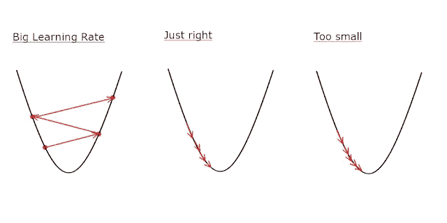
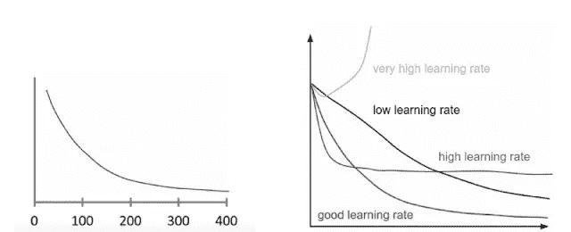
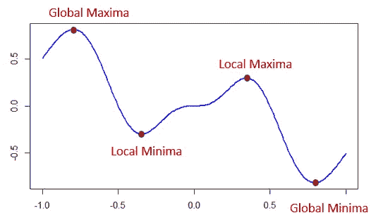

# 梯度下降:为什么和如何？

> 原文：<https://medium.com/analytics-vidhya/gradient-descent-why-and-how-e369950ae7d3?source=collection_archive---------2----------------------->

## 梯度下降及其变体的理论方法

最小化代价函数在机器学习模型中非常重要。这里梯度下降是用于最小化成本函数的迭代技术。成本函数是预测误差(Y_Actual-Y_Predicted)

梯度下降

如果你看到上面的图片，这个人在山顶或半山腰，他想用最少的步数下山。这个人反复地(一小步一小步地)这样做，直到到达山的底部。

梯度下降也一样。这里，山是数据的维度，步骤是学习率，底部(目标点)是误差最小的成本函数。

**学习率:-**

从上面的例子中，达到目标点(最佳点)所采取的步骤被称为学习率

**如何选择学习率？**

学习率比较

如果学习率太高，那么它会跳至凸函数，但不会有效地达到局部最小值

如果学习率太小，那么它会达到局部最小值，但会花费太多时间

我们必须选择学习率，使得成本函数同时降低。在此绘制成本函数与间隔的关系图，以检查正确的学习率。

在迭代中选择好的学习率

> 在梯度下降中，我们计算所有数据点的成本。并在每次迭代中更新权重。例如，如果我们在训练中有 10，000 个点，那么我们仅在一次迭代中计算 W(权重)和成本。

梯度下降的问题是，假设山有两个最小点，第一个到达的最小点被称为局部最小值，第二个(最后一个)最小点被称为全局最小值。

积分的最小值和最大值[图片来源:[点击 _ 此处](https://www.datasciencecentral.com/profiles/blogs/optimization-techniques-finding-maxima-and-minima) ]

优化成本函数使其达到全局最小值总是更好的。为此，我们必须使用另一种梯度下降技术。这些措施如下

1.  **批量梯度下降**
2.  **随机梯度下降**
3.  **小批量梯度下降**

# **1。批量梯度下降:-**

它也被称为香草梯度下降技术。在这种技术中，我们计算每个观测值的误差，但是仅当所有观测值都完成评估时才执行更新

批量梯度下降技术是计算昂贵的技术。它非常慢，而且大型数据集无法加载到内存中

# **2。随机梯度下降:-**

SGD 在每次迭代中对每个观察值执行权重更新。在这里，我们首先需要打乱数据集，以便我们得到完全随机的数据集。

由于我们的数据集是随机的数据集，并且针对每个示例更新了误差和权重，梯度权重达到了全局最小值，而不是停留在局部最小值。

SGD 比批量梯度技术更快。这种技术在计算上也是多余的，因为它一次计算一个例子

# 3.小批量梯度下降:-

该技术是 sgd 和批量梯度技术的结合。首先，它将数据集分成小批，然后对每批执行更新。这里，当我们在批量样本中获取数据时，它消除了噪声，即权重更新的方差。与分批法和 sgd 法相比，这是一种快速的技术。

> *同时查看下一部分，即该技术的编程方法*

# 参考资料:-

 [## 应用课程

### 我们知道转行是多么具有挑战性。我们的应用人工智能/机器学习课程被设计为整体学习…

www.appliedaicourse.com](https://www.appliedaicourse.com)  [## 梯度下降导论

### 梯度下降

梯度 Descentmedium.com](/mindorks/an-introduction-to-gradient-descent-7b0c6d9e49f6)  [## 梯度下降算法简介

### 梯度下降是机器学习和深度学习中使用最多的算法之一。

medium.com](/@montjoile/an-introduction-to-gradient-descent-algorithm-34cf3cee752b)  [## 减少损失:随机梯度下降

### 预计时间:3 分钟在梯度下降，一批是总数量的例子，你用来计算…

developers.google.com](https://developers.google.com/machine-learning/crash-course/reducing-loss/stochastic-gradient-descent)