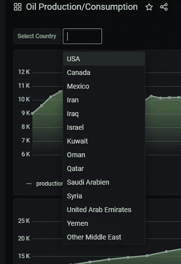

# Grafana with PostgreSQL —使用开源工具实现数据可视化

> 原文：<https://medium.com/analytics-vidhya/grafana-with-postgresql-data-visualization-with-open-source-tool-36f5150fa290?source=collection_archive---------0----------------------->

Grafana 是一个多平台开源分析和交互式可视化 web 应用程序。当连接到支持的数据源时，它为 web 提供图表、图形和警报。它可以通过一个插件系统进行扩展。终端用户可以使用交互式查询构建器创建复杂的监控仪表板。它是用 Go 编程语言写的。


图片由所有者创建:来自谷歌的图标

1.  从 [Grafana 官方网站](https://grafana.com/grafana/download?platform=windows)下载**设置**。
2.  选择您想要安装的 Grafana **版本**(默认选择最新的 Grafana 版本)。
3.  选择一个**版本**。
4.  点击**窗口**。

# 使用 Windows installer 安装

1.  点击**下载安装程序**。
2.  打开并运行安装程序。

# 第一次登录

1.  打开您的网络浏览器并转到 [http://localhost:3000/。](http://localhost:3000/.) `**3000**` 是默认的 HTTP 端口，如果您没有配置不同的端口，Grafana 会监听该端口。
2.  在登录页面上，键入`**admin**` 作为用户名和密码。
3.  更改您的密码。


Grafana 登录页面


登录后的仪表板看起来像！

# 数据库设置

遵循这些步骤:[https://www.postgresqltutorial.com/install-postgresql/](https://www.postgresqltutorial.com/install-postgresql/)

1.  从[https://www . enterprise db . com/downloads/postgres-PostgreSQL-downloads](https://www.enterprisedb.com/downloads/postgres-postgresql-downloads)下载 PostgreSQL 安装程序
2.  运行并安装它
3.  单击下一步
4.  如果要更改目录，请浏览文件夹；否则，它将转到默认路径 C:\\Program Files\\
5.  为超级用户添加密码
6.  选择端口号:默认情况下，PostgreSQL 在端口 5432 上运行
7.  单击下一步，下一步…然后它开始安装…

# PostgreSQL 安装成功了吗？

1.  在系统搜索栏中搜索“sql”，然后打开终端(SQL Shell)。


2.它看起来像下面的图像:除了密码之外的所有选项都按回车键。输入您在数据库安装过程中键入的密码。


# 用虚拟数据填充数据库

1.  首先，您需要创建表:

```
**CREATE** **TABLE** t_oil
(
region      **text**,
country     **text**,
year        **int**,
production  **int**,
consumption **int** );
```

2.其次，通过运行以下命令，用虚拟数据填充该表:

```
**COPY** t_oil FROM
PROGRAM ‘curl [https://www.cybertec-postgresql.com/secret/oil_ext.txt'](https://www.cybertec-postgresql.com/secret/oil_ext.txt');
```

上面的命令只是将所有的石油数据转储到数据库中的 ***t_oil*** 表中。也可以用 ***插入*** 命令插入数据，但需要手动插入每行数据。

```
**INSERT** INTO ***t_oil*** (
region, country, year, production, consumption )
**VALUES** (
North America, USA, 1965, 9014, 11522);
```

3.最后，运行下面的命令检查数据是否成功插入。

```
**SELECT** * FROM ***t_oil***;
```


显示 **t_oil** 表中的所有虚拟数据

# 用 Grafana 数据源配置 PostgreSQL

现在，数据库和数据已成功安装和配置。

让我们用 Grafana 数据源连接数据库。

1.  单击顶部标题中的 Grafana 图标打开侧面菜单。
2.  在`Configuration`图标下的侧菜单中，您应该会找到一个名为`Data Sources`的链接。
3.  点击顶部标题中的`+ Add data source`按钮。
4.  从*类型*下拉列表中选择 *PostgreSQL* 。


5.单击 postreSQL，它会打开配置选项卡以插入数据库详细信息。

6.插入以下配置

```
Host : localhost:5432
User: postgres
Password : // database password that you enter during installation
SSL Mode: disable
```


7.点击按钮中的“保存和测试”按钮，然后显示提示信息，如“数据库连接正常”，这意味着数据库已成功配置 Grafana。


8.您可以再次打开配置选项，您会看到 PostgreSQL 数据库显示在数据源选项卡中。


# 可视化 Grafana 仪表板上的数据

成功配置数据库后，让我们开始在 Grafana 中可视化数据。

1.  **创建仪表板**:点击左侧面板中的“创建”选项，并选择仪表板。


2.它创建了“新仪表板”。


3.点击“添加新面板”。它打开面板就像，

看到这里有太多选择，不要慌。让我们一个一个讨论吧！


4.命名您想要的面板标题，


5.选择要打印的可视化选项。我选择了一个“线图”来绘制石油消耗和产量。


6.选择在“数据源”选项卡中配置数据库时创建的数据库源。


7.点击“编辑 SQL”


8.在查询编辑器中输入 SQL 查询。


9.单击顶部的“应用”按钮，控制面板将显示如下:


10.类似地，创建一个新的“油耗”面板，它看起来像这样:


11.我们也可以在单个图形中制作多个图形。为此，我们需要单击查询并添加新的 SQL 查询:


12.单击“应用”,它应该看起来像这样:


# 格式化图

绘制完图表后，让我们做一些样式。

进入“编辑面板”,设置显示和图例参数如下:


显示设置


图例设置

设置参数后，仪表板中的图如下所示:


石油生产和消费仪表板

# Grafana 中的变量声明

> 注意:正如您在上面注意到的，用于绘制图表的 SQL 查询只适用于美国。如果用户也想看到其他国家的情况呢？是的，我们也可以那样做。就像用户从下拉列表中选择特定国家一样，仪表板将显示该国家的石油产量/消耗量。

为此，我们需要声明变量。进入仪表板设置，选择变量选项。


点击“添加变量”,然后打开“新变量”选项卡。输入如下参数。


点击“添加”按钮和“保存仪表板”，仪表板上出现下拉列表，显示所有国家名称。



现在，我们需要将变量链接到 Grafana 中的 SQL 查询，以便根据用户选择动态绘制图形。

再次进入编辑面板，更新查询，


这里的' $country '是下拉列表的变量名。将查询中 WHERE 子句中的“USA”替换为“$country”变量，并保存仪表板。

# 最后

最终仪表板根据用户从下拉列表中选择的国家更新图表。

Grafana 支持几乎所有的数据库来绘制实时数据，并提供不同的监控功能，如警报等。最后但同样重要的是，它节省了开发人员实现数据可视化前端的时间。

