# 图形算法—第一部分

> 原文：<https://medium.com/analytics-vidhya/graph-algorithms-1-5d80d022019?source=collection_archive---------10----------------------->

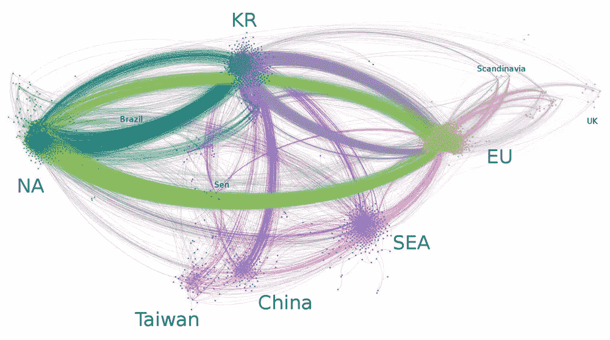

F 首先，感谢 Mosh 令人难以置信的课程——[终极数据结构&算法](https://codewithmosh.com/courses)。我从他的课程中学到了很多，这篇文章是我对他的课程的图算法部分的笔记。

# 介绍

图形可以表示连接的对象。在现实世界场景中，它可能是一个社交网络，代表人们的关系。当你想描述一堆物体之间的关系时，尽量用图！


## **组件，邻居**

图由**节点/顶点**和**边**组成。如果两个节点直接相连，则它们是**邻居/相邻**。在这个图中，节点代表不同的人，边显示人与人之间的关系。每对节点都是相邻的。我们把这种图叫做**团**。

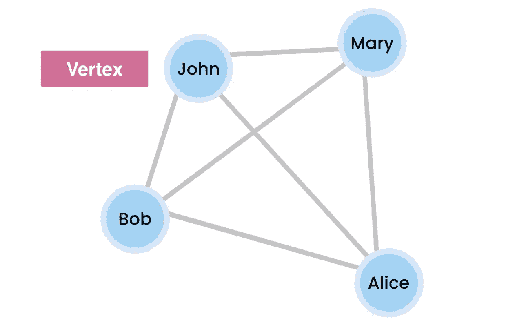

团，间接图

相比之下，在下图中，John 与 Sam 没有直接联系。因此，约翰和萨姆不是邻居。

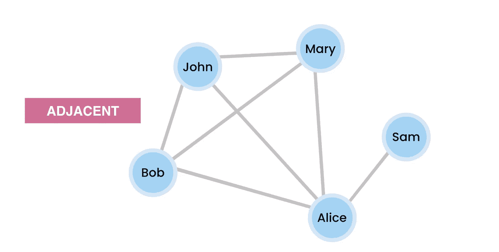

## 有向和无向图

上面我们关注的是无向图，这意味着边没有方向。什么是有向图？想想推特吧！我是斯蒂芬·库里的粉丝，我在推特上关注他，但他不关注我。因此，我和库里的关系需要一个方向。那就是**直接图**。

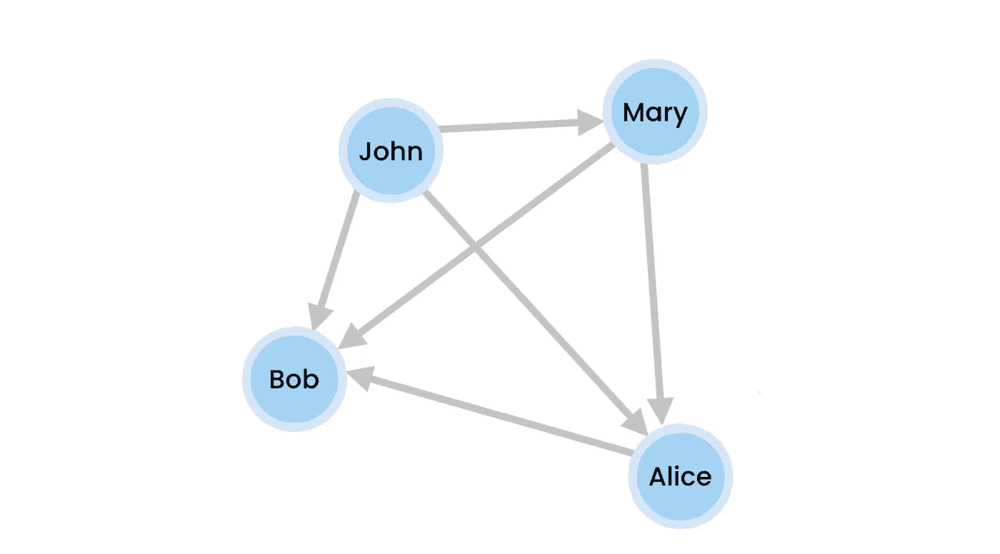

直接图形

## 加权和未加权图

边也可以具有表示关系有多强的权重。例如，在社交网络中，如果约翰和玛丽有许多交互，他们的关系将具有更高的权重。


加权图

# 表现

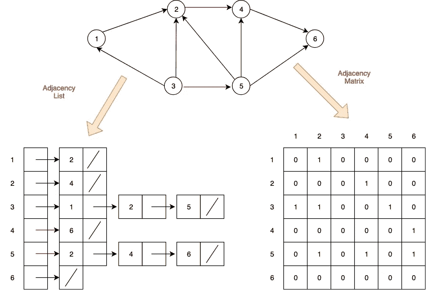

我们有几种方法来表示一个图。这里我们要讲的是**邻接矩阵**和**邻接表**。

## 邻接矩阵

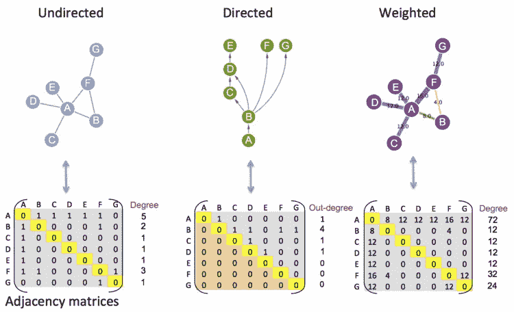

如果两个节点相连，我们将交集标记为 1 或 true 否则，我们将其标记为 0 或 false。我们可以使用二维数组轻松实现这种方法。缺点是我们需要为这个矩阵分配额外的空间。如果我们有 n 个节点，空间复杂度是 O(V)。(我们在处理图的时候用 V 代替 n。v 是指节点的数量)

添加一个新节点是 O(V ),因为我们需要创建一个多一行多一列的新数组，并将所有现有的项复制到新数组中。

此外，删除一个节点是 O(V ),因为我们需要分配一个新的更小的矩阵，并复制周围的项目。

加个边怎么样？例如，我们想在约翰和玛丽之间添加一个关系，第一步是找到(约翰，玛丽)的索引。

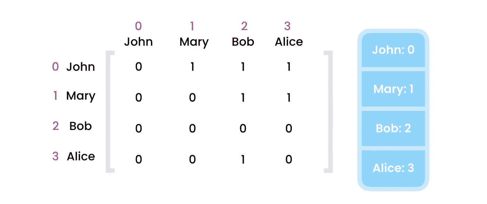

哈希表

我们可以使用一个**散列表**来存储索引。因此，添加新的边只需要 O(1)运算。要删除一个边，通过相同的过程，它也是 O(1)。

查询边意味着我们要检查两个节点是否连接。我们要做的是找到指数，寻找值。这是一个 O(1)运算。

寻找给定节点的所有邻接是一个 O(V)运算。例如，我们想找到鲍勃的邻居。首先求 Bob 的索引，那就是 O(1)。然后我们需要查看该行/列中的每一项。一行/一列中有多少项？五.项目。

## **邻接表**

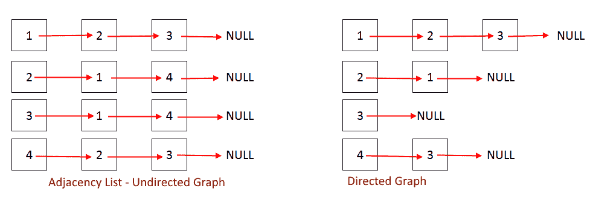

邻接表

邻接表是链接列表的一个**数组**。这个数组中的每一项都是一个**链表**。并且每个列表包含特定节点的邻居。

这种方法更加节省空间，因为我们只存储存在的边。空间复杂度为 O(V + E)。e 指总边数。在最坏的情况下，每个节点都与其他节点相连。我们称这种图为稠密图。总边数为 E = V * (V-1)，空间复杂度为 O(V -1+V ) = O(V)。(我们只关心比其他部分增长更快的 V 部分)

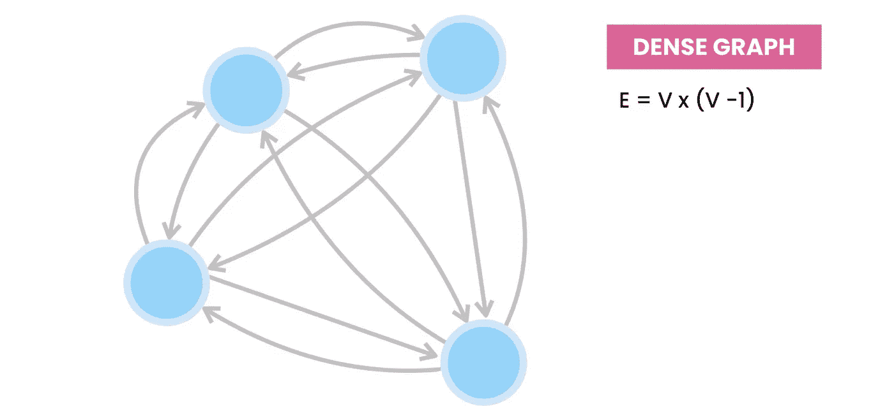

稠密图

添加一个节点需要 O(1)运算，因为我们只需要在邻接表中添加一个新项。(这里，我们可以使用一个能够自动增加长度的数组列表)

要删除一个节点，首先我们需要从邻接表中删除该元素，并确保没有其他节点链接到该节点，这意味着我们需要遍历列表，并从每个 LinkedList 中删除目标节点。

例如，根据下图，我们有一个邻接表，我们想删除节点 4。首先，我们需要遍历数组并删除节点 4。那是一个 O(V)。在每次迭代中，我们需要从每个 LinkedList 中删除目标节点。移除 LinkedList 中的项目需要 O(n)次运算，但是 n 的确切值因每个 LinkedList 而异。我们图中的每条边对应于 LinkedList 中的一个元素。总的来说，我们有 E 条边，所以在我们的五个链表中有 E 个元素。所以时间复杂度是 O(V + E)。在最坏的情况下，E = V*(V-1)，时间复杂度为 O(V)。

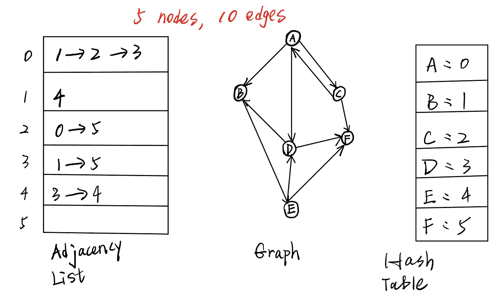

**提示:关键是，图中的边数(E)= linked list 中的项目总数。**

添加一条边的运行时间为 O(K)。例如，我们想添加一个从 B 到 a 的关系，首先，我们需要找到 B 的索引，然后我们需要迭代 LinkedList 以确保这个关系当前不存在。最后，我们可以添加一个新的关系。作为 HashMap 的结果，第一步只需要 O(1)。在 LinkedList 的末尾添加一个新项目需要 O(1)。第二步采用 O(K)迭代 LinkedList。(K 指给定节点的边数)。所以加一条边是 O(K)。最坏的情况下，又是一个稠密图，K = V-1，时间复杂度为 O(V)。

**温馨提示:如果你处理的是** [**多图**](https://en.wikipedia.org/wiki/Multigraph) **，这意味着两个节点可以通过不同的边连接。那我们就不需要第二步了。因此，在多重图中添加一条边的时间复杂度为 O(1)。**

移除边与添加边非常相似。找到索引 O(1) ->迭代 LinkedList 找到目标边 O(K) ->移除它 O(1)。还是那句话，最坏的情况下是 O(V)。

查询边和在邻接表中寻找邻居都是 O(K)运算。我们需要遍历链表来查看目标边是否存在(或者找到所有的邻居)，这在最坏的情况下需要 O(K)和 O(V)。

## 比较

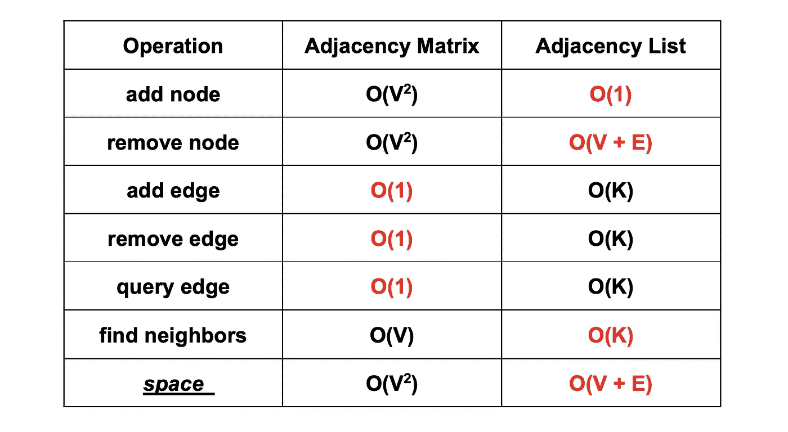

平均情景

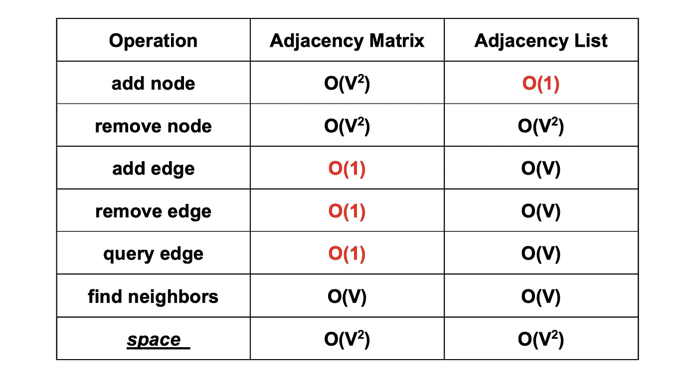

最坏情况(密集图)

总的来说，如果你处理的是密集图，使用矩阵更好；否则，使用列表会更有效。

# 使用 Java 创建图表

让我们用 Java 创建一个 graph 类。Mosh 使用两个 HashMaps 来创建图表，因为它更面向对象。我还尝试使用 Array、LinkedList 和 HashMap 来创建图表。

在这里，我想解释一下这两个散列表是如何工作的。第一个 HashMap 节点帮助我们封装节点对象。用户只需要传递一个字符串作为参数。第二个散列表是我们的邻接表。这里我们使用 HashMap 代替 array 进行快速查找。

让我们测试我们的程序！

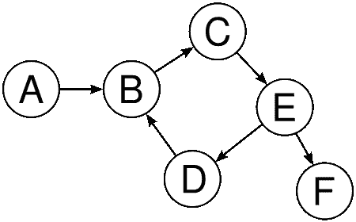

直接图形示例

根据示例图，我们将添加节点和边。

```
public class Main {

    public static void main(String[] args) {
        Graph g = new Graph();
        g.addNode("A");
        g.addNode("B");
        g.addNode("C");
        g.addNode("D");
        g.addNode("E");
        g.addNode("F");
        g.addEdge("A","B");
        g.addEdge("D","B");
        g.addEdge("B","C");
        g.addEdge("C","E");
        g.addEdge("E","D");
        g.addEdge("E","F");
        g.print();
    }
}
```

程序输出:

a 连接到[B]
E 连接到[D，F]
B 连接到[C]
C 连接到[E]
D 连接到[B]

```
g.removeNode("F");
g.removeEdge("A","B");
g.print();
```

程序输出:

E 连接到[D]
B 连接到[C]
C 连接到[E]
D 连接到[B]

最后，我还使用 HashMap、LinkedList 和 array 实现了 graph 类的相同功能。这两种方法的时间复杂度完全相同。

```
public class Main {

    public static void main(String[] args) {
        Graph2 g = new Graph2();
        g.addNode("A");
        g.addNode("B");
        g.addNode("C");
        g.addNode("D");
        g.addNode("E");
        g.addNode("F");
        g.addEdge("A","B");
        g.addEdge("D","B");
        g.addEdge("B","C");
        g.addEdge("C","E");
        g.addEdge("E","D");
        g.addEdge("E","F");
        g.removeEdge("A","B");
        g.removeNode("F");
        g.print();
    }
}
```

程序输出:

a 连接到[]
B 连接到[C]
C 连接到[E]
D 连接到[B]
E 连接到[D]

> 感谢您的阅读！学习永无止境。

***接下来:*** [***图形算法(二)***](/@allenhuang1996/graph-algorithms-part-2-3a42512f1745)