# 图形算法—第二部分

> 原文：<https://medium.com/analytics-vidhya/graph-algorithms-part-2-3a42512f1745?source=collection_archive---------15----------------------->

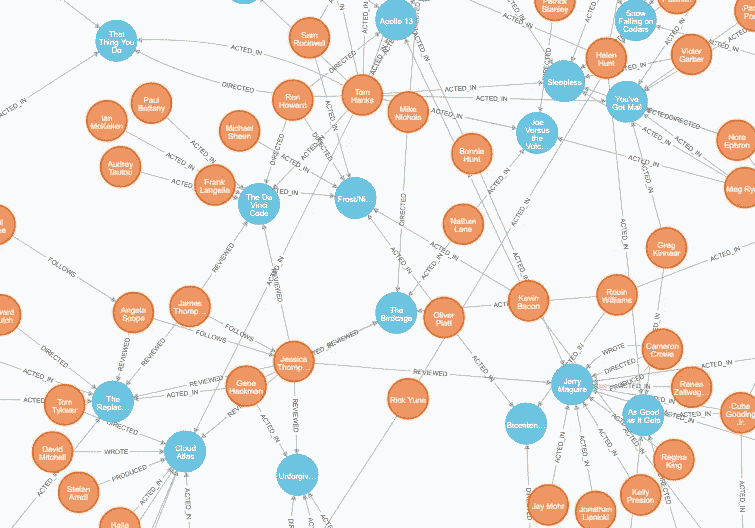

***上一篇:*** [***图形算法—第一部分***](/analytics-vidhya/graph-algorithms-1-5d80d022019)

## **目录**

*   深度优先遍历
*   广度优先遍历
*   拓扑排序
*   循环检测

在树遍历中，我们总是从根节点开始。事实上，树是图的一种，所以树遍历算法也可以应用于图遍历。但是，每棵树都有一个唯一的根节点，从根节点可以到达其他所有节点。在图中，有些节点可能无法从我们的起始节点到达。

# 深度优先遍历

**主旨:选择一个节点开始，递归寻找邻居。**

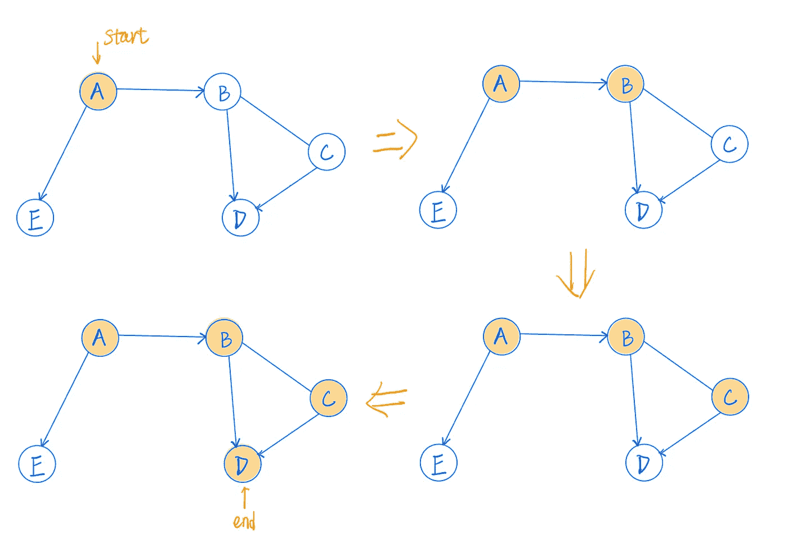

我们从节点 A 开始，找到 A 的邻居，分别是 B 和 e，假设我们接下来选择 B。最后，当我们到达节点 D 时，它没有任何邻居，我们的递归返回。

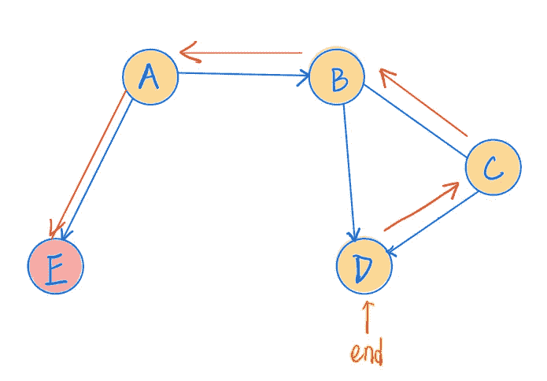

之后，我们回到 C，找到 C 的其他邻居，但是 C 没有任何其他邻居。然后回到 B，B 有另一个邻居 D，但是我们已经遍历了 D，最后我们回到 A，到 e。

如果我们从 B 开始呢？我们联系不到急救室。

**实现(递归)**

```
public void traverseDFT(String root) {
    var node = nodes.get(root);
    if (node == null) return;
    traverseDFT(node, new HashSet<>());

}

private void traverseDFT(Node root, Set<Node> visitedNodes) {
    // visit the root node
    System.*out*.println(root);
    visitedNodes.add(root);

    // find all neighbors of this node
    for (var node : adjacencyList.get(root)) {
        if (!visitedNodes.contains(node)) traverseDFT(node,visitedNodes);
    }
```

**实现(迭代)**

```
public void traverseDFTIter(String root) {
    var node = nodes.get(root);
    if (node == null) return; Stack<Node> nodeStack = new Stack<>();
    Set<Node> nodeVisited = new HashSet<>(); nodeStack.push(node); while (!nodeStack.isEmpty()) {
        var current = nodeStack.pop();
        if (nodeVisited.contains(current)) continue; System.*out*.println(current);
        nodeVisited.add(current); for (var nei : adjacencyList.get(current)) {
            if (!nodeVisited.contains(nei)) nodeStack.push(nei);
        }
    }
}
```

# 广度优先遍历

**大意:在去下一个节点之前，访问一个节点及其所有邻居。**

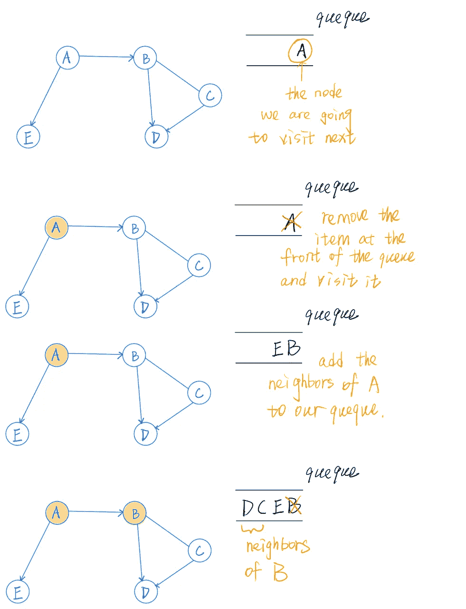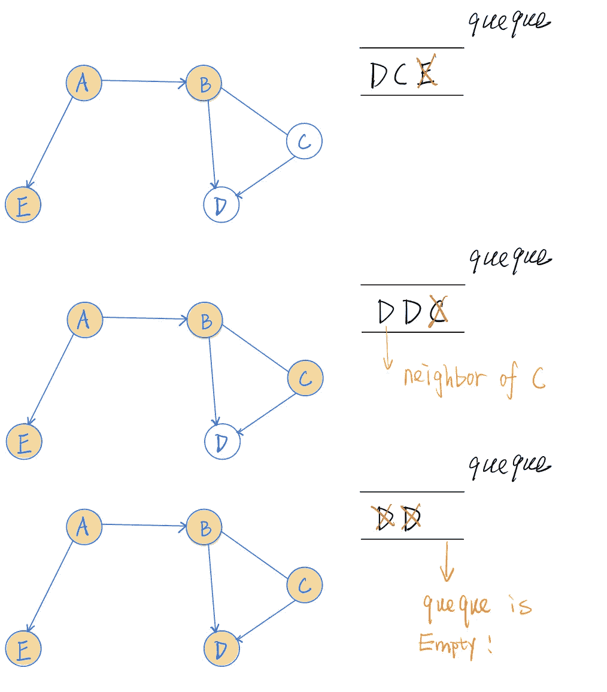

**实施(迭代)**

```
public void travarseBFTIter(String root) {
    var node = nodes.get(root);
    if (node == null) return; Queue<Node> nodeQueue = new ArrayDeque<>();
    Set<Node> nodeVisited = new HashSet<>(); nodeQueue.add(node); while (!nodeQueue.isEmpty()) {
        var current = nodeQueue.remove();
        if (nodeVisited.contains(current)) continue; System.*out*.println(current);
        nodeVisited.add(current);

        for (var nei : adjacencyList.get(current)) {
            if (!nodeVisited.contains(nei)) nodeQueue.add(nei);
        }
    }
}
```

# **拓扑排序**

> **有向无环图(DAG)** 的拓扑排序是顶点的线性排序，使得对于每个有向边 uv，顶点 u 在排序中位于 v 之前。如果图不是 DAG，则图的拓扑排序是不可能的。

关于下面的 DAG，让我们把每个节点想象成一个项目的过程。我们需要按顺序完成每个过程。拓扑排序的结果不是唯一的，我们可能得到 1–2–3–4–5，或者 1–3–2–5–4，等等。

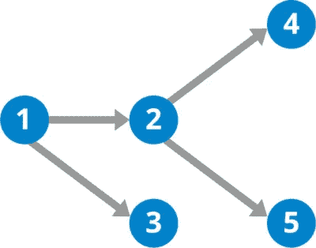

有向无环图

首先，我们需要找到最深的节点(4、5 或 3)并将其添加到堆栈中，该堆栈没有任何边。如何找到最深的节点？DFT！之后，转到前一个节点，如果该节点没有边，则将其添加到堆栈中；否则，转到当前节点连接的节点。最后，我们只需要弹出堆栈中的所有项目。

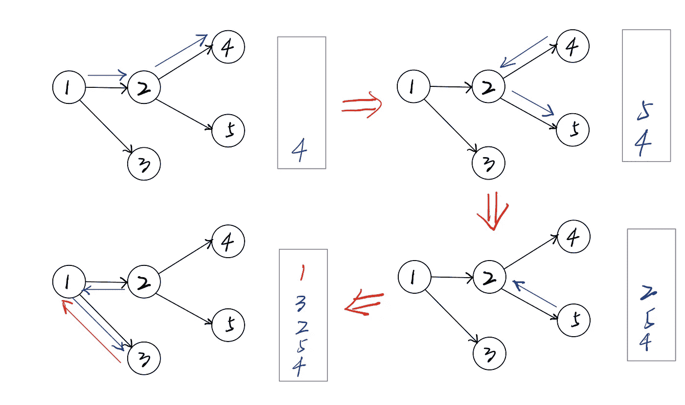

```
public List<String> topologySort() {
    Stack<Node> nodeStack = new Stack<>();
    Set<Node> nodeSet = new HashSet<>(); for (var node : nodes.values()) {
        topologySort(node, nodeStack, nodeSet);
    } List<String> sorted = new ArrayList<>(); while (!nodeStack.isEmpty()) {
        sorted.add(nodeStack.pop().label);
    } return sorted;
}

private void topologySort(Node node, Stack<Node> nodeStack, Set<Node> visitedNodes) {
    if (visitedNodes.contains(node)) return;

    visitedNodes.add(node);

    for (var nei : adjacencyList.get(node)) {
        topologySort(nei, nodeStack, visitedNodes);
    }

    nodeStack.push(node);
}
```

提示:当我们的节点已经在层次结构的底部时，我们的程序将跳过下面的循环，并将这个节点添加到我们的堆栈中。

```
for (var nei : adjacencyList.get(node)) {
        topologySort(nei, nodeStack, visitedNodes);
    }
```

# 循环检测

为了检测一个有向图中的循环，我们需要三组节点——所有的**、**访问**和**访问**。**

All:我们图表中的所有节点。

已访问:我们已经访问了一个节点及其所有子节点。

访问:我们没有访问一个节点的所有子节点。

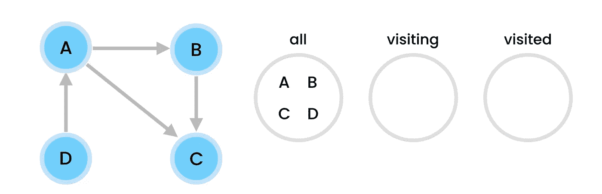

我们从添加“all”集合中的所有节点开始。然后从这个集合中选择一个节点并开始 DFT。因此，我们将它从“所有”集合中移除，并将其放入“访问”集合。

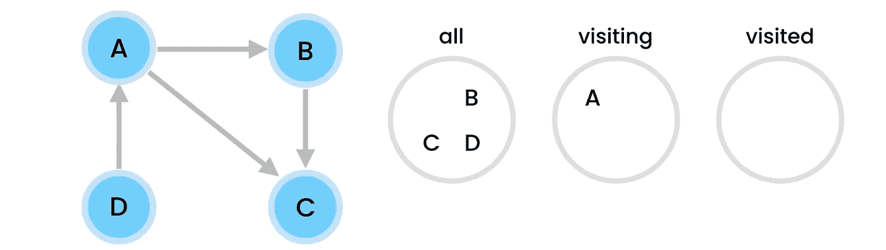

然后我们去拜访 A 的孩子，是 B 和 c，我们先从 B 开始吧。我们应该将 B 从“所有”集合中移除，并将其放入“访问”集合中。

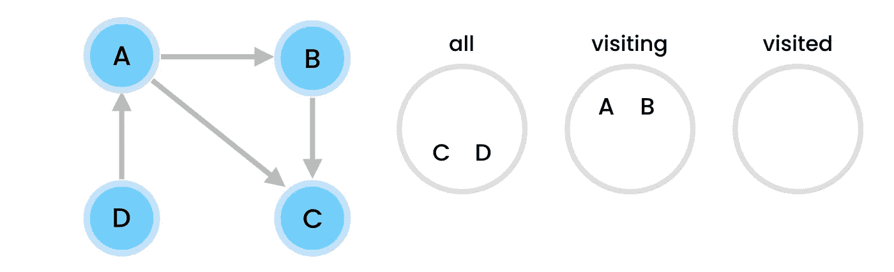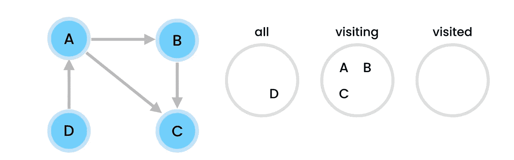

B 的孩子是 C，但是 C 没有孩子。所以我们可以把 C 放在“访问过的”集合中。之后，我们访问了 B 的所有孩子。因此，我们可以将 B 放在“已访问”集合中。

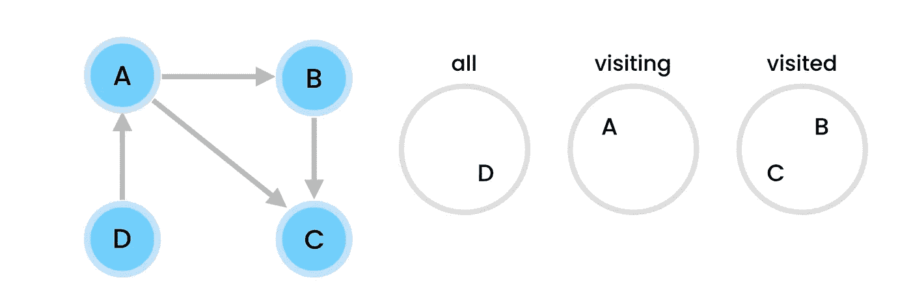

值得注意的是，当我们访问 A 的孩子时，我们选择与 B 一起去。现在，在我们访问 B 和 B 的孩子后，我们需要与 C 一起去。然而，C 已经在“已访问”集中。因此，我们可以将 A 放在“已访问”集合中。

最后，我们可以直接将 D 放入已访问过的集合中，因为 D 的孩子已经被访问过了。

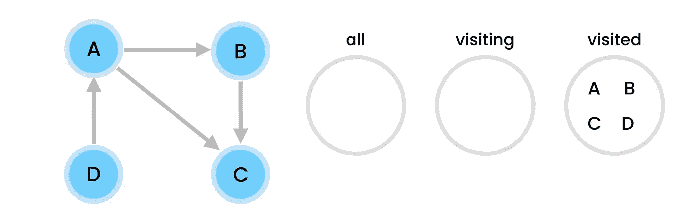

所有的节点都在“访问过的”集合中，所以在我们的图中没有循环。

如果我们改变 A 和 C 之间的边的方向呢？

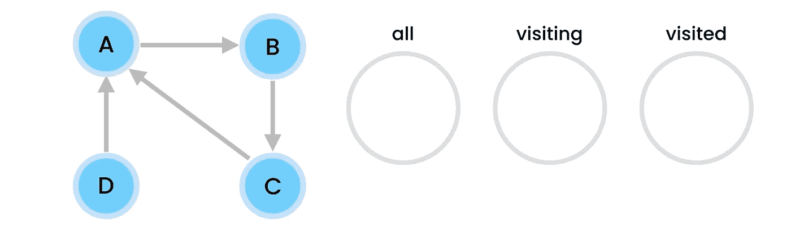

在重复了上面的一些步骤后，我们在寻找 C 的孩子，这里是有趣的部分，因为 C 的孩子，也就是 A，在我们的“访问”集中。因此，从一个子节点到它的父节点一定有一条边，这意味着这个图包含一个圈。

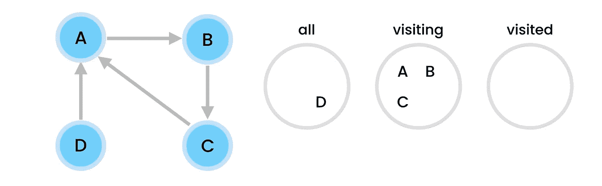

为了判断循环在哪里，我们需要一个散列表来存储每一对父子关系。

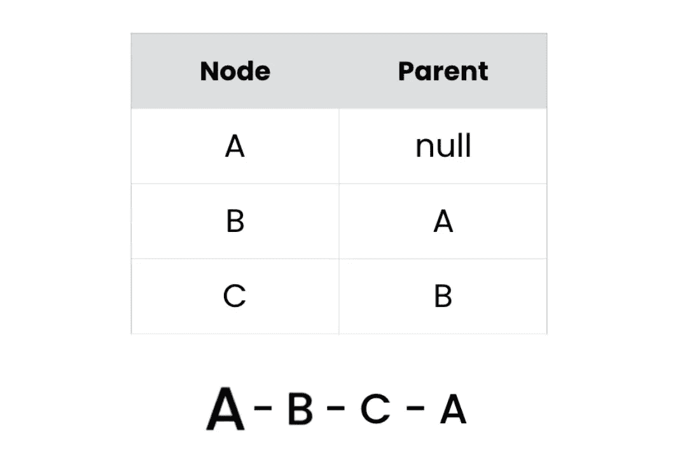

```
public boolean hasCycle() {
    Set<Node> all = new HashSet<>();
    all.addAll(nodes.values()); Set<Node> visiting = new HashSet<>();
    Set<Node> visited = new HashSet<>();

    while (!all.isEmpty()) {
        // pick the first node in all set
        var current = all.iterator().next();
        if (hasCycle(current, all, visiting,visited)) return true;
    }

    return false;
}

private boolean hasCycle(Node node, Set<Node> all,Set<Node> visiting, Set<Node> visited){
    all.remove(node);
    visiting.add(node);

    for (var nei : adjacencyList.get(node)) {
        if (visited.contains(nei)) continue;
        if (visiting.contains(nei)) return true;
        // if this child node have a cycle, return true. 
        if (hasCycle(nei,all,visiting,visited)) return true;
    }
    visiting.remove(node);
    visited.add(node); return false;
}
```

您可以在下面找到所有的代码。感谢您的阅读。

***上一篇:*** [***图形算法—第一部分***](/analytics-vidhya/graph-algorithms-1-5d80d022019)

***接下来:图形算法—第三部分***