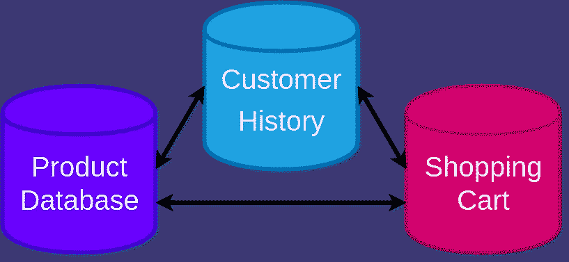
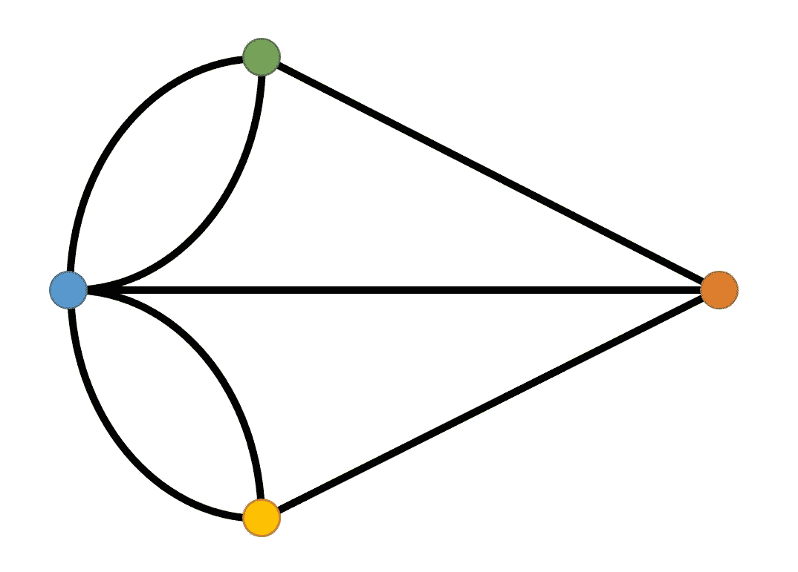
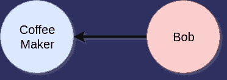
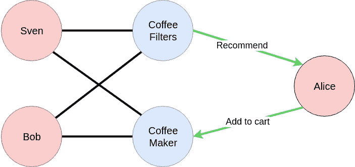

# 图表数据库和建议

> 原文：<https://medium.com/analytics-vidhya/graph-databases-and-recommendations-774ebdde8a08?source=collection_archive---------12----------------------->

几乎所有的电子商务都使用某种类型的推荐系统来向消费者展示他们可能喜欢的产品。到目前为止，每个人都非常熟悉每次你进入亚马逊产品页面时弹出的建议，或者当你登录或完成一个程序时出现在网飞上的建议。这些类型的系统已经成为网络上运行的许多业务的组成部分，这使得推荐系统成为一个非常活跃的研究和创新领域。由于我的学术背景，我对数据科学中的一项新创新产生了兴趣，这种创新被用于推荐系统，即图形数据库。

# 推荐基础

标准的推荐系统依赖于一个基本的想法，即有相似购买历史的用户有相似的品味。这是所谓的“协同过滤”的一个简化的特例例如，如果你在网上商店购买一台咖啡机，推荐系统会发现购买该咖啡机的大部分人还会购买附带的过滤器。然后，推荐系统会询问您是否也想购买咖啡过滤器。另一个基本的例子是关于网飞的电影。网飞会查看和你有相似观看和评级历史的其他用户，并推荐这些用户喜欢的电影。

很明显，你可以从许多不同的方向来理解这个想法，但是这些系统的力量来自于它们自己“学习”的事实。在咖啡的例子中，咖啡过滤器和咖啡机显然是一起购买的。有趣的是，没有人明确地给计算机编程来一起推荐它们；它是从过去的购物数据中推算出来的。一旦这些系统开始识别用户行为中更加不可预测和微妙的模式，它们就会变得真正强大。许多人都有过这样的经历:在网站上看到一个广告，感觉有人在读他们的思想！这是这些系统可能发生的事情——在大量时间和访问大量数据之后。

现在我们将看看一个基本的网络商店的结构，看看图形数据库如何帮助推荐。

# **电子商务**

下面是一个网络商店如何构建关系数据库的例子。

该企业有三个独立的数据库:

*   产品数据库:保存所有待售商品的记录，包括文字描述、图片、购买者信息以及其他相关细节。
*   客户历史:这保存了每个客户的档案信息和购买历史。
*   购物车:它跟踪用户想要购买的商品，这样就可以一次购买多个商品。

将数据存储在单独的数据库中是有意义的，因为每个数据库对其日常操作有不同的要求。购物车会随着产品的添加和删除而不断实时更新，而产品数据库只有在产品添加到目录中时才会更新新条目。

然而，在这样一个孤立的系统中，将来自不同地方的数据连接在一起是一个非常耗时的过程。例如，为了获取一些用户并查找他们的购书历史，数据库将结合客户历史表和产品信息表中的一些数据创建一个新表。这个新表可能需要将一些数据组合在一起，这进一步增加了时间。在进行推荐时，这些代价高昂的连接操作会严重降低速度。

例如，如果你在购物车里放了一个咖啡机，电子商务网站会向你推荐一些东西。这将需要(1)从购物车转到商品数据库并查找咖啡机，(2)在用户数据库中查找购买了咖啡机的所有用户，(3)比较他们对共同商品的所有购买历史，(4)对这些共同商品进行分类以找到购买最多的商品，以及(5)向用户建议该商品。

这通常需要很长时间，所以企业倾向于做的是检查所有(或许多)人和物品的组合，并提前提出所有可能的建议。然后可以根据需要存储和访问这些内容。但是，有一个问题:这种方法非常耗时，通常只能定期进行，通常是在一天或一周结束时。这可能意味着直到为时已晚才发现用户趋势，并且它创建了更多必须集成到整个系统中的数据库。

有很多新的有趣的数据库结构可以帮助解决这些问题，比如数据湖。在这种情况下，图形数据库是另一种有帮助的方法。

# 图表

在数学中，图就是我们通常所说的网络——它是可以由数据点和它们之间的连接来表示的任何东西。

[来源](https://crystalclearmaths.com/videos-learning-resources/geometry/graph-theory/)

这些点可以代表机场，线可以代表它们之间的航班，或者这些点可以代表人和线，以及它们之间发送的电子邮件。在这样的图中，我们称点为“节点”，线为“边”最初，在这个特定的图中，节点代表柯尼斯堡(今天的俄罗斯加里宁格勒)的普雷格尔河中的岛屿海岸，边代表[桥](https://en.wikipedia.org/wiki/Seven_Bridges_of_K%C3%B6nigsberg)。

# 图形数据库

图形数据库是一种基于图形存储数据的方式。不是将所有用户存储在一个表中，每个用户条目都引用产品表中的产品条目(以及其他数据)，而是将所有数据存储在一个图上的节点中，用边连接相关数据。在我们的数据库中，我们将使用节点和产品节点，如果用户购买了商品，它们将通过一条边连接起来。

我们可以使用这个图的结构非常有效地进行推荐。下图显示了咖啡机示例如何在我们的图形数据库中工作。

当 Alice 将咖啡机添加到她的购物车中时，数据库会查看连接到咖啡机的所有用户，在本例中是 Bob 和 Sven。我们可以找到连接到 Bob 和 Sven 的其他产品节点，在本例中是咖啡过滤器。然后，我们向 Alice 推荐过滤器。图形数据库的结构允许我们非常快速地进行这些类型的请求，因为我们不必像在传统数据库中那样在连接操作期间创建新表。性能提升如此之大，以至于在某些情况下，我们可以按需提供建议。这使得我们的系统比使用关系数据库的系统有更大的优势，后者只能定期更新推荐。

# 更复杂的例子

在我的下一篇博文中，我将讲述我参与的一个项目，在这个项目中，我使用一个大型 Yelp 数据集对图形数据库和推荐系统进行了实验。