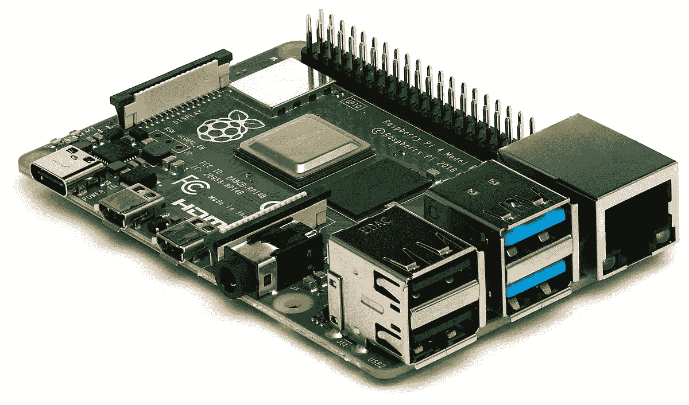
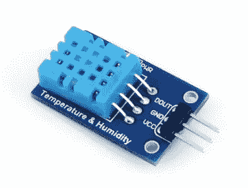
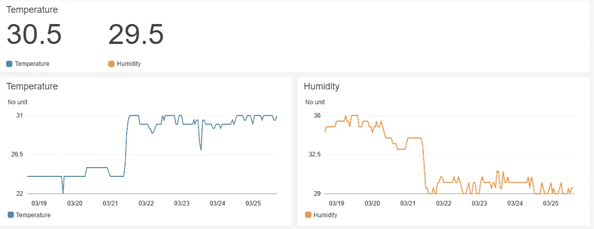
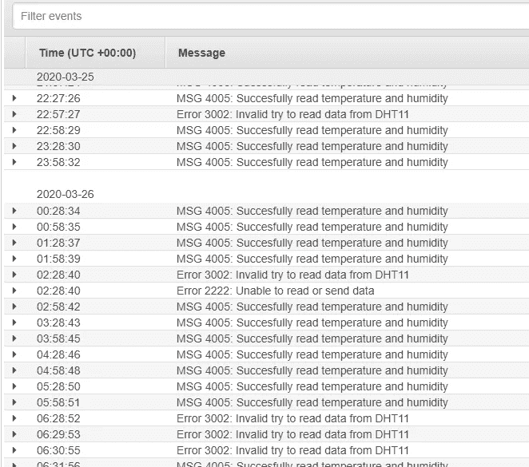
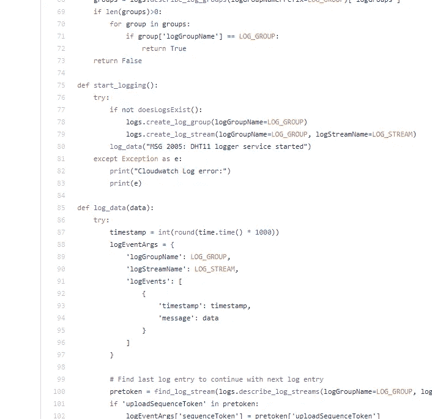

# 使用 Raspberry Pi 和 AWS Cloudwatch 绘制温度和湿度图

> 原文：<https://medium.com/analytics-vidhya/graph-temperature-and-humidity-using-raspberry-pi-and-aws-cloudwatch-cfa55451ff7c?source=collection_archive---------16----------------------->

我做过许多关于 Raspberry Pi 和 AWS 的项目，但是大多数都有一个共同的缺陷。此外，如果你的项目时间有限，就很难长期管理它们。

使用 Raspberry Pi 进行温度和湿度监控非常简单

当我决定下一个项目时，我的主要标准是它必须非常容易开发和管理。因此，我决定使用树莓 Pi 的 DHT11 传感器，它可以帮助您测量湿度和温度。

将传感器连接到 RPI 并不困难，甚至不需要 PCB(印刷电路板)或任何其他部件。只需将三根电缆连接到 RPI 板上，就可以了。

主要问题是如何存储传感器数据。当然，您可以将 InfluxDB 与 Grafana 或任何其他时间序列数据库一起使用。我不会说它在某种程度上很难建立，但一年左右后，你会发现它可能很难管理。相信我，我在系统管理方面有很多经验，我知道在你几乎忘记了一个项目的一切之后，再去做所有的升级和维护总是很遗憾的。

您可以轻松地将 DHT11 传感器连接到 RPi，无需电路板

所以我开始考虑一些管理解决方案。相信我，我更多地考虑 AWS，因为我每天都在使用它。不幸的是，我无法在整个 AWS 栈中找到一些带有图形工具的通用时间序列数据库。唯一的可能性是使用 Cloudwatch 获得一个带有推送指标的图表。

我不觉得这是冒犯。此外，我发现网上有更多的人有同样的想法。我在 NodeJS 中找到了这个由 HumbleCode 编写的解决方案(在撰写本文时，该站点处于离线状态，所以我没有附上链接)。我很高兴我能够这么快地测试我的解决方案，只是因为有人在我之前解决了同样的问题。

HumbleCode 的问题是代码质量相当低，至少对我来说是这样。您应该在控制台中运行守护程序，作为名为“screen”的实用程序中的前端进程，该实用程序允许您在后台运行控制台，这意味着您必须在每次重新启动 Raspberry Pi 时手动启动守护程序。

在 AWS Cloudwatch 中监控温度和湿度

此外，所有变量(例如 AWS 凭证)都是硬编码的，应用程序的日志记录非常弱。这是一个大问题，因为当传感器意外断开时，我不只是知道。

这些是我决定从头重写传感器代理代码的主要原因。因为我不熟悉 NodeJS，所以我决定使用 Python 作为编程语言。

我用原来的解决方案解决了所有的问题。例如，我的代理不仅将度量放入 Cloudwatch，还将度量的状态记录到 Cloudwatch 日志中。这是为什么呢？如果您的 RPI 与网络断开连接，或者传感器出现问题，您可以在 Cloudwatch 中轻松设置一个警报，它会通过电子邮件或短信通知您。

这也是一个好主意，看看你的树莓派和传感器的状态

我的代码也作为 SystemD 守护进程工作，所以它可以在设备每次启动时自动启动——不需要手动干预。

我对目前的解决方案相当满意。它不需要任何维护，只是工作。如果你也想建立这个项目，你可以在 GitHub 上查看我的代码—[https://github.com/koss822/misc/tree/master/Aws/dht11](https://github.com/koss822/misc/tree/master/Aws/dht11)

所有必要的代码都已经用 Python 写好了