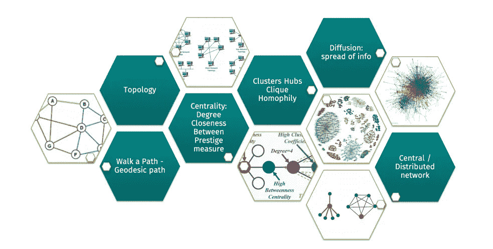

# 图论:网络中联系强度的识别及其在联系建议中的应用。

> 原文：<https://medium.com/analytics-vidhya/graph-theory-identification-of-tie-strength-in-networks-and-using-them-in-contact-recommendations-4acbca5cdd70?source=collection_archive---------13----------------------->

图论的组成部分

推荐系统是向用户提供一些建议的软件工具和技术。基于必须推荐的产品或服务，推荐系统可以用于广泛的应用中。一个这样的应用是在一个巨大的网络中连接人们。在进行了大量的研究并探索了几种改进推荐的方法之后，图论的主题被发现是最有希望进行推荐的。

有几种基于节点、拓扑和社会理论的链接预测算法可以用于联系推荐系统。这个博客使用社会理论的概念来确定两个用户之间的关系强度。要准确预测关系强度，必须考虑七个维度:互动强度、亲密度、互动新近度、互惠、情感支持、关系结构和社会距离。现实生活中两个用户之间的实际联系强度不能通过可用的经典用户数据精确地建模。因此，拓扑和社会理论概念可以用于识别弱联系，然后进一步扩展到联系推荐。

我们将认为一个节点是一个用户，并且两个节点之间的边的存在是这些用户之间的连接。

**地面真相**

*在两个用户之间不可能存在代表用户之间相互联系强度的量化值，类似于真实世界关系的强度。然而，我们可以对网络中的强关系和弱关系进行二元区分*

*强三元闭包是三个节点 A、B 和 C 之间的性质，使得如果 A-B 和 A-C 之间存在强联结，则 B-C 之间存在弱联结或强联结*

局部桥是连接两个子图的边。这座地方桥梁总是薄弱环节。

推荐系统的薄弱环节

# 假设

参考上面的视频:

假设“A”是要向其推荐联系人的用户。“A”与“B”相连，“B”与“E”相连。这意味着“E”是第二级接触或“A”。

根据假设，如果“A”&“B”之间或“B”&“E”之间的连接是本地桥(弱连接),并且如果除了“B”之外“A”&“E”之间没有共同的朋友，那么向“B”推荐与“E”的连接是一个坏主意。

因此，我们需要实现 3 个条件:

*条件 1 : E 是 a 的二级联系人*

*条件 2:A 和 B 之间或者 B 和 E 之间的连接应该有一个是本地桥。*

*条件三:除了 b，A 和 E 之间没有其他共同的朋友*

**结果:**

在应用了所有上述条件之后:我们得到一个连接(边)列表，根据假设，这不是一个好的推荐，因为它们相互认识的可能性非常低。

# **评估和确认**

上述假设在一个著名的专业网络网站的大约 30，000 名用户的样本集上进行了测试。

将 2017 年满足假设(结果)的可能连接列表与 2018 年的相同用户样本集进行比较，以识别新创建的连接的重叠，从而找到假设的误报。通过将假阳性的数量与创建的边的总数进行比较，检查连接的可能性是否较低。此外，还可以找到错误百分比(违反假设的连接数量)。

# **结果**

样本网络中约有 15%的现有链路可识别为弱连接。

这个假设成功地从推荐系统中过滤了所有可能的二级连接中的 5%。

这一假设的误差可能性为 0.003%。这意味着这个假设的准确性是 99%。

**注:**值得注意的是，本研究中的假阴性数为零，因为假阴性表示那些被预测为不是弱联系但实际上是弱联系的联系。

# **结论**

随着越来越多的社交活动转移到网上，维护和访问社交网络的方式也开始改变。有必要了解网络的结构，以便更好地满足用户的需求，并利用网络本身的优势。

弱联系在信息传播中以两种方式起主要作用:一是信息传播的范围，二是信息的多样性。弱关系被认为有助于信息在社交网络中的传播，因为它们倾向于跨越距离较远的子群体。直观地说，这意味着要传播的内容可以接触到更多的人，并且当通过弱关系而不是强关系传递时，可以跨越更大的社会距离。