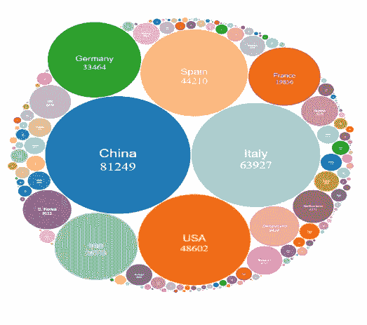
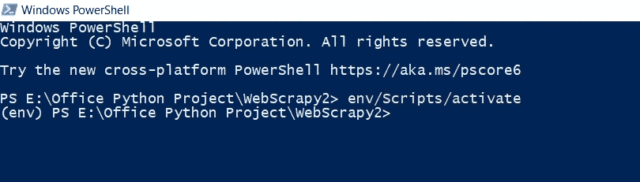
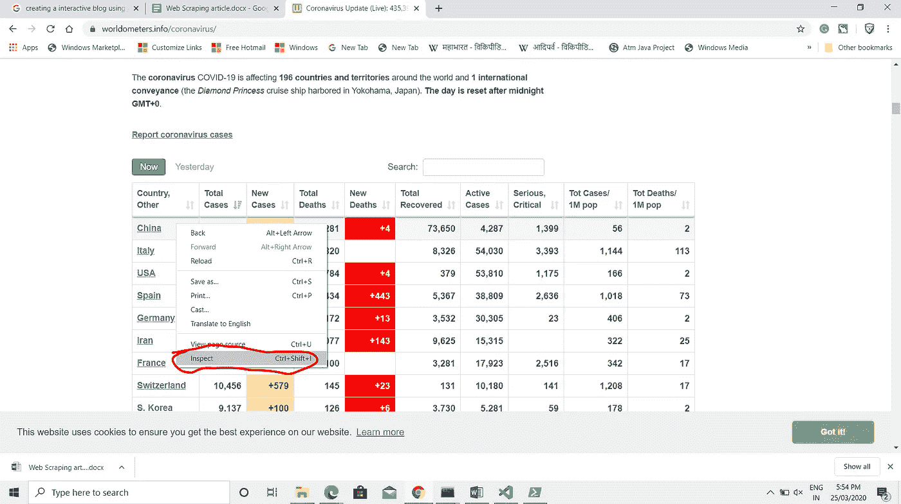
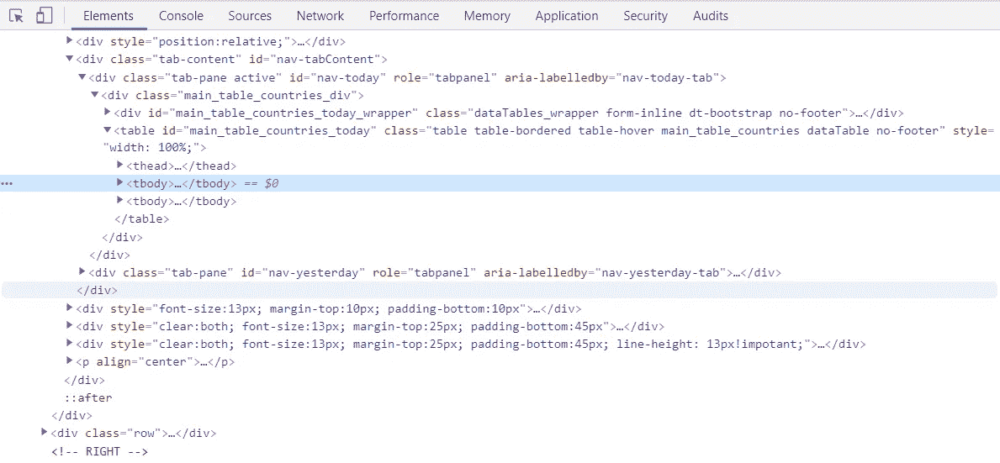
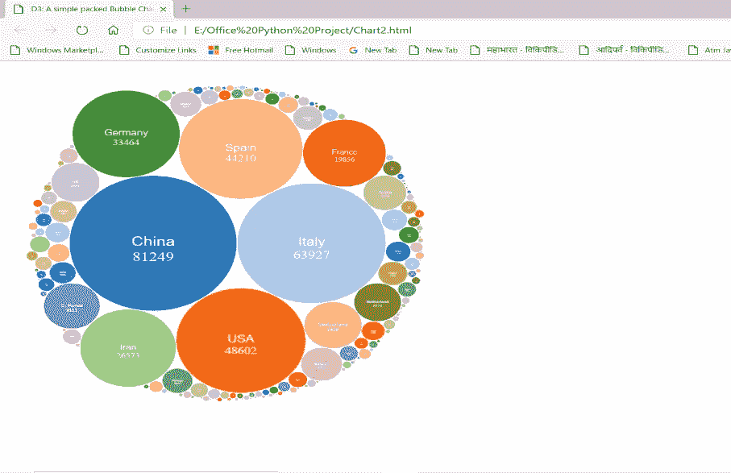
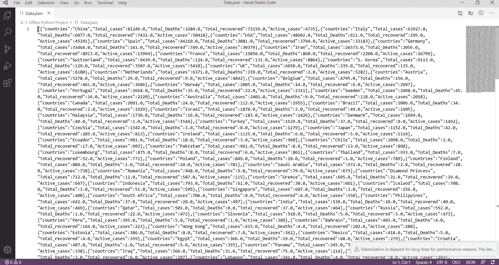

# 冠状病毒实时更新的图形视图—使用 python

> 原文：<https://medium.com/analytics-vidhya/graphical-view-of-coronavirus-live-update-using-python-f83903e5870?source=collection_archive---------20----------------------->

# 使用 python 从网页的表格中抓取数据

在本文中，我们将从网站([https://www.worldometers.info/coronavirus/](https://www.worldometers.info/coronavirus/))的表格中提取数据，并将其存储到 CSV 或 JSON 中，使用 D3.js 进行可视化

## **什么是网页抓取？**

简单来说，它是从不同的网页(HTML 源)收集信息或数据的过程。这样收集的信息或数据可以用于为不同的应用建立数据集或数据库，例如数据分析、建立价格比较应用等。)

**先决条件:-**

1.对 Python 3.0 编程有基本的了解。

2.pc 上安装的 Python 3.0 或以上版本(安装时不要忘记将 Python 添加到路径中)。

**我们正在使用的库:-**

1.美丽的声音。

2.熊猫。

3.请求。

以下是进行项目的步骤。

**步骤 1:-创建 Virtualenv(对于 Windows 和 Linux 也是如此)。**

创建 Virtualenv 使我们能够使我们的项目独立(我们将这个项目所需的所有库安装到这个 Virtualenv 中。)

> #升级 pip
> 
> python -m pip 安装—升级 pip
> 
> #安装 Virtalenv
> 
> pip 安装虚拟设备
> 
> #创建虚拟
> 
> virtualenv[环境名称]#输入不带[]的环境名称。
> 
> 例如:-虚拟环境

**步骤 2:-激活 Virtualenv 并安装所需的库。**

**窗口:-**

**如果需要**

**(以管理员身份打开 Windows PowerShell，并通过以下命令在 PowerShell 窗口中设置激活 env 的权限。)**

> set-execution policy remote signed
> 
> 现在激活环境:-
> 
> 环境/脚本/激活

**在 PowerShell 窗口中激活 env**

***现在如果 env 被激活，你会在下一行的开头看到(env)。***

**在 Linux 中(env/bin/activate)**

安装所需的库:-

> #安装 BeautifulSoup
> 
> pip 安装 bs4
> 
> #安装熊猫。
> 
> pip 安装熊猫
> 
> #安装请求。
> 
> pip 安装请求

将所需的库冻结到 requirements.txt 始终是最佳实践

> pip 冻结> requirements.txt

**步骤 3:-打开网页，导航至您想要从>中收集数据的表格，右键单击>单击 Inspect。**

**现在了解 HTML 结构了。**

第 4 步:-现在继续进行程序。

**D3.js 图表模板:-**

**D3.js 图表模板**

Python 编程:-

Python 编程

***D3.js 图像输出***

***D3.js 图像输出***

***Data.json 输出文件***

***Data.json 输出文件***

在这里引用 GitHub 中的代码:-[https://github.com/saicharankr/WebScrap](https://github.com/saicharankr/WebScrap)

*原载于*[*https://just-python.blogspot.com*](https://just-python.blogspot.com/p/web-scraping-web-scraping-data-from.html)*。*