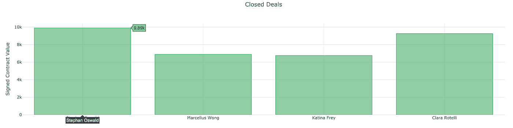
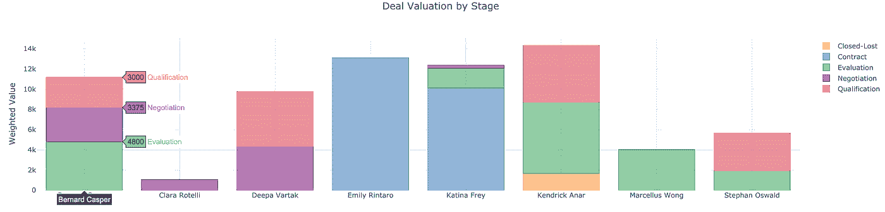
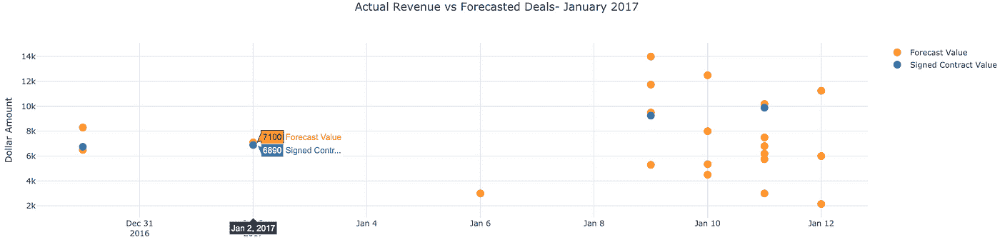
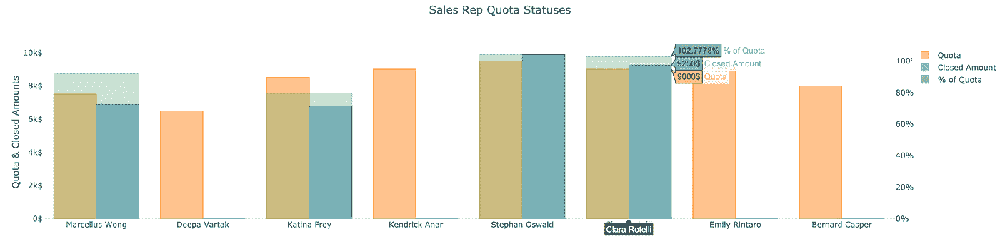

# 从 Airtable 绘制数据

> 原文：<https://medium.com/analytics-vidhya/graphing-data-from-airtable-67d4ebf13f39?source=collection_archive---------11----------------------->


## 本指南将带您了解如何使用 python 从 Jupyter 笔记本连接到 Airtable 底座，获取数据并绘制数据。

# 介绍

Airtable 是一个非常棒的工具，可以集中数据并运行多个不同的业务部门。然而，有时我们可能有太多的表格数据，很难真正掌握每周的发展情况。

‌It 有可能(在 pro 计划中)使用 Airtable 的代码块构建图表。另一个选择是导出到 excel。但要真正增强你的分析能力，这项工作应该尽可能自动化。因此，本指南将向您展示如何从 Jupyter 笔记本中获取 Airtable 数据，操作和可视化这些数据，所有这些都是用 Python 编写的。

这篇文章是为你写的，如果:

*   您已经在使用 Airtable 进行一些特定的知识管理，例如销售 CRM，但对内置的数据可视化功能感到失望。
*   如果您认为您的团队可以从一个更加自动化的流程中受益，该流程用于跟踪影响决策的指标。

# 入门指南

Airtable Python 使用[请求](http://docs.python-requests.org/)，您可以通过运行以下命令来安装:

```
conda install -c anaconda requests -y
```

请注意，如果您还没有为您的帐户生成 API 密钥，您将需要[。你可以在你的 Airtable](https://airtable.com/account) [账户设置](https://airtable.com/account)中进行。

将 API 键放在正在运行的代码中是一种不好的做法。相反，我们可以在我们的`~/.bash_profile`中设置一个全局变量。将您的 API 密钥复制到剪贴板。在首选编辑器中打开 bash 概要文件，并输入以下内容:

```
export 'AIRTABLE_API_KEY' = "API_KEY"
```

用刚才复制的字符串替换“API_KEY”。

从命令行运行:

```
source ~/.bash_profile
```

Airtable 的 REST API 接口可以在这里找到:[https://airtable.com/api](https://airtable.com/api)。我们现在准备开始使用 Airtable Python。

# 在 Jupyterlab

## 获取我们的数据

出于本指南的目的，我们将使用 Airtable 的一个示例模板——[销售渠道](https://airtable.com/templates/sales-and-customers/expuCeCuZwIAc89uI/sales-pipeline)基础。让我们获取数据:

```
from airtable import airtableat = airtable.Airtable('BASE_ID', 'AIRTABLE_API_KEY') response1 = at.get('Sales Deals')response2 = at.get('Sales Reps')
```

其中‘air table _ API _ KEY’是我们刚刚在 bash 配置文件中设置的全局变量，而‘BASE _ ID’是我们正在使用的特定库的 ID。Airtable 的 REST API 接口可以在这里找到:[https://airtable.com/api](https://airtable.com/api)，在这里你可以访问你所有的 Airtable 基础列表。每个 Airtable 库都将提供自己的 API 来创建、读取、更新和销毁记录。

我们在*销售渠道*数据库中引入了两个不同的响应，分别对应于两个表格。

## 将响应转换成熊猫数据帧

```
import pandas as pdsales = pd.DataFrame(response1, columns=response.keys())reps = pd.DataFrame(response2, columns=response.keys())sales = pd.concat([sales.drop(['records'], axis=1), sales['records'].apply(pd.Series)], axis=1)sales = pd.concat([salesdf.drop(['fields'], axis=1), sales['fields'].apply(pd.Series)], axis=1).fillna('')reps = pd.concat([reps.drop(['records'], axis=1), reps['records'].apply(pd.Series)], axis=1)reps = pd.concat([reps.drop(['fields'], axis=1), reps['fields'].apply(pd.Series)], axis=1).fillna('')
```

上面我们已经将我们的响应分配给变量，并将它们读入各自的数据帧。来自 Airtable 的响应以有序字典的形式出现，我们已经在上面解析过了。

## 可视化我们的数据

现在是时候开始从我们的数据中获得洞察力了，但首先:

**定义您的业务问题**

你想回答什么商业问题？我们已经为我们的销售渠道样本数据列出了一些示例问题。

1.  我们达成交易的价值是什么？谁获得了最多的收入？
2.  正在进行的其他交易处于什么阶段？这些交易的加权价值是多少？
3.  我们每月的实际收入是多少？我们的预测目标是什么？
4.  我们的销售代表表现如何？他们达到配额了吗？

## 安装所需的软件包

在 Kyso，我们与[合作很多。为了在 jupyterlab 中使用，我们需要安装 JupyterLab 和 ipywidgets 包:](https://plot.ly/python/)

```
conda install -c conda-forge jupyterlab-plotly-extension -y
```

Plotly 有一个名为*袖扣*的熊猫包装器(数据操作库)，目前与 plotly 的最新版本存在兼容性问题。目前解决这个问题的方法是降级 plotly 并使用以下命令安装袖扣。一旦你看到用袖扣生成图形是多么容易，你就会明白为什么我们要经历这种麻烦。

从 2019 年 9 月起，这将帮助您启动并运行:

```
conda install -c conda-forge plotly=2.7.0 -yconda install -c conda-forge cufflinks-py -y
```

现在我们可以回答上面的问题了:

## 1.按合同规模和销售代表列出的已完成交易

```
sales[sales['Sales Stage']=='Closed-Won'][['Signed Contract Value', 'Sales Rep']].set_index('Sales Rep').iplot(kind='bar', color = 'rgba(50, 171, 96, 1.0)', showgrid=False,title='Closed Deals', yTitle='Signed Contract Value')
```



## 2.按阶段和销售代表列出的交易估价

```
pd.DataFrame(sales[sales['Sales Stage']!='Closed-Won'][['Name', 'Sales Stage', 'Weighted Value', 'Sales Rep']].set_index('Sales Stage').groupby(['Sales Stage', 'Sales Rep'])['Weighted Value'].sum().unstack(level=0)).iplot(kind='bar', mode='group', barmode='stack',showgrid=False, title='Deal Valuation by Stage',yTitle='Weighted Value (Forecasted Value * Probability of Closing)')
```



## 3.实际收入和预测交易估值

```
sales['Last Contact'] = pd.to_datetime(sales['Last Contact'])sales[['Last Contact', 'Forecast Value', 'Signed Contract Value']].sort_values(by='Last Contact').set_index('Last Contact').iplot(kind='scatter', mode='markers',showgrid=True, title='Actual Revenue and Forecasted Deals- January 2017',yTitle='Signed Conntract Value')
```



## 4.我们销售代表的成功率

```
fig = reps[['Name', 'Quota', 'Closed Amount', '% of Quota']].set_index('Name').iplot(kind='bar', mode='group', secondary_y=['% of Quota'],showgrid=False, title = 'Sales Rep Quota Statuses', asFigure=True)fig['layout']['yaxis1'].update(title='Quota & Closed Amounts')fig['layout']['yaxis2'].update(ticksuffix="%")fig['layout']['yaxis1'].update(ticksuffix="$")fig['data'][0].marker.update(opacity=1)fig['data'][1].marker.update(opacity=1)fig['data'][2].marker.update(opacity=0.5)fig.iplot()
```



# 结论

现在你知道了。易于构建的数据仪表盘现在触手可及！请注意，您可以在 Github [上查看该指南，这里有一个示例笔记本和 python 代码，可以快速设置。要真正自动化这个工作流，您可以派生存储库&编辑笔记本(即插入您自己的 Airtable API 密钥、您的基本名称和表名称)。](http://github.com/KyleOS/airtable.py)

按照本指南中的[将您的存储库](https://docs.kyso.io/posting-to-kyso/connect-a-github-repo-to-kyso)同步到您的 Kyso 帐户。

现在，每次您提交新的任务时，比如每周运行笔记本，这些变化都会反映在 Kyso 帖子上，您的团队可以在那里学习和协作。记住——只有当你真正使用所获得的洞察力时，数据对你才有用！