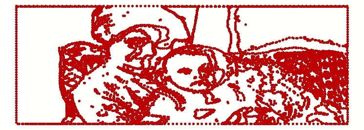

# 用 R 绘制你最喜欢的图片

> 原文：<https://medium.com/analytics-vidhya/graphing-your-favorite-pic-using-r-d9e46f780343?source=collection_archive---------15----------------------->

**先决条件:**
1 .使用工具将你最喜欢的图片转换成 SVG 格式，例如([http://pngtosvg.com/](http://pngtosvg.com/))
2。使用工具[https://spotify.github.io/coordinator/](https://spotify.github.io/coordinator/)
3 将 SVG 文件转换为数据坐标。保存 coordinator.csv 文件

```
########## **Load Packages** ########## 
library(data.table)
library(ggplot2)########## **Import Coordinates Data file**##########
 # reading coordinator.csv file generated in step 3 abovedf <- fread(‘coordinator.csv’)########## **Plotting the Data** ##########p <- ggplot(df, aes(x=x, y=y)) +
 geom_point(color = “#BF0000”) +
 theme_void()p <-p + scale_y_reverse()# Clearing axes , titles 
p + 
 theme(panel.background = element_rect(fill = ‘white’)) +
 theme(axis.line=element_blank(),
 axis.text.x=element_blank(),
 axis.text.y=element_blank(),
 axis.ticks=element_blank(),
 axis.title.x=element_blank(),
 axis.title.y=element_blank(),
 legend.position=”none”,
 panel.background=element_blank(),
 panel.border=element_blank(),
 panel.grid.major=element_blank(),
 panel.grid.minor=element_blank(),
 plot.background=element_blank())
```

**我得到了我最喜欢的照片**

