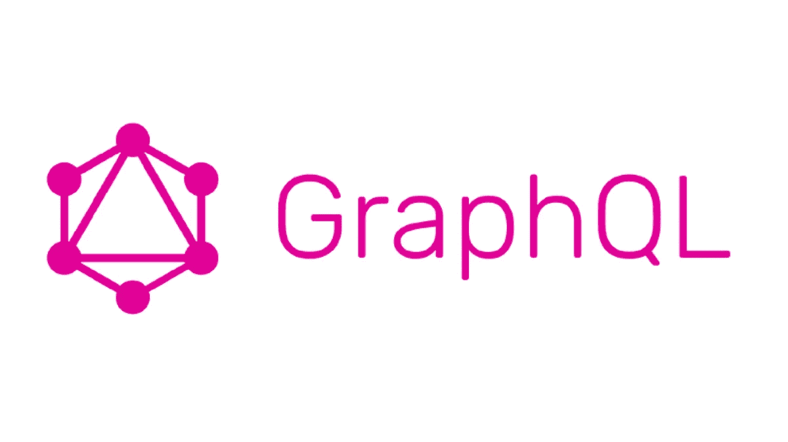
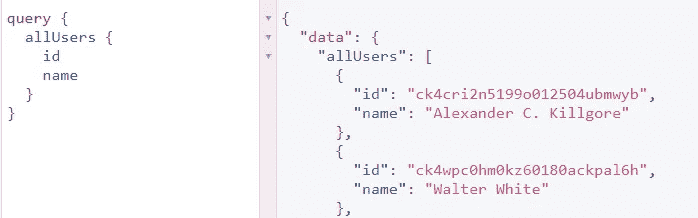
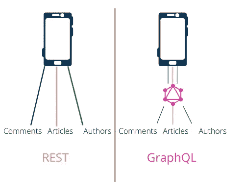
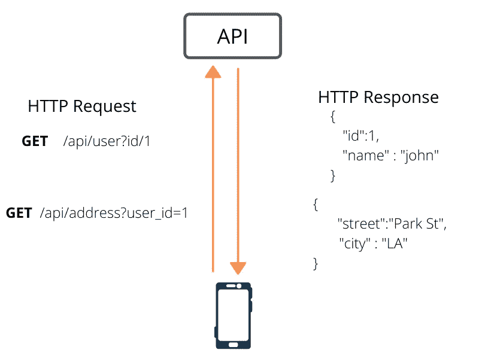
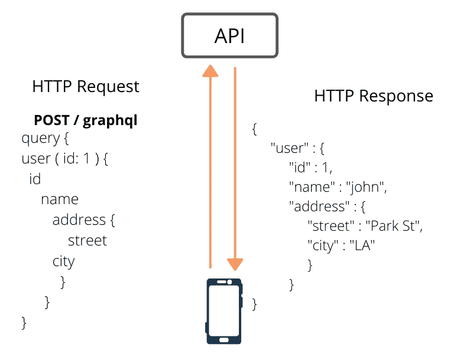
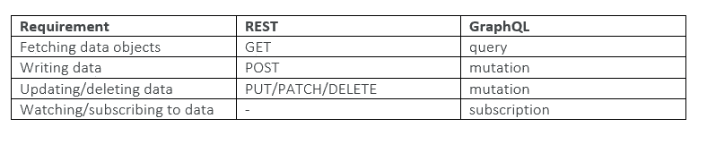

# 关于 GraphQL 的见解

> 原文：<https://medium.com/analytics-vidhya/graphql-a-quick-look-a8ab0c03105?source=collection_archive---------37----------------------->

GraphQL 是一种用于 API 的查询语言，它还提供了一个运行时来用可用的数据完成这些查询。2012 年，脸书在寻找一种数据获取 API，它足够强大，可以描述整个脸书，同时又足够简单，便于产品开发人员学习，这导致了这种新语法的创新。简单地说，它的目的是将数据从服务器加载到客户端。

但它以一种更高效、更灵活的方式来实现。

它将确认正在加载的数据是相关且必要的。以脸书和 Facebook Messenger 应用程序为例。通过只获取他们需要的信息，他们保留了可能被更大的有效载荷占用的带宽。与 REST API 调用的整个 JSON 负载相比，这可以用于只需要更新应用程序 UI 的某些部分来提高整体速度的情况。

graphql 的格式是，它是一个发送到服务器的字符串，将作为 JSON 返回。

左边是查询，右边是响应。

## **graph QL 的优势**

GraphQL 相对于 REST 的一个突出优势是，当 REST 在多个回合中获取资源时，GraphQL 可以通过一个请求来完成。本质上，请求就像一个复用的休止符。因此它避免了获取更多的数据，也防止了多个 API 调用，如下所示。

GraphQL 的分层性质遵循对象之间的关系，其中 RESTful 服务可能需要多次往返或复杂的 SQL join 语句。这种数据层次结构与图形结构的数据存储和层次化的用户界面很好地结合在一起。

GraphQL 查询的每一级将匹配特定的类型，并且每种类型将描述一组可用的字段，这些字段将在执行查询之前提供描述性的错误消息。

当您想要获取更多数据并避免多次调用时，您将需要创建另一个 API，可能需要从后端开发人员那里请求它。但是有了 GraphQL 你就可以独立工作了。

## **GraphQL vs REST**

REST 如何要求您基于 ID 获取用户详细信息和用户的位置详细信息

在 GraphQL 中，所有这些都包含在一个请求中

为了从 GraphQL API 中获取初始资源，与 REST 非常相似:即:你传递一个名字和一些参数。但是与使用多个 URL 获取数据的 REST 不同，GraphQL 使用对单个 URL 端点的特别查询，该端点根据查询返回数据。

你可以使用“POST”查询来定义你想要的数据，而不是 GET。

在一个单一的镜头中，您以“图形”格式获取相关数据，如上图所示。

您在 POST 请求中发送数据的查询有一个结构和语法，即 GraphQL。

**参考文献**

 [## GraphQL 与 REST

### 通常，GraphQL 被认为是思考 API 的一种革命性的新方法。而不是与僵化的…

www.apollographql.com](https://www.apollographql.com/blog/graphql-vs-rest-5d425123e34b) 

[https://hasura.io/learn/graphql/react/intro-to-graphql/](https://hasura.io/learn/graphql/react/intro-to-graphql/)

【https://smartbear.com/blog/design/what-is-graphql/ 号