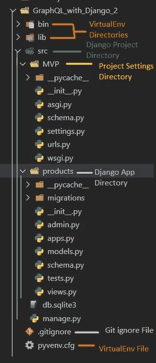
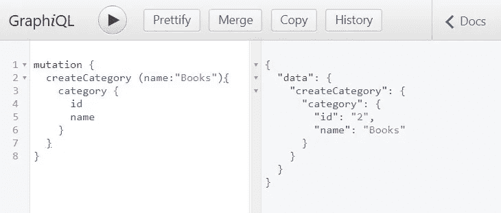
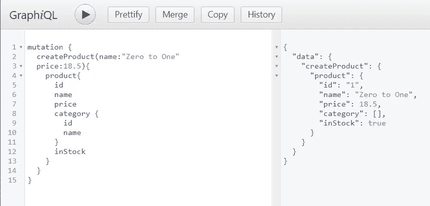
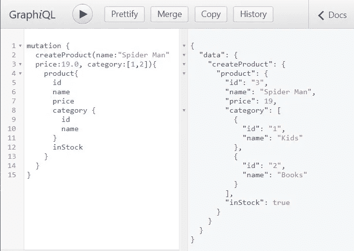
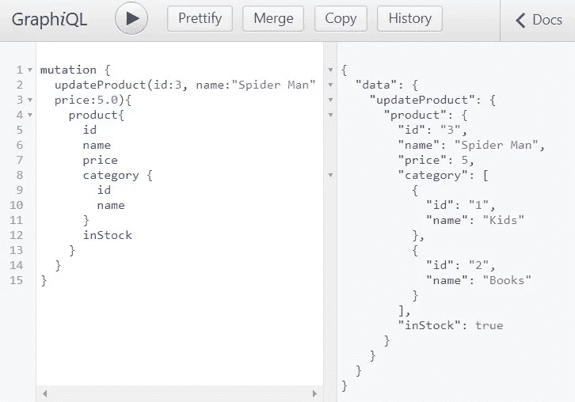
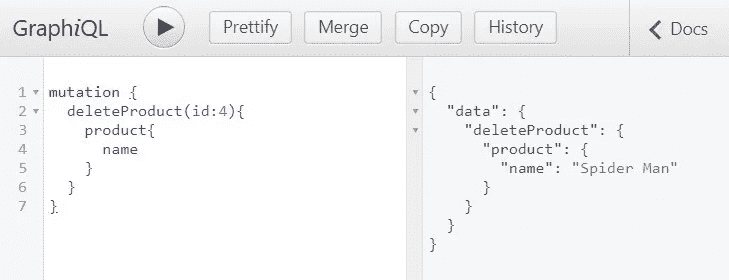

# 使用 Django 的 GraphQL 简单而强大(CRUD) —第 2 部分

> 原文：<https://medium.com/analytics-vidhya/graphql-with-django-simple-yet-powerful-crud-part-2-bacce3668e35?source=collection_archive---------3----------------------->


timJ 在 Unsplash 上拍摄的照片

我记得我第一次开始使用 GraphQL-with-Django 的时候，我所能找到的都是只涵盖基础知识的教程，我搜索了网页，但是我能找到的大部分内容都只涵盖了基础知识，或者太复杂而难以理解。

因此，这一次我们将深入探讨所有 CRUD 操作(创建、读取、更新、删除)。但就 GraphQL 而言，有两种类型的操作，一种可以读，一种可以写，所以它把这些基本操作分为**查询**(只读)和**变异**(创建、更新&删除)。

但是，如果您仍然不熟悉 Django 中的 GraphQL 集成，您可以参考本教程的第一部分，在那里我们介绍了基础知识

[](/@alhajee2009/graphql-with-django-a-tutorial-that-works-2812be163a26) [## 使用 Django 的 GraphQL 一个有效的教程

### 如果你不知道 GraphQL 是什么，它是一种查询语言，让客户能够准确地询问他们需要什么…

medium.com](/@alhajee2009/graphql-with-django-a-tutorial-that-works-2812be163a26) 

既然您已经在考虑集成一个 API，那么假设您已经熟悉 Django 是安全的，那么让我们开始吧💪

# 普罗博诺:我现在如何构建我的 Django 项目😇🔥

*如果你已经有了一套遵循的方法，你可以跳过这一步*



项目目录设置

如果你和我一样，不喜欢 Django 构建项目的方式，重组它是一件好事

我首先创建一个目录，在这个例子中，我将存放所有的东西；`GraphQL_with_Django_2`

然后，我在该目录中创建一个虚拟环境；

`virtualenv **.**`

启动我的虚拟环境后，我创建了一个新的 Django 项目

`django-admin startproject MVP`

现在我把`Django Project directory`从`MVP`改名为`src`

不要忘记`**git ignore**` 虚拟环境文件

**这将是我们努力的方向；**

产品/型号. py

这不是最好的产品模型。然而，这意味着给你一个如何在 GraphQL `(CharField, DecimanField, ManyToManyField, BooleanField & DateTimeField)`中处理不同数据类型的想法

**让我们创建我们的应用程序级模式**

产品/架构. py

几乎所有的神奇都发生在`products/schema.py`中，所以我们将很快解释大部分代码是如何工作的。

同时将 **app 级** `schema.py`包含到项目的`schema.py`中

项目级 schema.py

让我们将 GraphQL 端点添加到项目的`urls.py`

# 典型突变的结构

突变类有三(3)个特定部分；**类实参，返回对象，& mutate 方法。**

```
class mutationName(graphene.mutation):
  class Arguments:
    . . . 
  what_were_returning = graphene.Field(SomeType)
  def mutate(self, info, args ...):
    . . .
    return mutationName(what_were_returning)
```

我们将使用 **createProduct 突变**作为例子

## 1.让我们从课堂辩论开始

**类参数:**这由可以作为参数传递的变量组成。传统上，Python 是**松散类型**，不强制**严格类型**。然而，GraphQL 以自己的方式要求定义参数的数据类型。这可能是一个痛苦的屁股，但沿着它的帮助。

我们指定可能传递给`CreateProduct`的参数

```
name = graphene.String()
price = graphene.Float()
category = graphene.List(graphene.ID) 
in_stock = graphene.Boolean()
date_created = graphene.types.datetime.DateTime()
```

如果你已经注意到了，数据类型与`Models`中使用的不完全相同，但是它们在某种程度上是相同的。

对于`CharField`，我们将使用`graphene.String()`
而对于`DecimalField`，我们将使用`graphene.Float()`
`ManyToMany`只是一个外键(ID)列表，因此我们将使用`graphene.List(graphene.ID)`
`Boolean`保持不变
`DateTimeField`也有些相同，但我们将从`graphene.types`中的`datetime`格式列表中选取它

*注:如果你感到困惑，石墨烯只是 Python 对 GraphQL 的实现*

## 2.我们的返回对象

接下来，我们要定义突变会返回什么

```
product = graphene.Field(ProductType)
```

每当我们返回一个非标准的数据类型，在这种情况下；我们的自定义`**ProductType**`，我们必须将它作为参数传递给`**graphene.Field(. . .)**`

## 3.变异方法

mutate 方法基本上是逻辑驻留的地方，在这种情况下，这是我们创建产品对象、用必要的数据填充它并保存它的地方。

如果你注意到了，你会意识到我们开始时会预置一些参数`None`，这是因为它们不是必需的，因此我们可以选择将它们留空。

> 我第一次尝试突变时，花了几天时间😅调试为什么我必须在 mutate 方法中传递所有变量。我最终意识到这是 python 的问题而不是 GraphQL 的问题，我可以使用默认参数来解决它。
> 
> 如果没有指定参数，默认参数将作为默认值。因此，如果您用不同的值指定了一个参数，它将覆盖默认值。

接下来，您还会注意到我们没有在`objects.create`方法中包含类别，这是因为类别是一个`**ManyToManyField**`，所以当值不是`None`(用户已经为它传递了一个值)时，我们循环遍历值(id ),将它们附加到一个列表中，最后将产品的类别设置到该列表中

```
if category is not None:
      category_set = []
      for category_id in category:
        category_object = Category.objects.get(pk=category_id)
        category_set.append(category_object)
      product.category.set(category_set)
```

最后，我们保存产品`product.save()`并返回突变的一个实例，将产品传递给它

# 最终注释

在 Django 中，GraphQL 的变异比你想象的更相似，其中一个显著的不同是 mutate 方法，所以如果你要为 **UpdateProduct** 创建一个变异，你只需在**类参数**和 **mutate 方法**的参数中添加`id`，然后做一个基本的更新操作，而不是创建。

因为更新和删除只是重复我们已经做过的事情，这标志着我们简单而强大的教程的结束

删除更简单，更多信息请参考完整的 GitHub 项目

[](https://github.com/alhajee/GraphQL_with_Django_part2) [## alhajee/graph QL _ with _ Django _ part 2

### 涵盖所有 CRUD 操作(创建、读取、更新、删除)的 Django 项目。…

github.com](https://github.com/alhajee/GraphQL_with_Django_part2) 

# 测试

我们将通过创建一个新的类别来开始测试 API



创建类别变异

让我们创造一个新产品



创造产品突变

让我们创建另一个产品，但是这一次我们将传递类别列表



创造产品突变

我们要测试的下一件事是，更新产品。因此，让我们将`price`从`19.0`更改为`5.0`，您会注意到我们又经过了同一个`name`，这是一个错误，所以不要介意(产品名称将保持不变)



更新产品突变

最后，我们尝试删除一个产品😉



删除产品

酷，我们已经使用 GraphQL 成功地完成了所有的 CRUD 操作。

> 注意:GraphQL 无疑是健壮的，它与移动应用程序和前端程序(React、Vue 等)无缝集成
> 
> 然而，在设置它之前，你需要在`*schema.py*`中写很多代码，大多数时候这只是代码的重复，这是一个缺点。