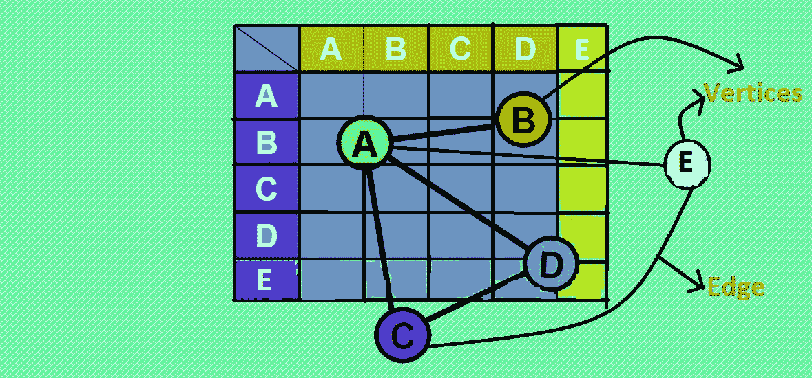
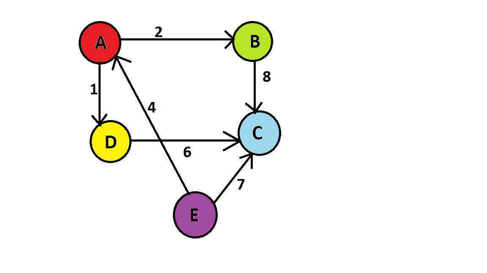
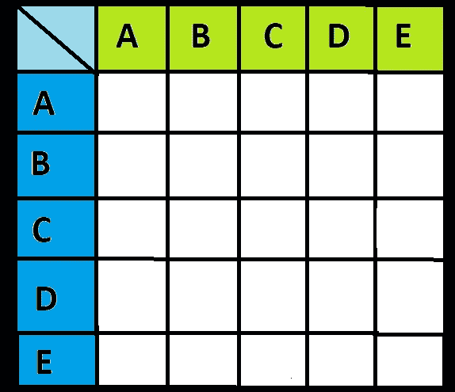
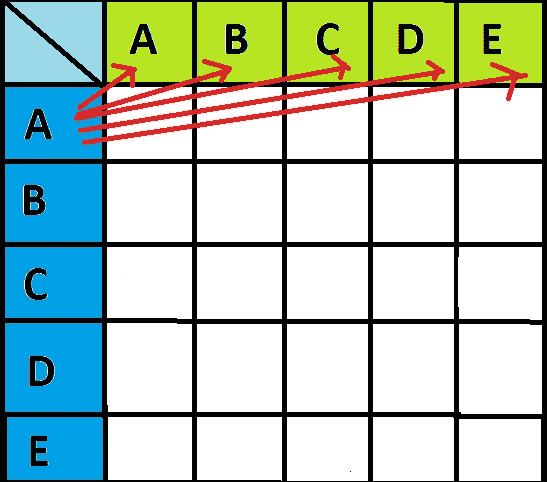
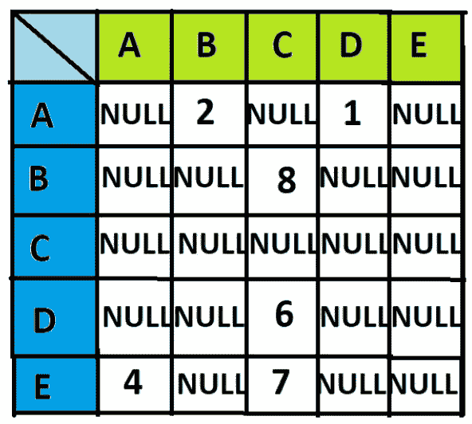
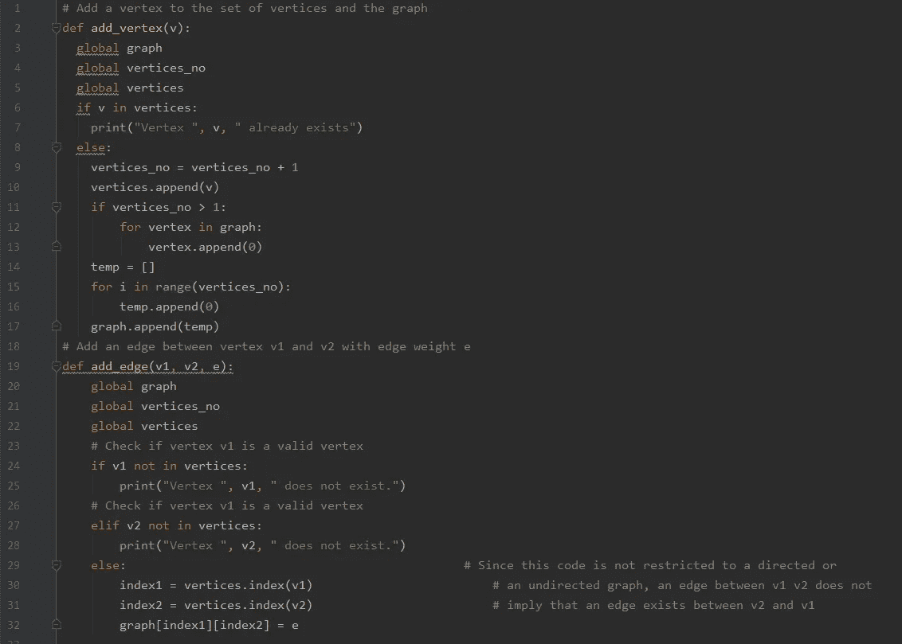
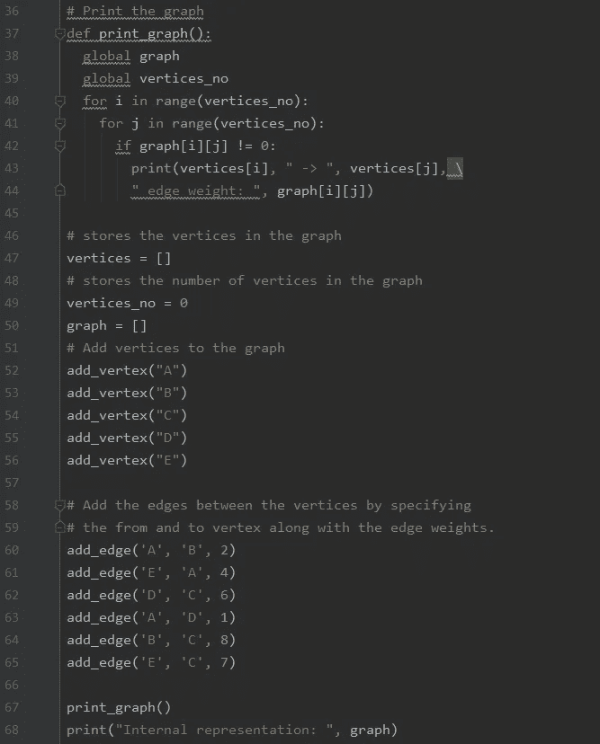
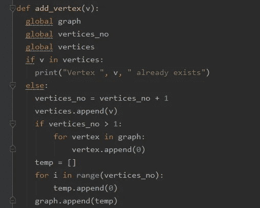
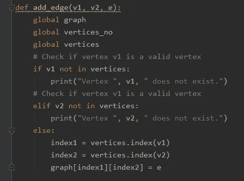
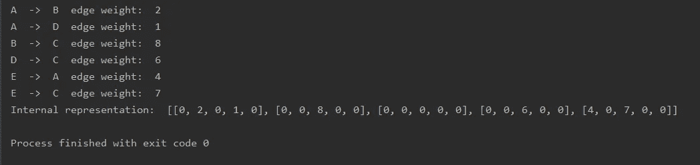

# Python 中的图:邻接矩阵

> 原文：<https://medium.com/analytics-vidhya/graphs-in-python-adjacency-matrix-d0726620e8d7?source=collection_archive---------1----------------------->

# **大家好！！**

众所周知，**图**是一种数据结构，主要用于通过网络连接各种元素。

**在这篇文章中，你将学习如何在 python 中使用邻接矩阵创建一个图。我们开始吧！！**

# 1️⃣图表:

图是由节点和边组成的非线性数据结构。节点有时也称为顶点，边是连接图中任意两个节点的直线或弧线。

> 图由一组有限的顶点(或节点)和一组连接一对节点的边组成。

上图表示有顶点和边的图。但是问题出现了:

**你将如何在你的代码中表示图形？？**

**为了回答上述问题，邻接矩阵应运而生！**

它们给了我们一种方法来**按照一个非常有效和结构化的过程**表示我们的图表。通过创建矩阵(包含行和列的表)，可以非常容易地表示节点和边。

**让我们看看如何为给定的图创建邻接矩阵**

加权有向图

# 让我们创建一个邻接矩阵:

1️⃣首先，创建一个如下所示的空矩阵:

空矩阵

现在，2️⃣看着图表，从节点 a 开始填充矩阵:

因为没有边从 A 到 A，所以在块中填充 0。

**A →A，值将为 0**

**A →B，值将为 2**

**A →C，值将为 0**

**A →D，值将为 1**

**A →E，值将为 0，**

对其他顶点重复相同的过程。

3️⃣用 NULL 替换所有的 0 值。在完全填充块之后，矩阵将看起来如下:

# 🏆终于！—我们的矩阵准备好了！

# 💻**我们来码吧！**

这是一个用邻接矩阵表示的加权有向图的例子👇

添加顶点和边

**打印图形的代码:**

**让我们看看这段代码是如何在幕后工作的:**

**1️⃣添加顶点:**

使用这部分代码，您可以向矩阵添加顶点。

如果您添加的顶点已经存在，则打印“已经存在”,否则将该顶点附加到图形中。

**2️⃣加边:**

要在两个顶点之间添加边，首先检查顶点是否有效，是否存在于图中。

在这之后，由于这段代码不限于有向和无向图，所以你可以给顶点 v1 和 v2 都添加边。

**3️⃣现在打印图形以获得以下输出:**

最终输出

通过这种方式，你可以使用邻接矩阵在 Python 中创建图形。👍

# 谢谢大家！！😊