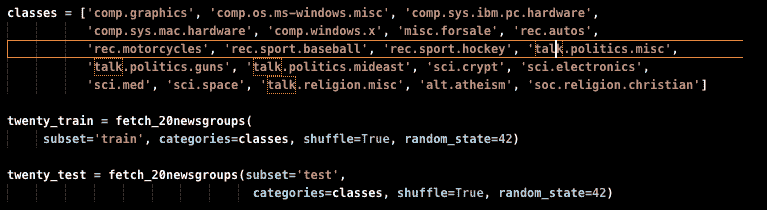

# 用于机器学习算法中参数调整的 GridSearchCV

> 原文：<https://medium.com/analytics-vidhya/gridsearchcv-for-parameter-tuning-in-machine-learning-algorithms-b8a80218d2a8?source=collection_archive---------20----------------------->

托尔·阿尔维斯在 [Unsplash](https://unsplash.com?utm_source=medium&utm_medium=referral) 上的照片

***scikit-learn*** 提供的大多数机器学习算法都有默认参数。然而，在大多数问题中，由于问题的性质、所用数据集的大小或数据集特征的性质，无论是离散的还是分类的，这些参数都不能给出算法的最佳性能。基于预先执行的数据分析，GridSearchCV 可以帮助在参数空间中搜索特定算法和特定数据集的最佳性能参数。

我最近做了一个任务，需要在数据集上找到性能最好的模型。这是我第一次使用 GridSearchCV，所以我很难理解如何实现它。下面我将详细说明我是如何在其中一个模型中实现的。

为此，我将使用 scikit-learn 提供的 ***随机森林分类器*** 和 ***二十个新组数据集*** 。所有的预处理步骤大部分是使用 ***NLTK*** 完成的。首先，我们导入我们的库和数据集:

必需的进口

准备好所有包后，我们加载数据集，包括训练集和测试集:

加载训练集和测试集

然后，我们将数据集要素转换为数字矩阵:

将特征转换成数值矩阵

在此之后，我们现在准备建立我们的随机森林管道。首先，我们将使用默认参数构建随机森林模型，以评估其在数据集上的性能:

随机森林管道(管道功能由我的朋友[乌吉瓦尔·库马尔](https://github.com/ujjwal3067)提供)

最后，使用 GridSearchCV，我们可以给出一系列参数，并使数据集适合模型。这将遍历所提供的参数空间，并找到提供最佳性能的参数组合。根据可用的时间和计算资源，参数网格可以扩展。

使用 gridSearchCV 寻找最佳参数

以上步骤可以应用到 Sklearn 提供的大部分分类算法中。请务必查看随机森林分类器和 GridSearchCV 的 sklearn 文档