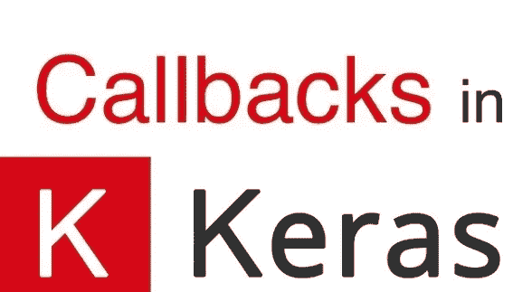

# 使用 Keras 回调整理您的模型

> 原文：<https://medium.com/analytics-vidhya/groom-your-model-using-keras-callbacks-e97b4fa1b21c?source=collection_archive---------6----------------------->



在本教程中，让我们了解回调函数在训练深度学习模型时的关键作用。

训练深度学习模型耗费大量时间。有时，可能会发生这样的情况，您连续几天运行一个模型，却没有找到最小的预期结果。因此，我们可以通过控制一些回调函数和监控损失、准确性等来克服这个问题。，训练时。

Keras 是一个深度学习库，建立在其他深度学习库如 Tensorflow、CNTK、Theano 之上。

让我们讨论以下回调函数:

1.  **基地记录器**
2.  **终止于 NaN**
3.  **进度条记录器**
4.  **历史**
5.  **模型检查点**
6.  **提前停止**
7.  **远程监视器**
8.  **学习率调度器**
9.  **在平稳状态下减少 lr**
10.  **CSV 记录器**
11.  **λ回调**
12.  **张量板**

让我们看看每个回调的用法

## **1 —基线记录器:**

```
from keras.callbacks import BaseLoggerbaselogger = BaseLogger(stateful_metrics = None)
```

默认情况下，`stateful_metrics = None`；这意味着在每个时期后我们得到的任何精度和损失实际上是该时期内所有批次的精度/损失的平均值。

如果我们通过了`stateful_metrics = [‘acc’, ‘loss’]`，那么我们可以得到最终批次的损耗和精度，而不是平均值。一个时期内所有批次的值。

## **2 —终止于 NaN** :


```
from keras.callbacks import TerminateOnNaNterminate = TerminateOnNaN()
```

在训练深度学习模型时，如果我们在回调列表中传递这个 terminate 对象，那么当在特定时期后遇到 NaN 丢失时，训练将会停止。

## **3 —进度条记录器:**

```
from keras.callbacks import ProgbarLoggerprogbar = ProgbarLogger(count_mode=’samples’, stateful_metrics=None)
```

**计数模式** =“样本”或“步骤”。控制进度条显示“步骤”(看到的批次数量)还是“样本”(看到的样本数量)。

**stateful _ metrics**=[' ACC ']，我们在此列表中传递的所有度量(作为字符串)，不会在一个时期内进行平均。所有其他指标将在一个时期内进行平均(与 BaseLogger 中讨论的相同)

## **4 —历史:**

```
from keras.callbacks import Historymodel_history = History()
```

这个回调函数将每个时期模型的所有事件记录/记录到 model_history 对象中

`model_history.epoch`返回历元列表

`model_history.history` 返回字典，将关键字作为不同的事件，并将它们在每个时期后的值作为列表

`model_history.keys()`返回训练时使用的所有不同事件

`model_history.params()`给出训练模型时使用的所有参数的信息

## **5 —模型检查点:**

```
from keras.callbacks import ModelCheckpointcheckpoint = ModelCheckpoint(filepath, monitor=’val_loss’, verbose=0, save_best_only=**False**, save_weights_only=**False**, mode=’auto’, period=1)
```

该回调用于在每个时期之后保存一个或多个最佳模型，并将其用于未来的预测。

**文件路径**:保存你的模型`.../classifier.hdf5`的路径。如果您想在每个时期后保存，`".../classifier-{epoch:02d}-{val_acc:.2f}.hdf5".`

**监视器**:基于哪个事件你想保存你的模型。如果它的 val_loss，那么我们将得到所有历元中 val_loss 最小的最佳模型。如果它是精确的，那么我们将得到最好的模型，其中 val_acc 在所有时期中是最高的。

**verbose** : 1 表示我们将了解在终端训练时发生了什么。

**save_best_only** :如果为真，则只保存最佳模型。如果它是假的，那么模型将在每个时期之后被保存。

**模式**:一般使用“自动”。如果模式设置为“min”且监控=“val_loss”，则只有当 val _ loss 减少时，才会保存模型。如果模式设置为“最大”且监视器=“val _ ACC”。那么只有 val_acc 得到改进，模型才会被保存。

**save_weights_only** :如果为真，则只保存模型权重。否则整个模型将被保存。

**period** :整数，如果为 2，则每隔 2 个时期调用一次回调。

## **6 —提前停止:**

```
from keras.callbacks import EarlyStoppingearlystopping = EarlyStopping(monitor=’val_loss’, min_delta=0, patience=0, verbose=0, mode=’auto’, baseline=**None**, restore_best_weights=**False**)
```

提前停止可以防止模型过度拟合。

当我们监控的事件停止改进到超出耐心时，模型会自动停止训练。

**监视器，模式**:与模式检查点中看到的相同

min_delta :在被监控的事件中，被认为是改进的最小变化量。如果 min_delta 是 0.5，monitor = 'val_acc '，那么如果精度在每个历元之后没有提高 0.5，则不认为是提高。当前事件和最佳事件之间的差异通过计算得出。

**耐心**:等待监控事件改善的时期数。

**restore_best_weights** :在某个历元获得最佳权重后，模型仍然运行，直到超出忍耐水平。因此，要检索最佳权重，请将该参数设置为 True。

**基线**:您应该为您正在监控的事件获得的最低金额。比方说，您正在监控“val_acc”，基线= 0.85，但是如果您的 val_acc 在特定时期(>耐心)后= 0.75，那么您的模型将停止训练。

## **7 —远程监视器:**

```
from keras.callbacks import RemoteMonitor()remotemonitor = RemoteMonitor(root=’http://localhost:5000', path=’/publish/epoch/end/’, field=’data’, headers=**None**, send_as_json=**False**)
```

此回调用于将事件流式传输到服务器。

## **8 —学习率调度器:**

```
from keras.callbacks import LearningRateSchedulerlrscheduler = LearningRateScheduler(schedule,verbose)
```

在训练模型时，学习率决定权重和偏差应该如何变化。

如果我们的学习率(α)太小，神经网络就很难学习。

如果我们的学习率(alpha)太高，那么模型可能会超过全局最小值。

w = w+(α)。梯度

阿尔法:我们沿着梯度踏步/跳跃

如果我们以相同的学习速率为所有时代训练我们的模型，它不是在所有情况下都有效。当我们接近全局最小值时，降低 LR 有助于模型更好地收敛。

LR 计划有 3 种类型:基于时间的衰减、指数衰减和步进衰减。

**调度:**以历元索引和当前 lr 为输入，返回更新后的 lr 的函数。

## **9 —在平稳状态下降低 LR:**

```
from keras.callbacks import ReduceLROnPlateaureduce_lr = ReduceLROnPlateau(monitor=’val_loss’, factor=0.1, patience=10, verbose=0, mode=’auto’, min_delta=0.0001, cooldown=0, min_lr=0)
```

**冷却:**LR 降低后等待应用更改的时期数。

该回调用于在指标停止提高超过耐心水平时降低学习率。

## **10 — CSVLogger:**

```
from keras.callbacks import CSVLoggercsvlogger = CSVLogger(filename, separator=’,’ , append=**False**)
```

该回调将所有事件保存到 csv 文件中。

**文件名:**文件名保存为 csv 文件

**分隔符:**用于分隔 csv 文件中元素的字符串

**追加:**如果设置为真，则将训练结果追加到同一个 csv 文件中。如果设置为 False，它将覆盖 csv 文件。

**12。张量板:**

```
from keras.callbacks.tensorboard_v1 import TensorBoardtensorboard = TensorBoard(log_dir=’./logs’, histogram_freq=0, batch_size=32, write_graph=**True**, write_grads=**False**, write_images=**False**, embeddings_freq=0, embeddings_layer_names=**None**, embeddings_metadata=**None**, embeddings_data=**None**, update_freq=’epoch’)
```

在您的终端中运行以下命令:

使结果可视化。

在 tensorboard 中，我们只能看到每个历元的损耗和精度。为了在 tensorboard 中显示每一批的损失和准确性值，我们需要编写自定义回调。