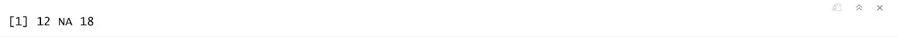
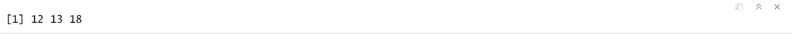
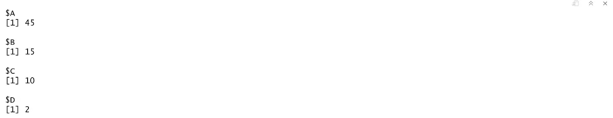
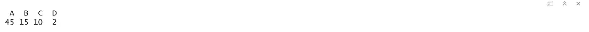
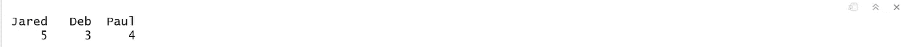
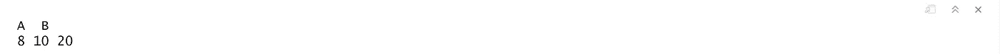
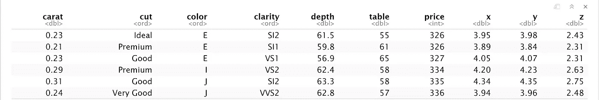
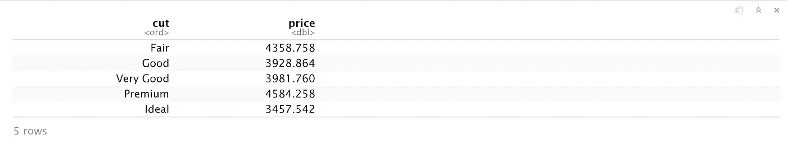
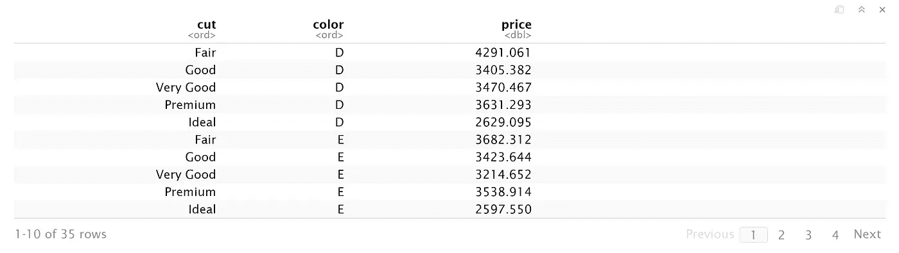
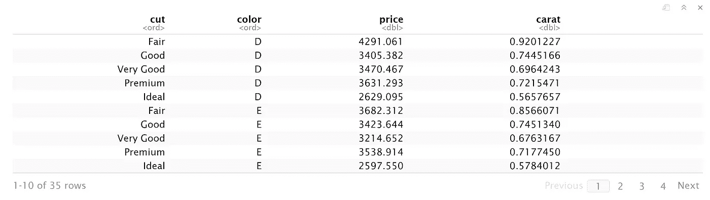

# R — 3 中的群操纵

> 原文：<https://medium.com/analytics-vidhya/group-manipulation-in-r-3-5554a0c1b544?source=collection_archive---------3----------------------->

> 如果您还没有阅读 R 数据分析系列的第 2 部分，请仔细阅读下面这篇文章，在这篇文章中，我们讨论了 R-2 中的[统计可视化。](/@viveksrinivasan/statistical-visualization-in-r-2-9e9070bcdecf)
> 
> 这篇文章的内容是我在 IIM-B 时代得到的几本书的要点。
> 
> 人人为我——贾里德·p·兰德
> 
> 实用数据科学与 R — Nina Zumel 和 John Mount
> 
> 文中讨论的所有代码块都以 R markdown 的形式出现在 [Github 链接](https://github.com/viveksrinivasanss/Data_Science_Using_R)中。


数据分析的一般经验法则是，处理数据或数据管理消耗 80 %的精力。这通常需要对数据的不同部分进行重复操作— `split-apply-combine`。也就是说，我们根据某种度量将数据分割成离散的部分，对每个部分应用某种转换，然后将所有部分组合在一起。在 R 中有很多方法可以迭代数据，我们将看到一些最方便的方法。

# 应用系列

r 内置了`apply`函数及其所有相关函数，如`tapply`、`lapply`、`sapply` 和`mapply.`，让我们看看每个函数在处理数据时是如何使用的。

## 应用

`apply` 是用户通常学习的这个家族的第一个成员，也是本质上限制最多的。它必须用在`matrix`上，这意味着所有元素必须是同一类型，无论它们是`character`、`numeric` 还是`logical`。如果用于其他对象，如`data.frame`，它将首先被转换为`matrix` 。

`apply` 的第一个参数是我们正在处理的对象。第二个参数是应用函数的边距，1 表示在`rows` 上操作，2 表示在`columns`上操作。第三个参数是我们想要应用的函数。任何随后的参数都将被传递给函数。

为了说明它的用法，我们从一个简单的例子开始，对一个`matrix`的行或列求和。注意，这也可以使用内置的`rowSums` 和`colSums`来完成，产生相同的结果。

```
theMatrix <- matrix(1:9, nrow=3)
apply(theMatrix,1,sum) ## Row Sum
apply(theMatrix,2,sum) ## Column Sum
```

类似于大多数的`R`函数，我们有一个参数`na.rm`来处理矩阵或任何其他数据类型中的缺失值`NA`。我们给`theMatrix`加一些`NA` 吧。

```
theMatrix[2,1] <- NA
apply(theMatrix,1,sum)
```



通过向`apply` 函数添加`na.rm`参数，它将忽略缺失的值，并计算行和列的总和。

```
apply(theMatrix,1,sum,na.rm=TRUE)
```



## 轻快活泼

`lapply` 的工作方式与`apply` 相似，但它将函数应用于`list` 的每个元素，并将结果作为`list` 返回。

```
theList <- list(A=matrix(1:9,3), B=1:5,C=matrix(1:4,2), D=2)
lapply(theList,sum)
```



处理`lists` 有时候感觉有点麻烦，所以把结果返回为`vector` 代替，`sapply` 可以像`lapply`一样投入使用。而矢量在技术上是`list`的一种形式，所以`lapply` 和`sapply` 也可以把`vector` 作为它们的输入

```
sapply(theList,sum)## Counting no of characters in each word
theNames <- c("Jared","Deb","Paul")
sapply(theNames,nchar)
```



## 地图

也许 apply 家族中最容易被忽略但却非常有用的成员是`mapply`，它将一个函数应用于 multiple `lists`的每个元素。通常，当面对这种情况时，人们会求助于使用循环，这当然是不必要的。让我们构建两个列表，通过一个例子来理解`mapply` 的用法。我们在 R 中使用内置的`identical` 函数，通过元素到元素的比较来查看两个列表是否相同。

```
## build two lists
firstList <- list(A=matrix(1:16,4),B=matrix(1:16,2),c(1:5))
secondList <- list(A=matrix(1:16,4),B=matrix(1:16,8),c(15:1))## test element by element if they are identical
mapply(identical,firstList,secondList)
```

`mapply` 也可以用自定义函数代替 r 中的内置函数，我们来构建一个简单的函数，将 a `lists`中每个对应元素的行数相加。


```
simpleFunc <- function(x,y) {
              NROW(x) + NROW(y)
              }
mapply(simpleFunc,firstList,secondList)
```



`apply` 家族中还有许多其他成员，它们要么不常被使用，要么已经被`plyr` 家族中的函数所取代。它们包括

*   塔普利
*   rapply
*   eapply
*   vapply
*   经过

## 总计

习惯了`SQL` 术语的人通常想把运行 group by 和 aggregation 作为他们的第一个 R 任务。做到这一点的方法是使用名副其实的`aggregate` 函数。我们有多种方法调用，`aggregate`，我们将看到使用`formula` 符号调用它的最方便的方法。

`formulas`由左右两边组成，中间用波浪号`(~)`隔开。公式方法的使用类似于我们在上一篇文章中使用 ggplot2 创建图形的方式。左侧代表我们要进行计算的变量，右侧代表我们要进行分组计算的一个或多个变量。为了演示骨料的用法，我们曾经求助于 ggplot2 中的钻石数据。

```
require(ggplot2)
data(diamonds)
head(diamonds)
```



作为第一个例子，我们将计算钻石数据中每种切割类型的`average` 价格。第一个参数`aggregate`是`formula`指定价格应该通过切割来打破。第二个参数是要使用的数据，在本例中是钻石。第三个参数是应用于每个数据子集的函数。

```
aggregate(price~cut, diamonds,mean)
```



请注意，我们只指定了列名，而不必标识数据，因为在第二个参数中已经给出了数据。在指定函数的第三个参数之后，该函数的其他命名参数可以按如下方式传递。

```
aggregate(price~cut, diamonds,mean,na.rm=TRUE)
```

要按多个变量对数据进行分组，请将附加变量添加到公式的右侧，并用加号(+)分隔。

```
aggregate(price~cut + color, diamonds,mean)
```



要合计两个变量，必须使用公式左侧的`cbind` 将它们组合在一起。

```
aggregate(cbind(price,carat)~ cut + color,diamonds,mean)
```



重要的是要注意，从上面的例子只能提供一个函数，因此适用于变量。要应用多个功能，使用扩展和增强`data.frames`功能的`dplyr` 或`data.table`包更容易。

汇总数据是分析过程中非常重要的一步。有时它是最终目标，有时它是应用更高级方法的准备。在本文中，我们已经看到了在 r 中执行组操作的常用方法。在下一篇文章中，我们将使用两个通用的包`dplyr` 和`data.table`来比较高级的组操作技术。

[*高级-R—4 中的数据争论*](/@viveksrinivasan/advanced-data-wrangling-in-r-4-f98693b92851)

> 一定要通过评论和分享文章来分享你的想法和支持。