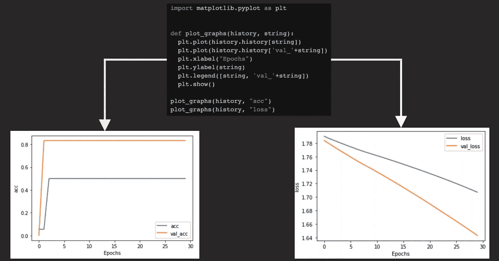

# 分组反馈:使用 NLP 的数据透视表和情感分析

> 原文：<https://medium.com/analytics-vidhya/grouping-feedback-pivot-tables-and-sentiment-analysis-using-nlp-f7f1a3b0fc09?source=collection_archive---------17----------------------->

## 整理 IGN 的游戏 Wiki 反馈，并建议改进数据收集

## 背景

申请产品管理实习通常是同一个系列的事件。链接一份简历，或者在调查表的空白处填写一些内容，然后提交。然而，我遇到的最有趣的 PM 应用之一是 [IGN 的](https://www.ign.com/)。申请人只能回答一系列问题；不接受简历。这个过程是伟大的实践；这个问题是这样的…

> “IGN 一直在从我们的维基用户那里收集反馈，以找出我们可以改善他们体验的方法...创建一个数据透视表，将这些反馈按类别分组，以帮助我们改善维基页面上的用户体验，以及您对后续步骤的建议。”

***免责声明:我假设这不是侵犯隐私，这些问题可以在他们的应用程序网站***[***IGN Code Foo 2020***](https://www.ign.com/code-foo/2020)

# 概观

我决定从两个角度回答这个关于分组反馈的问题(封锁给了我*很多*时间去思考)；使用 Excel 和数据透视表的直接“逻辑”方法，以及使用机器学习& TensorFlow 试图检测情绪的 moonshot“创造性”方法。

## 资料组

来自 IGN 游戏维基页面的反馈数据

# 逻辑方法

*使用 Excel 并根据我认为在数据集中有用的类别创建一个数据透视表。*

## 方法学

*   我首先访问了每个反馈的 URL，发现了一些有用的特性和分组类别。只有 24 个网站，从这些访问中，我建立了类别，导致对数据进行有见地的过滤。

基于最佳判断对反馈进行分类

*   我不确定这是扫描网页内容的最有效方式。我本来可以使用自动数据收集程序，但活到老学到老。
*   我创建了一个数据透视表，以便更好地可视化反馈中的子部分。我使用了缺失或错误信息等类别，并根据我认为最重要的内容过滤数据，如国家代码顶级域名(ccTLD)。

根据创建的类别过滤反馈的数据透视表

*   这个数据透视表还允许对负面反馈集中的地方(如果有的话)进行广泛的概述，比如地区，或者游戏的页面是否没有像其他页面一样更新。

## 结果

发现潜在的趋势和反馈集中的地方

*   无论在哪个国家，缺失信息在用户反馈中所占比例最大(约 70%)。
*   至少 5 年没有
    更新的缺失信息类别下的 URL 大约占反馈的 40%。

# 创造性方法

*在 TensorFlow 上使用机器学习和自然语言处理来检测文本中的情感(对某个情况的看法或态度)，然后在多维视觉中对发现进行分类。*

## 方法学

**免责声明:由于数据集很小，我强烈认为这不会提供非常有用的结果，但这种方法可以为未来包括更大数据集的方法提供见解，这很有趣。*

*   我的最终目标是让我的算法学习数据集的一部分(75%)，并针对剩余部分(25%)进行测试。使用输出的准确性，我将能够根据向量的关系对相似的反馈进行分组。
*   使用 Excel、TensorFlow、一点 Python 和 Google 的 Colab 笔记本，我首先清理数据集并删除 URL、常用词(停用词)和其他不一致的内容。
*   一旦我在 NLP 算法中建立了一些初始变量，比如训练部分和截断/填充位置，我就检查以确保我仍然接收到所有列出的反馈。
*   现在将数据集分成训练和测试变量。

我运行 NLP 模型的 Google Colab 笔记本的屏幕截图

*   我用嵌入、密集层和我定义的损失函数创建了一个 Keras 序列模型。我本来可以添加 LSTM 层和其他配置，但由于数据集很小，我保持简单。
*   检查概要有助于确认我的模型中没有运行无效的参数。

我用来定义我的模型的屏幕截图

*   该模型针对设定数量的时期(迭代)进行训练。这个值可以通过迭代和评估“准确性”度量来改变。
*   我喜欢用模型来绘制我的学习曲线，因为这些图表可以给出不同的见解。在这里，我的假设得到了证实，我的数据集的数据点太少了。

根据我的模型绘制学习曲线，以确定更好的参数

*   左侧的图表显示了训练集和验证集的准确性之间相对于时期(迭代次数)的关系。我们可以从该图中推断出，该模型将受益于更多的时期，但是如果没有更多的数据，这可能会导致对训练集的过度拟合。
*   右侧的图表显示了训练集和验证集的丢失与时期之间的关系。我们可以从这个图表中推断出模型需要更多的数据(两个损失都超过 100%)。

## 结果

*   为了可视化模型的输出(尽管从小数据集来看非常不准确)，我将矢量文件导出到 [TensorFlow 嵌入投影仪](https://projector.tensorflow.org/)。我发现可视化后更容易掌握主成分分析聚类的结果。

使用 TensorFlow 嵌入式投影仪可视化模型输出

*   这种多维互动投影显示了类似的反馈分组(肯定不准确，肯定很酷)。
*   事后证明，我的假设再次正确，这是没有价值的数据集只有 24 条评论。但是，对于更大的数据集，可以找到更准确的类别表示，并且可以将其他类别中类似的棘手问题分组在一起。总的来说，这是一个有趣的基于情绪的分组反馈，但需要更多的数据和不同的参数来有效地使用这种方法。

# 丰富

## 建议(第 1 条，共 2 条)

*   我从确定如何收集反馈开始。然后，我创建了一个改进反馈收集表的模型。

对反馈收集表的改进建议

## 建议(第 2 条，共 2 条)

*   **允许用户提交和批准更新。**
*   很像普通的维基百科，允许账户持有人提交他们认为需要添加到页面的内容。这可以在游戏的维基页面上正式实现之前通过提交审查。
*   我还注意到一些用户的反馈直接填补了缺失的数据，比如一个用户说，*“你从冥想点向右转，穿过缺口跳到墙上，然后跟着它绕一圈”。*这可以转变为直接提交更新。

## 权衡

列出我建议的收集反馈的改进权衡

# 摘要

*   在研究了 IGN 游戏 Wiki 页面上的一些反馈分组方法后，我确定最有效的反馈排序方法是使用数据透视表，尽管对于较大的数据集来说这可能很耗时。另一方面，对于更大的数据集，自然语言处理模型可以有效地对反馈中的情绪进行分组，并需要一种更加放手的方法。
*   改进反馈收集流程可以在内部团队或项目查看反馈之前更有效地过滤反馈。
*   总的来说，这个问题让我对数据透视表有了更多的了解，并对如何在不与客户交谈的情况下仅基于数据点过滤反馈有了一个大致的想法。我还能够通过尝试创建自然语言过程模型和可视化文本中的情感来实践一种创造性的方法。

感谢阅读到最后！如果你想谈论产品的所有事情，问问题，或提供反馈，请与我联系！[领英](https://www.linkedin.com/in/rommy-shehadeh/)